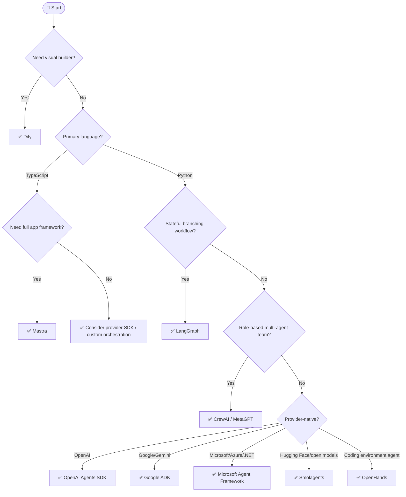

## Overview

> **TL;DR:** Choose an agent framework by language, state complexity, workflow model, and production constraints. Use LangGraph for explicit state graphs, CrewAI for role/task crews, OpenAI/Google SDKs for provider-native apps, and Microsoft Agent Framework for Microsoft/Azure enterprise stacks.

## Why It's in the Arsenal

Agent framework choice determines how your team models state, tools, delegation, retries, observability, and human review. The wrong abstraction can make simple systems fragile or complex systems unmaintainable.

## Key Features

- Covers Python vs TypeScript, code-first vs visual, single vs multi-agent, and enterprise constraints
- Explicitly handles the AutoGen → Microsoft Agent Framework transition
- Links to Sprint 1 canonical agent framework entries

## Architecture / How It Works



Plain-language tree:

1. Need a visual builder? Start with Dify.
2. TypeScript-first team? Evaluate Mastra.
3. Python and stateful graph workflows? Start with LangGraph.
4. Role/team metaphor? Start with CrewAI; study MetaGPT for software-company patterns.
5. OpenAI-native app? Use OpenAI Agents SDK.
6. Google/Gemini ecosystem? Use Google ADK.
7. Microsoft/Azure/.NET enterprise? Use Microsoft Agent Framework.
8. Existing AutoGen users should plan migration to Microsoft Agent Framework; AutoGen is legacy/maintenance for new feature work.
9. Coding agents need environment/sandbox thinking; evaluate OpenHands.

### Quick Reference Table

| Need | Recommended Start | Canonical Entry |
|---|---|---|
| Explicit state graph | LangGraph | [LangGraph](../../projects/agents/frameworks/langgraph.md) |
| Role/task crews | CrewAI | [CrewAI](../../projects/agents/frameworks/crewai.md) |
| Microsoft/Azure enterprise | Microsoft Agent Framework | [Microsoft Agent Framework](../../projects/agents/frameworks/microsoft-agent-framework.md) |
| Legacy Microsoft multi-agent apps | AutoGen → migrate | [AutoGen](../../projects/agents/frameworks/autogen.md) |
| OpenAI-native | OpenAI Agents SDK | [OpenAI Agents SDK](../../projects/agents/frameworks/openai-agents-sdk.md) |
| Google/Gemini-native | Google ADK | [Google ADK](../../projects/agents/frameworks/google-adk.md) |
| Hugging Face/open-model code agents | Smolagents | [Smolagents](../../projects/agents/frameworks/smolagents.md) |
| Visual workflows | Dify | [Dify](../../projects/agents/frameworks/dify.md) |
| TypeScript app framework | Mastra | [Mastra](../../projects/agents/frameworks/mastra.md) |
| Coding environment agent | OpenHands | [OpenHands](../../projects/agents/frameworks/openhands.md) |

## Getting Started

```bash
# Stateful graph baseline
pip install -U langgraph

# Role-based crew baseline
pip install crewai
```

## Use Cases

1. **Scenario**: You need a fast shortlist without reading every project entry first
2. **Scenario**: You want to explain an architecture choice to a teammate or reviewer
3. **Scenario**: You are giving an LLM/agent structured context for stack selection

## Strengths

- Converts a broad tool category into explicit decision logic
- Links leaf-node recommendations to canonical Arsenal entries
- Includes both Mermaid and plain-text forms for humans and LLMs

## Limitations / When NOT to Use

- Does not replace hands-on benchmarks with your actual data and traffic
- Pricing, model availability, quotas, and hosted-service limits can change
- Regulated environments still require legal, security, and compliance review

## Integration Patterns

- Start with the Mermaid tree for fast orientation.
- Use the text decision tree when copying into LLM context or design docs.
- Open the linked canonical entries before making a production commitment.
- Run a proof of concept and evaluation before standardizing on a tool.

## Resources

- [LangGraph](../../projects/agents/frameworks/langgraph.md)
- [CrewAI](../../projects/agents/frameworks/crewai.md)
- [Microsoft Agent Framework](../../projects/agents/frameworks/microsoft-agent-framework.md)
- [OpenAI Agents SDK](../../projects/agents/frameworks/openai-agents-sdk.md)
- [Google ADK](../../projects/agents/frameworks/google-adk.md)
- [Dify](../../projects/agents/frameworks/dify.md)

## Buzz & Reception

Decision-tree pages are maintained as high-value LLM/agent routing context. They should be updated whenever major tooling or model defaults shift.

---
*Last reviewed: 2026-06-13 by @maintainer*

