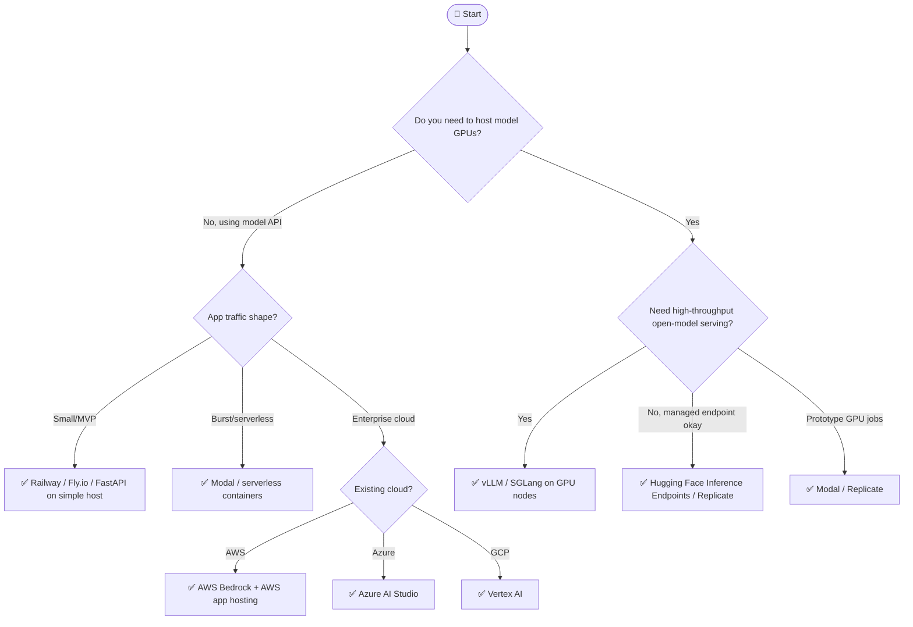

## Overview

> **TL;DR:** Deploy the application and the model separately unless you are intentionally building a small all-in-one prototype. Choose by GPU need, traffic shape, cloud commitment, and operations maturity.

## Why It's in the Arsenal

Deployment is where prototypes become expensive, slow, or unreliable. AI systems often need separate choices for app hosting, model serving, data stores, observability, and batch jobs.

## Key Features

- Covers serverless vs always-on, GPU, cloud providers, autoscaling, and budget
- Links deployment tools from Sprint 5 and inference engines from Sprint 2
- Encourages separate app and model serving decisions

## Architecture / How It Works



Plain-language tree:

1. If you use hosted model APIs, deploy your app separately from model serving.
2. For MVPs, use Railway, Fly.io, or a simple FastAPI deployment.
3. For bursty Python/GPU jobs, evaluate Modal.
4. For managed model APIs in a cloud commitment, use Bedrock, Azure AI Studio, or Vertex AI.
5. For self-hosted high-throughput open models, benchmark vLLM or SGLang on GPU infrastructure.
6. For managed model endpoints, evaluate Hugging Face Inference Endpoints, Replicate, or provider-specific services.

### Quick Reference Table

| Need | Recommended Start | Canonical Entry |
|---|---|---|
| Simple API wrapper | FastAPI + Railway/Fly.io | [FastAPI](../../tools/serving-and-deployment/fastapi.md), [Railway](../../tools/serving-and-deployment/railway.md), [Fly.io](../../tools/serving-and-deployment/fly-io.md) |
| Serverless Python/GPU jobs | Modal | [Modal](../../tools/serving-and-deployment/modal.md) |
| Managed model endpoint | HF Endpoints / Replicate | [HF Inference Endpoints](../../tools/serving-and-deployment/hf-inference-endpoints.md), [Replicate](../../tools/serving-and-deployment/replicate.md) |
| AWS enterprise | Bedrock | [AWS Bedrock](../../tools/serving-and-deployment/aws-bedrock.md) |
| Azure enterprise | Azure AI Studio | [Azure AI Studio](../../tools/serving-and-deployment/azure-ai-studio.md) |
| GCP enterprise | Vertex AI | [Google Vertex AI](../../tools/serving-and-deployment/google-vertex-ai.md) |
| Self-host open models | vLLM / SGLang | [vLLM](../../projects/inference-engines/vllm.md), [SGLang](../../projects/inference-engines/sglang.md) |

## Getting Started

```bash
# App API baseline
pip install fastapi uvicorn

# Model serving baseline
pip install vllm
vllm serve Qwen/Qwen2.5-7B-Instruct
```

## Use Cases

1. **Scenario**: You need a fast shortlist without reading every project entry first
2. **Scenario**: You want to explain an architecture choice to a teammate or reviewer
3. **Scenario**: You are giving an LLM/agent structured context for stack selection

## Strengths

- Converts a broad tool category into explicit decision logic
- Links leaf-node recommendations to canonical Arsenal entries
- Includes both Mermaid and plain-text forms for humans and LLMs

## Limitations / When NOT to Use

- Does not replace hands-on benchmarks with your actual data and traffic
- Pricing, model availability, quotas, and hosted-service limits can change
- Regulated environments still require legal, security, and compliance review

## Integration Patterns

- Start with the Mermaid tree for fast orientation.
- Use the text decision tree when copying into LLM context or design docs.
- Open the linked canonical entries before making a production commitment.
- Run a proof of concept and evaluation before standardizing on a tool.

## Resources

- [Modal](../../tools/serving-and-deployment/modal.md)
- [BentoML](../../tools/serving-and-deployment/bentoml.md)
- [Replicate](../../tools/serving-and-deployment/replicate.md)
- [Fly.io](../../tools/serving-and-deployment/fly-io.md)
- [Railway](../../tools/serving-and-deployment/railway.md)
- [AWS Bedrock](../../tools/serving-and-deployment/aws-bedrock.md)
- [Azure AI Studio](../../tools/serving-and-deployment/azure-ai-studio.md)
- [Google Vertex AI](../../tools/serving-and-deployment/google-vertex-ai.md)

## Buzz & Reception

Decision-tree pages are maintained as high-value LLM/agent routing context. They should be updated whenever major tooling or model defaults shift.

---
*Last reviewed: 2026-06-13 by @maintainer*

