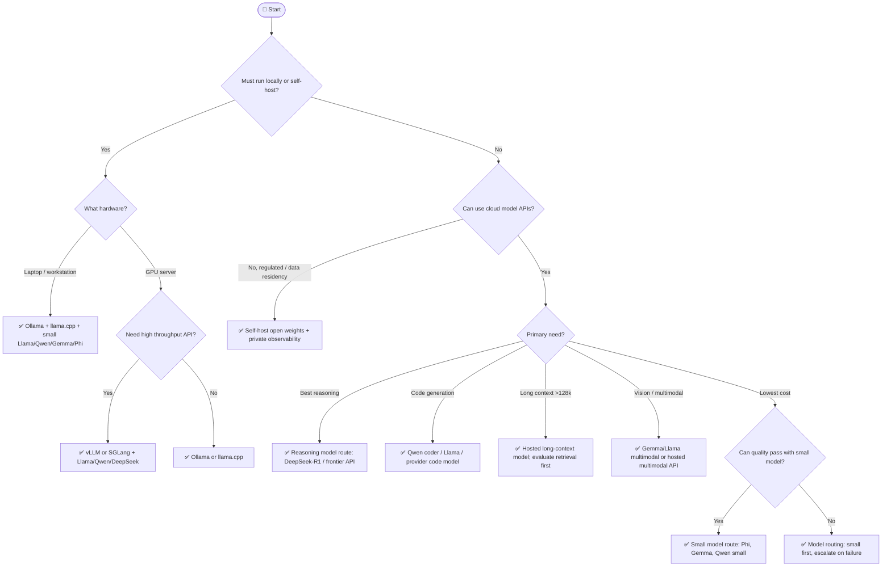

## Overview

> **TL;DR:** Choose the smallest model and hosting path that satisfies quality, privacy, latency, and cost. Start with constraints, then benchmark with production-shaped prompts.

This tree helps choose between cloud APIs, open-weight models, local runtimes, code models, long-context models, multimodal models, and reasoning-oriented models.

## Why It's in the Arsenal

Model choice is the root decision for most AI applications. The wrong model path can make every later choice—RAG, fine-tuning, serving, cost control, and observability—harder.

## Key Features

- Covers local vs cloud first, because that is usually the hardest constraint
- Separates reasoning, code, long-context, and multimodal needs
- Links leaf nodes to model families and inference engines already in the Arsenal
- Includes a budget-aware path for cost-sensitive systems

## Architecture / How It Works



Plain-language tree:

1. If data cannot leave your environment, choose self-hosted open weights.
2. If you need laptop/local development, start with Ollama and llama.cpp.
3. If you need production GPU serving, benchmark vLLM and SGLang.
4. If cloud APIs are allowed, choose by primary need:
   - reasoning → reasoning-capable model route
   - code → code-specialized model
   - long context → hosted long-context model, but evaluate RAG first
   - multimodal → multimodal model or hosted vision API
   - cost → start small, route upward only when evals fail
5. Always measure quality, latency, and cost on your real workload.

### Quick Reference Table

| Need | Start With | Canonical Entries |
|---|---|---|
| Local laptop dev | Ollama + llama.cpp | [Ollama](../../projects/inference-engines/ollama.md), [llama.cpp](../../projects/inference-engines/llama-cpp.md) |
| Production open-model serving | vLLM or SGLang | [vLLM](../../projects/inference-engines/vllm.md), [SGLang](../../projects/inference-engines/sglang.md) |
| Broad open-weight default | Llama or Qwen | [Llama 3.x](../../projects/foundation-models/llama-3.md), [Qwen 2.5/QwQ](../../projects/foundation-models/qwen-2-5.md) |
| Reasoning model evaluation | DeepSeek-R1/QwQ route | [DeepSeek-V3/R1](../../projects/foundation-models/deepseek-v3-r1.md), [Qwen 2.5/QwQ](../../projects/foundation-models/qwen-2-5.md) |
| Small-model routing | Phi/Gemma/Qwen small | [Phi-4](../../projects/foundation-models/phi-4.md), [Gemma 3](../../projects/foundation-models/gemma-3.md) |
| Enterprise RAG model | Command R+ or hosted enterprise model | [Command R+](../../projects/foundation-models/command-r-plus.md) |

## Getting Started

```bash
# Local baseline
ollama pull llama3.1
ollama run llama3.1

# Production serving baseline
pip install vllm
vllm serve Qwen/Qwen2.5-7B-Instruct
```

## Use Cases

1. **Scenario**: You need a fast shortlist without reading every project entry first
2. **Scenario**: You want to explain an architecture choice to a teammate or reviewer
3. **Scenario**: You are giving an LLM/agent structured context for stack selection

## Strengths

- Converts a broad tool category into explicit decision logic
- Links leaf-node recommendations to canonical Arsenal entries
- Includes both Mermaid and plain-text forms for humans and LLMs

## Limitations / When NOT to Use

- Does not replace hands-on benchmarks with your actual data and traffic
- Pricing, model availability, quotas, and hosted-service limits can change
- Regulated environments still require legal, security, and compliance review

## Integration Patterns

- Start with the Mermaid tree for fast orientation.
- Use the text decision tree when copying into LLM context or design docs.
- Open the linked canonical entries before making a production commitment.
- Run a proof of concept and evaluation before standardizing on a tool.

## Resources

- [Ollama](../../projects/inference-engines/ollama.md)
- [vLLM](../../projects/inference-engines/vllm.md)
- [Llama 3.x](../../projects/foundation-models/llama-3.md)
- [Qwen 2.5 / QwQ](../../projects/foundation-models/qwen-2-5.md)
- [DeepSeek-V3 / R1](../../projects/foundation-models/deepseek-v3-r1.md)

## Buzz & Reception

Decision-tree pages are maintained as high-value LLM/agent routing context. They should be updated whenever major tooling or model defaults shift.

---
*Last reviewed: 2026-06-13 by @maintainer*

