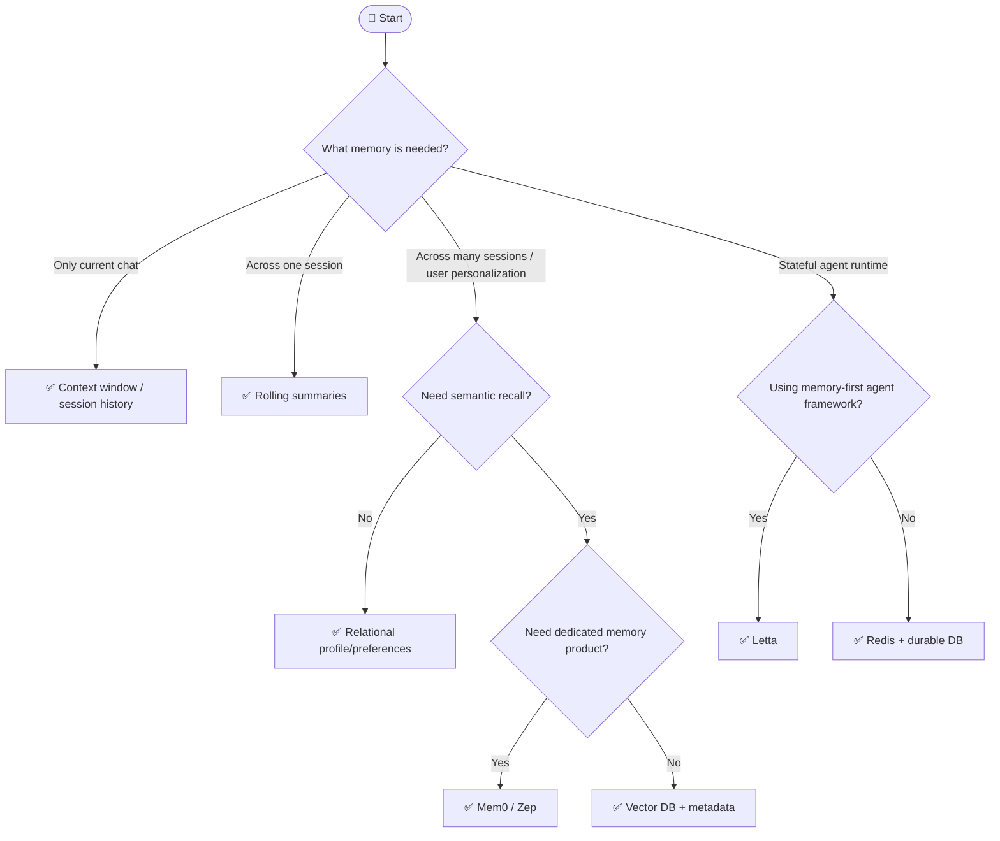

## Overview

> **TL;DR:** Use conversation history for short-term context, summaries for session continuity, vector/graph memory for long-term recall, and dedicated memory tools when personalization becomes a product feature.

## Why It's in the Arsenal

Agent memory is easy to overbuild and hard to govern. This tree helps choose the simplest memory layer that creates user value without creating privacy or reliability risk.

## Key Features

- Separates conversation memory, long-term memory, semantic memory, and operational state
- Links to Sprint 5 memory tools
- Emphasizes retention policy and evaluation before storing everything

## Architecture / How It Works



Plain-language tree:

1. If memory only matters inside the current request, use context window state.
2. If memory spans one session, use rolling summaries and explicit state.
3. If memory spans users/sessions, decide whether recall is semantic or structured.
4. Use relational storage for preferences, settings, and facts with clear schema.
5. Use vector/graph memory for fuzzy recall.
6. Use Mem0/Zep when memory is a product feature and you want an abstraction layer.
7. Use Redis for fast operational memory, caches, queues, and session state—not as the only durable memory.

### Quick Reference Table

| Need | Recommended Start | Canonical Entry |
|---|---|---|
| Short chat continuity | Session history | — |
| Session compression | Rolling summary | — |
| User long-term memory | Mem0 or Zep | [Mem0](../../tools/orchestration/mem0.md), [Zep](../../tools/orchestration/zep.md) |
| Stateful agent memory | Letta | [Letta](../../tools/orchestration/letta.md) |
| Fast cache/session state | Redis | [Redis](../../tools/orchestration/redis-memory.md) |
| Custom semantic memory | Vector DB | [Qdrant](../../projects/data-and-retrieval/qdrant.md), [pgvector](../../projects/data-and-retrieval/pgvector.md) |

## Getting Started

```bash
# Fast operational memory baseline
redis-server

# Dedicated memory abstraction baseline
pip install mem0ai
```

## Use Cases

1. **Scenario**: You need a fast shortlist without reading every project entry first
2. **Scenario**: You want to explain an architecture choice to a teammate or reviewer
3. **Scenario**: You are giving an LLM/agent structured context for stack selection

## Strengths

- Converts a broad tool category into explicit decision logic
- Links leaf-node recommendations to canonical Arsenal entries
- Includes both Mermaid and plain-text forms for humans and LLMs

## Limitations / When NOT to Use

- Does not replace hands-on benchmarks with your actual data and traffic
- Pricing, model availability, quotas, and hosted-service limits can change
- Regulated environments still require legal, security, and compliance review

## Integration Patterns

- Start with the Mermaid tree for fast orientation.
- Use the text decision tree when copying into LLM context or design docs.
- Open the linked canonical entries before making a production commitment.
- Run a proof of concept and evaluation before standardizing on a tool.

## Resources

- [Mem0](../../tools/orchestration/mem0.md)
- [Zep](../../tools/orchestration/zep.md)
- [Letta](../../tools/orchestration/letta.md)
- [Redis](../../tools/orchestration/redis-memory.md)
- [Qdrant](../../projects/data-and-retrieval/qdrant.md)

## Buzz & Reception

Decision-tree pages are maintained as high-value LLM/agent routing context. They should be updated whenever major tooling or model defaults shift.

---
*Last reviewed: 2026-06-13 by @maintainer*

