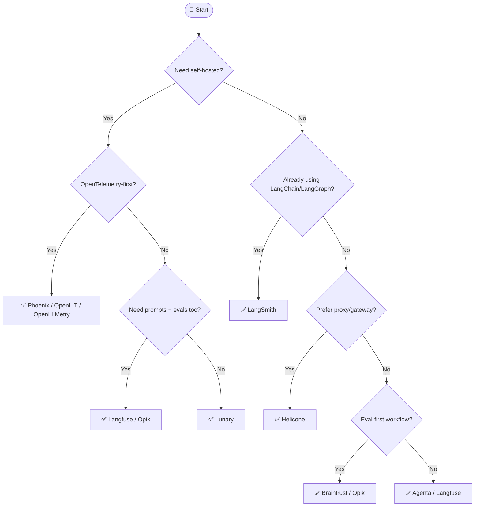

## Overview

> **TL;DR:** Pick observability by integration approach first: SDK, proxy, OpenTelemetry-native, or platform. Then choose based on self-hosting, evaluation depth, and your existing framework stack.

## Why It's in the Arsenal

Observability is the production trust layer for LLM apps. The right tool depends less on feature checklists and more on how telemetry enters the system.

## Key Features

- Covers self-hosted, LangChain/LangGraph, OpenTelemetry, proxy, eval-first, and free-tier needs
- Links to Sprint 4 observability entries
- Makes the integration approach explicit

## Architecture / How It Works



Plain-language tree:

1. Need self-hosted and open-source? Start with Langfuse, Phoenix, Opik, OpenLIT, or Lunary.
2. Need OpenTelemetry alignment? Start with Phoenix, OpenLIT, or OpenLLMetry.
3. Already using LangChain/LangGraph? Start with LangSmith.
4. Want minimal app changes through a provider gateway? Start with Helicone.
5. Need evaluation-first development? Evaluate Braintrust, Opik, Langfuse, or Phoenix.
6. Need prompt collaboration? Evaluate Agenta, Langfuse, LangSmith, or Braintrust.

### Quick Reference Table

| Need | Recommended Start | Canonical Entry |
|---|---|---|
| Self-hosted full lifecycle | Langfuse | [Langfuse](../../projects/observability/tracing/langfuse.md) |
| LangChain/LangGraph native | LangSmith | [LangSmith](../../projects/observability/tracing/langsmith-platform.md) |
| RAG eval + OTel | Phoenix | [Phoenix](../../projects/observability/tracing/phoenix.md) |
| Proxy/gateway logging | Helicone | [Helicone](../../projects/observability/tracing/helicone.md) |
| Eval-first workflow | Braintrust / Opik | [Braintrust](../../projects/observability/tracing/braintrust.md), [Opik](../../projects/observability/tracing/opik.md) |
| OTel instrumentation only | OpenLLMetry | [OpenLLMetry](../../projects/observability/tracing/openllmetry.md) |
| OTel + GPU monitoring | OpenLIT | [OpenLIT](../../projects/observability/tracing/openlit.md) |
| Prompt collaboration | Agenta | [Agenta](../../projects/observability/tracing/agenta.md) |

## Getting Started

```bash
# SDK example
pip install langfuse

# OTel example
pip install arize-phoenix openinference-instrumentation-openai
```

## Use Cases

1. **Scenario**: You need a fast shortlist without reading every project entry first
2. **Scenario**: You want to explain an architecture choice to a teammate or reviewer
3. **Scenario**: You are giving an LLM/agent structured context for stack selection

## Strengths

- Converts a broad tool category into explicit decision logic
- Links leaf-node recommendations to canonical Arsenal entries
- Includes both Mermaid and plain-text forms for humans and LLMs

## Limitations / When NOT to Use

- Does not replace hands-on benchmarks with your actual data and traffic
- Pricing, model availability, quotas, and hosted-service limits can change
- Regulated environments still require legal, security, and compliance review

## Integration Patterns

- Start with the Mermaid tree for fast orientation.
- Use the text decision tree when copying into LLM context or design docs.
- Open the linked canonical entries before making a production commitment.
- Run a proof of concept and evaluation before standardizing on a tool.

## Resources

- [Langfuse](../../projects/observability/tracing/langfuse.md)
- [LangSmith](../../projects/observability/tracing/langsmith-platform.md)
- [Phoenix](../../projects/observability/tracing/phoenix.md)
- [Helicone](../../projects/observability/tracing/helicone.md)
- [Braintrust](../../projects/observability/tracing/braintrust.md)
- [Opik](../../projects/observability/tracing/opik.md)
- [OpenLIT](../../projects/observability/tracing/openlit.md)

## Buzz & Reception

Decision-tree pages are maintained as high-value LLM/agent routing context. They should be updated whenever major tooling or model defaults shift.

---
*Last reviewed: 2026-06-13 by @maintainer*

