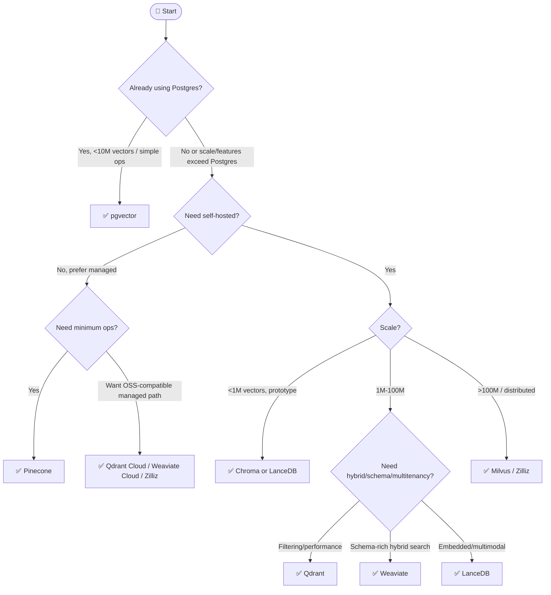

## Overview

> **TL;DR:** Start with your existing database and scale requirements before chasing vector DB features. Use pgvector for simplicity, Qdrant/Weaviate for production self-hosted search, Pinecone for managed ops, and Milvus for larger distributed scale.

## Why It's in the Arsenal

Vector database choice is one of the most common RAG architecture decisions. It affects retrieval quality, filtering, latency, operations, and cost.

## Key Features

- Covers self-hosting, hybrid search, scale, Postgres reuse, and multitenancy
- Links every leaf node to a canonical vector database entry
- Encourages teams to start with operational simplicity before adding infrastructure

## Architecture / How It Works



Plain-language tree:

1. If you already use Postgres and your vector needs are moderate, start with pgvector.
2. If you want managed infrastructure, evaluate Pinecone first, then managed Qdrant/Weaviate/Milvus options.
3. If you need local prototyping, use Chroma or LanceDB.
4. If you need production self-hosted filtering and performance, start with Qdrant.
5. If your data model benefits from object schemas and hybrid retrieval, evaluate Weaviate.
6. If you need very large distributed vector workloads, evaluate Milvus.

### Quick Reference Table

| Constraint | Recommended Start | Canonical Entry |
|---|---|---|
| Existing Postgres | pgvector | [pgvector](../../projects/rag/vector-databases/pgvector.md) |
| Fast local prototype | Chroma | [Chroma](../../projects/rag/vector-databases/chroma.md) |
| Self-hosted production | Qdrant | [Qdrant](../../projects/rag/vector-databases/qdrant.md) |
| Schema-rich hybrid search | Weaviate | [Weaviate](../../projects/rag/vector-databases/weaviate.md) |
| Large distributed scale | Milvus | [Milvus](../../projects/rag/vector-databases/milvus.md) |
| Managed only | Pinecone | [Pinecone](../../projects/rag/vector-databases/pinecone-vector-db.md) |
| Embedded/multimodal | LanceDB | [LanceDB](../../projects/rag/vector-databases/lancedb.md) |

## Getting Started

```bash
# Simple local prototype
pip install chromadb

# Postgres path
CREATE EXTENSION IF NOT EXISTS vector;
```

## Use Cases

1. **Scenario**: You need a fast shortlist without reading every project entry first
2. **Scenario**: You want to explain an architecture choice to a teammate or reviewer
3. **Scenario**: You are giving an LLM/agent structured context for stack selection

## Strengths

- Converts a broad tool category into explicit decision logic
- Links leaf-node recommendations to canonical Arsenal entries
- Includes both Mermaid and plain-text forms for humans and LLMs

## Limitations / When NOT to Use

- Does not replace hands-on benchmarks with your actual data and traffic
- Pricing, model availability, quotas, and hosted-service limits can change
- Regulated environments still require legal, security, and compliance review

## Integration Patterns

- Start with the Mermaid tree for fast orientation.
- Use the text decision tree when copying into LLM context or design docs.
- Open the linked canonical entries before making a production commitment.
- Run a proof of concept and evaluation before standardizing on a tool.

## Resources

- [Qdrant](../../projects/rag/vector-databases/qdrant.md)
- [Weaviate](../../projects/rag/vector-databases/weaviate.md)
- [Chroma](../../projects/rag/vector-databases/chroma.md)
- [Milvus](../../projects/rag/vector-databases/milvus.md)
- [Pinecone](../../projects/rag/vector-databases/pinecone-vector-db.md)
- [pgvector](../../projects/rag/vector-databases/pgvector.md)
- [LanceDB](../../projects/rag/vector-databases/lancedb.md)

## Buzz & Reception

Decision-tree pages are maintained as high-value LLM/agent routing context. They should be updated whenever major tooling or model defaults shift.

---
*Last reviewed: 2026-06-13 by @maintainer*

