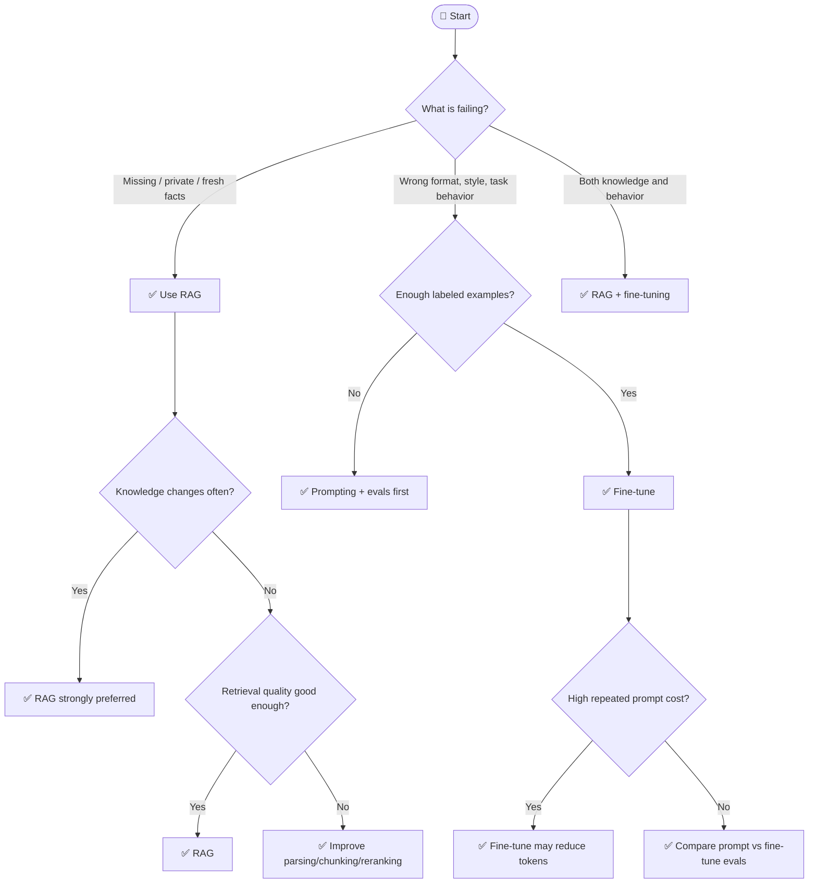

## Overview

> **TL;DR:** Use RAG to add or update knowledge. Use fine-tuning to change behavior, format, style, or task skill. Use both when the system needs private knowledge and specialized behavior.

This is one of the most common AI engineering decisions. The key is to separate **knowledge injection** from **behavior adaptation**.

## Why It's in the Arsenal

Teams often fine-tune when they need retrieval, or add RAG when they need behavioral consistency. This decision tree prevents expensive wrong turns.

## Key Features

- Starts with data availability and problem type
- Separates knowledge freshness from behavior/style improvement
- Includes cost structure and hybrid approach guidance

## Architecture / How It Works



### Core Tradeoff Matrix

| Dimension | RAG | Fine-Tuning |
|---|---|---|
| Adds new/private knowledge | Excellent | Poor fit |
| Handles frequently changing facts | Excellent | Poor fit |
| Changes tone/style/output format | Medium | Excellent |
| Improves narrow repeated task behavior | Medium | Excellent |
| Requires labeled examples | Optional | Usually yes |
| Easier to update | Usually yes | No, retrain/redeploy |
| Easier to cite sources | Yes | No |
| Main cost | retrieval infra + tokens | training + serving + eval |

### When RAG Always Wins

- Knowledge changes weekly/daily/hourly.
- Users require citations or source review.
- Data is private and should not be baked into weights.
- The model already knows how to answer if given the right context.

### When Fine-Tuning Always Wins

- Output format must be consistent across thousands/millions of calls.
- You have enough high-quality labeled examples.
- The model repeatedly fails a narrow behavior despite good prompts.
- You want to reduce long repeated instruction prompts.

### Gray Area

Use a hybrid when:

- The model needs private knowledge and a domain-specific response style.
- RAG retrieves correct context but the model uses it poorly.
- A small fine-tuned model can handle routing/formatting before a RAG step.

## Getting Started

```bash
# RAG baseline: build retrieval evals first
# Fine-tune baseline: collect labeled examples before training
```

## Use Cases

1. **Scenario**: You need a fast shortlist without reading every project entry first
2. **Scenario**: You want to explain an architecture choice to a teammate or reviewer
3. **Scenario**: You are giving an LLM/agent structured context for stack selection

## Strengths

- Converts a broad tool category into explicit decision logic
- Links leaf-node recommendations to canonical Arsenal entries
- Includes both Mermaid and plain-text forms for humans and LLMs

## Limitations / When NOT to Use

- Does not replace hands-on benchmarks with your actual data and traffic
- Pricing, model availability, quotas, and hosted-service limits can change
- Regulated environments still require legal, security, and compliance review

## Integration Patterns

- Start with the Mermaid tree for fast orientation.
- Use the text decision tree when copying into LLM context or design docs.
- Open the linked canonical entries before making a production commitment.
- Run a proof of concept and evaluation before standardizing on a tool.

## Resources

- [LlamaIndex](../../projects/frameworks/llamaindex.md)
- [LangChain for RAG](../../projects/frameworks/langchain.md)
- [Ragas for RAG Evaluation](../../projects/benchmarks-and-evals/ragas-rag-evaluation.md)
- [Unsloth](../../tools/model-layer/unsloth.md)
- [Axolotl](../../tools/model-layer/axolotl.md)
- [PEFT](../../tools/model-layer/peft.md)

## Buzz & Reception

Decision-tree pages are maintained as high-value LLM/agent routing context. They should be updated whenever major tooling or model defaults shift.

---
*Last reviewed: 2026-06-13 by @maintainer*

