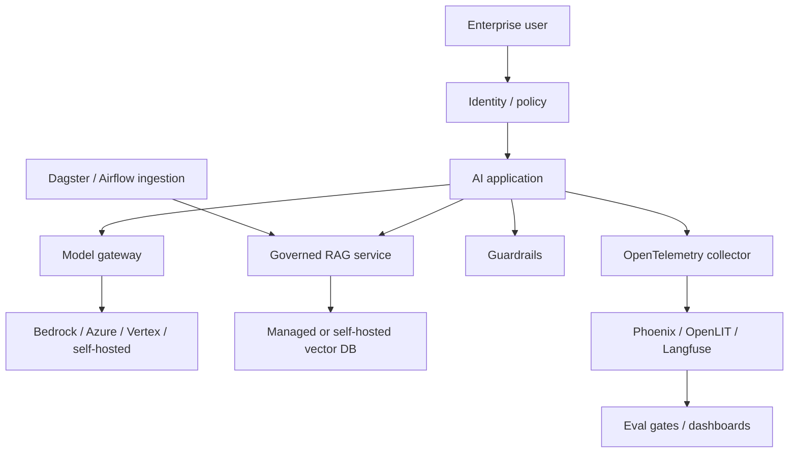

## Overview

This reference stack is an opinionated baseline for governed, regulated, or multi-team AI systems — not a universally better stack than a simpler production setup, but a deliberately heavier one whose cost is only justified by real governance requirements. It prioritizes identity, auditability, observability, evaluation, and cloud alignment over minimal setup, which is the correct tradeoff specifically for the organizations described in When to Use, and the wrong one for everyone else.

## The Decision

This is fundamentally a progressive decision: most organizations should start with a simpler production stack and adopt this stack's governance layers specifically once a triggering requirement appears (regulatory audit need, a second team needing shared model access, a compliance review). Adopting the full enterprise stack speculatively, before those requirements exist, means paying its cost and complexity floor for value that isn't being used yet.

## Decision Framework

| Layer | Tool | Why This Choice |
|---|---|---|
| Cloud Platform | AWS Bedrock / Azure AI Studio / Vertex AI | Use existing enterprise cloud controls |
| Gateway | LiteLLM / Portkey-style gateway | Central model routing, budgets, policy, and audit |
| Orchestration | Microsoft Agent Framework / LangGraph | Production agent/workflow control |
| Data/RAG | Qdrant / Weaviate / managed vector DB | Governed retrieval with metadata and tenancy |
| Observability | OpenTelemetry + Phoenix/OpenLIT/Langfuse | Trace and evaluate across services |
| Security | Llama Guard / NeMo Guardrails | Layered input/output and action guardrails |
| Workflow Ops | Dagster / Airflow | Scheduled ingestion, eval, and data pipelines |

Getting started: choose the enterprise cloud platform first, then enforce policy through the gateway and observability layers before adding autonomous agent capability — do not start with autonomous agents before identity, logging, and eval gates exist.

## Approach Deep-Dives

**The enterprise-scale stack** separates policy, model access, data access, and observability into distinct, independently governable layers — this is the source of both its value (auditability, centralized control) and its cost (each layer is real infrastructure to operate). At small-startup scale, expect $1,000-$10,000/month; at real scale, $10,000+, dominated by cloud services, gateway, observability retention, and managed databases, plus the platform/support team needed to operate it. **The production RAG stack** (see [Production RAG Stack](./production-rag.md)) provides most of the same component categories (RAG framework, vector DB, evaluation, observability) without the centralized governance layer, at a materially lower cost floor — the right choice whenever the enterprise stack's specific governance requirements (audit, multi-team budget/policy, regulatory compliance) aren't yet present.

## Common Mistakes

- **Adopting full enterprise governance for a single-team, non-regulated application.** This pays the cost/complexity floor for value nobody is using.
- **Starting autonomous agents before identity, logging, and eval gates exist.** This undermines the entire governance rationale for choosing this stack.
- **Skipping the gateway layer and calling a cloud provider's model API directly**, reintroducing the vendor lock-in this stack's gateway layer exists specifically to avoid.

## When This Guidance Might Be Outdated

Confidence is `established` for the overall governance-layering pattern itself (identity → gateway → guardrails → observability is a stable enterprise architecture pattern), but the specific tool recommendations at each layer should be re-checked periodically as the gateway and guardrails tool categories are less mature than the pattern itself.

## Related Decisions

Directly related to [Production RAG Stack](./production-rag.md) as the lighter-weight alternative, and to [Choosing a Deployment Target](../serving-patterns/choose-deployment-target.md) and [Choosing an Observability Tool](../evaluation-strategy/choose-observability-tool.md), both of which this stack's layers depend on.

## Resources

- [AWS Bedrock](../../tools/serving-and-deployment/aws-bedrock.md)
- [Azure AI Studio](../../tools/serving-and-deployment/azure-ai-studio.md)
- [Google Vertex AI](../../tools/serving-and-deployment/google-vertex-ai.md)
- [Microsoft Agent Framework](../../projects/frameworks/microsoft-agent-framework.md)
- [LangGraph](../../projects/frameworks/langgraph.md)
- [Qdrant](../../projects/data-and-retrieval/qdrant.md)
- [OpenLIT](../../projects/benchmarks-and-evals/openlit.md)
- [NeMo Guardrails](../../tools/evaluation-and-observability/nemo-guardrails.md)

---
*Last reviewed: 2026-07-06 by @maintainer*
