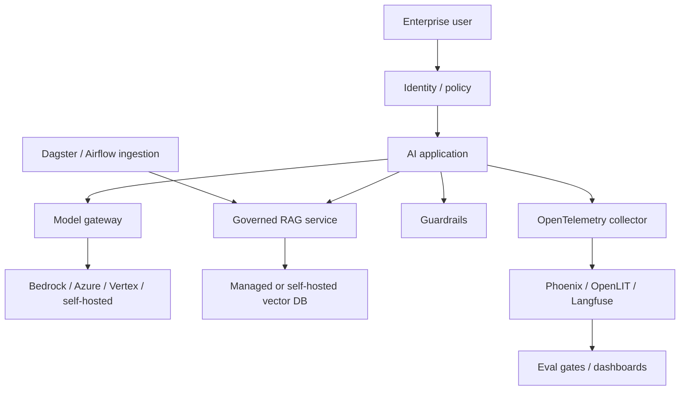

> **TL;DR:** Enterprise stack for governed AI applications in regulated or large organizations. Prioritizes identity, auditability, observability, evaluation, and cloud alignment over minimal setup.

## Overview

This reference stack is an opinionated baseline. It is not the only valid architecture, but it gives teams a coherent starting point with known component boundaries.

## Stack at a Glance

| Layer | Tool | Why This Choice |
|---|---|---|
| Cloud Platform | AWS Bedrock / Azure AI Studio / Vertex AI | Use existing enterprise cloud controls |
| Gateway | LiteLLM / Portkey-style gateway | Central model routing, budgets, policy, and audit |
| Orchestration | Microsoft Agent Framework / LangGraph | Production agent/workflow control |
| Data/RAG | Qdrant / Weaviate / managed vector DB | Governed retrieval with metadata and tenancy |
| Observability | OpenTelemetry + Phoenix/OpenLIT/Langfuse | Trace and evaluate across services |
| Security | Llama Guard / NeMo Guardrails | Layered input/output and action guardrails |
| Workflow Ops | Dagster / Airflow | Scheduled ingestion, eval, and data pipelines |

## Why It's in the Arsenal

A stack is more useful than a list of tools when the components are selected to work together. This page shows the tradeoffs, operating assumptions, and links to canonical entries.

## Key Features

- Optimized for governance and repeatability
- Assumes centralized platform controls
- Separates policy, model access, data access, and observability

## Architecture / How It Works



## When to Use This Stack

1. **Scenario**: Large organization with existing cloud/security standards
2. **Scenario**: Regulated workloads requiring audit and access control
3. **Scenario**: Multiple AI apps sharing model access, budgets, and observability

## When NOT to Use This Stack

- Small teams that need to ship in days
- Simple internal prototype with no compliance needs
- Organizations without platform/DevOps support

## Getting Started

```bash
# Choose the enterprise cloud first, then enforce policy through gateway + observability.
# Do not start with autonomous agents before identity, logging, and eval gates exist.
```

## Cost Estimate

| Usage Level | Expected Monthly Cost | Main Cost Drivers |
|---|---:|---|
| Hobbyist | Not recommended | Too much platform overhead |
| Small startup | $1,000-$10,000 | Cloud services, gateway, observability, managed DBs |
| Scale | $10,000+ | Usage volume, compliance, support, platform teams |

> Cost estimates are directional. Verify provider pricing, token volume, GPU availability, data storage, and observability retention before committing.

## Use Cases

1. **Scenario**: Large organization with existing cloud/security standards
2. **Scenario**: Regulated workloads requiring audit and access control
3. **Scenario**: Multiple AI apps sharing model access, budgets, and observability

## Strengths

- Components map cleanly to responsibilities, making the system easier to debug.
- Each major layer has a canonical Arsenal entry for deeper comparison.
- The stack can be simplified or scaled without changing the whole architecture at once.

## Limitations / When NOT to Use

- Small teams that need to ship in days
- Simple internal prototype with no compliance needs
- Organizations without platform/DevOps support

## Component Deep Dives

- **AWS Bedrock**: [AWS Bedrock](../../tools/serving-and-deployment/aws-bedrock.md)
- **Azure AI Studio**: [Azure AI Studio](../../tools/serving-and-deployment/azure-ai-studio.md)
- **Google Vertex AI**: [Google Vertex AI](../../tools/serving-and-deployment/google-vertex-ai.md)
- **Microsoft Agent Framework**: [Microsoft Agent Framework](../../projects/frameworks/microsoft-agent-framework.md)
- **LangGraph**: [LangGraph](../../projects/frameworks/langgraph.md)
- **Qdrant**: [Qdrant](../../projects/data-and-retrieval/qdrant.md)
- **OpenLIT**: [OpenLIT](../../projects/observability/tracing/openlit.md)
- **NeMo Guardrails**: [NeMo Guardrails](../../tools/evaluation-and-observability/nemo-guardrails.md)

## Integration Patterns

- Keep application code, model serving, retrieval, and observability as separate layers.
- Attach trace IDs across user requests, retrieval calls, model calls, and tool calls.
- Promote production failures into evaluation datasets before changing prompts or retrievers.
- Start with managed components when speed matters; move to self-hosted components only when control or economics justify it.

## Resources

- [AWS Bedrock](../../tools/serving-and-deployment/aws-bedrock.md)
- [Azure AI Studio](../../tools/serving-and-deployment/azure-ai-studio.md)
- [Google Vertex AI](../../tools/serving-and-deployment/google-vertex-ai.md)
- [Microsoft Agent Framework](../../projects/frameworks/microsoft-agent-framework.md)
- [LangGraph](../../projects/frameworks/langgraph.md)
- [Qdrant](../../projects/data-and-retrieval/qdrant.md)
- [OpenLIT](../../projects/observability/tracing/openlit.md)
- [NeMo Guardrails](../../tools/evaluation-and-observability/nemo-guardrails.md)

## Buzz & Reception

Reference stacks are maintained as opinionated starting points. They should be revisited whenever model pricing, tool maturity, or deployment patterns change.

---
*Last reviewed: 2026-06-13 by @maintainer*

