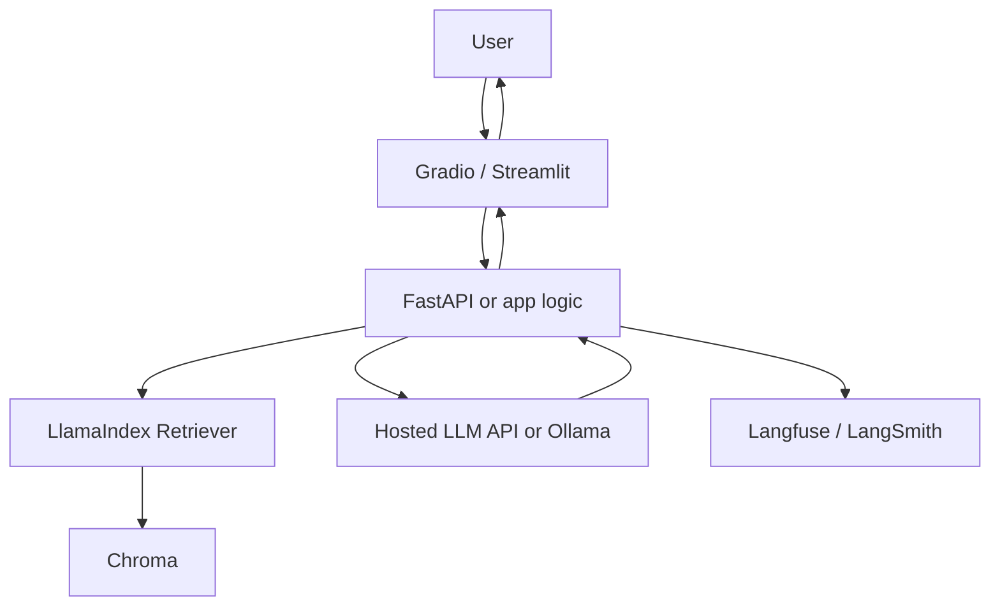

> **TL;DR:** Solo dev stack for proving an AI idea quickly. Uses hosted models, simple RAG, lightweight UI, and minimal infrastructure.

## Overview

This reference stack is an opinionated baseline. It is not the only valid architecture, but it gives teams a coherent starting point with known component boundaries.

## Stack at a Glance

| Layer | Tool | Why This Choice |
|---|---|---|
| UI | Gradio or Streamlit | Fastest Python-first path to a working demo |
| LLM | Hosted API or Ollama | Hosted for quality/speed; Ollama for local/private demos |
| RAG Framework | LlamaIndex | Fast ingestion and retrieval abstractions |
| Vector DB | Chroma | Minimal local setup for prototypes |
| Observability | Langfuse or LangSmith | Basic traces before users test the app |
| Deployment | Railway or Fly.io | Low-friction hosting for MVP APIs/apps |

## Why It's in the Arsenal

A stack is more useful than a list of tools when the components are selected to work together. This page shows the tradeoffs, operating assumptions, and links to canonical entries.

## Key Features

- Prioritizes build speed over perfect architecture
- Keeps all components swappable
- Uses tracing early to avoid debugging blind spots

## Architecture / How It Works



## When to Use This Stack

1. **Scenario**: Weekend prototype or internal demo
2. **Scenario**: Solo developer validating product demand
3. **Scenario**: Small RAG app over a few documents

## When NOT to Use This Stack

- Strict enterprise compliance requirements
- High-throughput production serving
- Large multi-tenant workloads with strict isolation

## Getting Started

```bash
pip install gradio llama-index chromadb langfuse
# Build UI + ingestion + query path first
# Add deployment only after local eval passes
```

## Cost Estimate

| Usage Level | Expected Monthly Cost | Main Cost Drivers |
|---|---:|---|
| Hobbyist | $0-$50 | Hosted model tokens or local compute |
| Small startup | $50-$300 | API tokens, hosting, observability retention |
| Scale | Not recommended | Move to production RAG stack |

> Cost estimates are directional. Verify provider pricing, token volume, GPU availability, data storage, and observability retention before committing.

## Use Cases

1. **Scenario**: Weekend prototype or internal demo
2. **Scenario**: Solo developer validating product demand
3. **Scenario**: Small RAG app over a few documents

## Strengths

- Components map cleanly to responsibilities, making the system easier to debug.
- Each major layer has a canonical Arsenal entry for deeper comparison.
- The stack can be simplified or scaled without changing the whole architecture at once.

## Limitations / When NOT to Use

- Strict enterprise compliance requirements
- High-throughput production serving
- Large multi-tenant workloads with strict isolation

## Component Deep Dives

- **Gradio**: [Gradio](../../tools/dx-and-tooling/gradio.md)
- **Streamlit**: [Streamlit](../../tools/dx-and-tooling/streamlit.md)
- **LlamaIndex**: [LlamaIndex](../../projects/frameworks/llamaindex.md)
- **Chroma**: [Chroma](../../projects/data-and-retrieval/chroma.md)
- **Ollama**: [Ollama](../../projects/inference-engines/ollama.md)
- **Railway**: [Railway](../../tools/serving-and-deployment/railway.md)

## Integration Patterns

- Keep application code, model serving, retrieval, and observability as separate layers.
- Attach trace IDs across user requests, retrieval calls, model calls, and tool calls.
- Promote production failures into evaluation datasets before changing prompts or retrievers.
- Start with managed components when speed matters; move to self-hosted components only when control or economics justify it.

## Resources

- [Gradio](../../tools/dx-and-tooling/gradio.md)
- [Streamlit](../../tools/dx-and-tooling/streamlit.md)
- [LlamaIndex](../../projects/frameworks/llamaindex.md)
- [Chroma](../../projects/data-and-retrieval/chroma.md)
- [Ollama](../../projects/inference-engines/ollama.md)
- [Railway](../../tools/serving-and-deployment/railway.md)

## Buzz & Reception

Reference stacks are maintained as opinionated starting points. They should be revisited whenever model pricing, tool maturity, or deployment patterns change.

---
*Last reviewed: 2026-06-13 by @maintainer*

