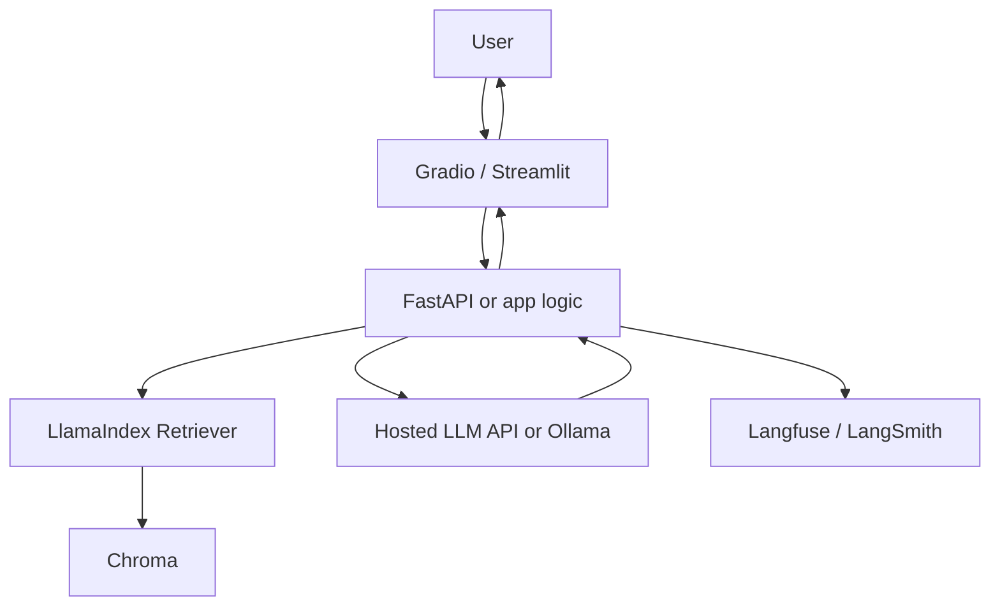

## Overview

This reference stack is an opinionated baseline for proving an AI product idea works before investing in production infrastructure. It prioritizes build speed over architectural completeness deliberately — every component is chosen to minimize time-to-working-demo, with the explicit expectation that a validated idea graduates to a more durable stack (see [Production RAG Stack](./production-rag.md)) rather than this stack being hardened in place indefinitely.

## The Decision

This is a progressive decision, not a permanent architectural commitment: the lean stack is the correct starting point for validating a new idea, and staying on it after validation (once real users and real traffic exist) is itself a common mistake this entry calls out explicitly. The signal to graduate is concrete, not a vague sense that things are getting more serious — actual traffic or reliability requirements exceeding what this stack's minimal-setup components comfortably handle.

## Decision Framework

| Layer | Tool | Why This Choice |
|---|---|---|
| UI | Gradio or Streamlit | Fastest Python-first path to a working demo |
| LLM | Hosted API or Ollama | Hosted for quality/speed; Ollama for local/private demos |
| RAG Framework | LlamaIndex | Fast ingestion and retrieval abstractions |
| Vector DB | Chroma | Minimal local setup for prototypes |
| Observability | Langfuse or LangSmith | Basic traces before users test the app |
| Deployment | Railway or Fly.io | Low-friction hosting for MVP APIs/apps |



Getting started:
```bash
pip install gradio llama-index chromadb langfuse
# Build UI + ingestion + query path first
# Add deployment only after local eval passes
```

## Approach Deep-Dives

**The lean MVP stack** keeps every component swappable by design — this is not an accident of using simple tools, but the deliberate point: a solo developer or small team should be able to prove an idea works and migrate individual components later without a full rewrite. Cost stays low ($0-$300/month across hobbyist to small-startup scale) because every choice (hosted API or Ollama, Chroma over a production vector DB, a simple host over Kubernetes) trades production robustness for near-zero setup friction. **Graduating to the production RAG stack** is the correct next step once real user traffic exposes requirements this stack doesn't address: durability under concurrent load, evaluation regression gates, multi-tenant isolation, and dedicated observability retention.

## Common Mistakes

- **Building production durability before validating product demand.** This is premature investment in exactly the direction this stack exists to avoid.
- **Staying on the lean stack past validated product-market fit.** The stack's own guidance flags scale as "not recommended" for a reason.
- **Treating component choices as permanent architecture rather than deliberately swappable placeholders.**

## When This Guidance Might Be Outdated

Confidence is `established` for the overall "validate cheap, then graduate" pattern, which is a stable product-development principle independent of the AI tooling landscape — but the specific component recommendations (Gradio/Streamlit, Chroma, Railway/Fly.io) should be re-checked periodically as the fastest-to-set-up options in each category can shift.

## Related Decisions

Directly precedes [Production RAG Stack](./production-rag.md) as the natural graduation path, and interacts with [Choosing a Deployment Target](../serving-patterns/choose-deployment-target.md) for the hosting-layer decision specifically.

## Resources

- [Gradio](../../tools/dx-and-tooling/gradio.md)
- [Streamlit](../../tools/dx-and-tooling/streamlit.md)
- [LlamaIndex](../../projects/frameworks/llamaindex.md)
- [Chroma](../../projects/data-and-retrieval/chroma.md)
- [Ollama](../../projects/inference-engines/ollama.md)
- [Railway](../../tools/serving-and-deployment/railway.md)

---
*Last reviewed: 2026-07-06 by @maintainer*
