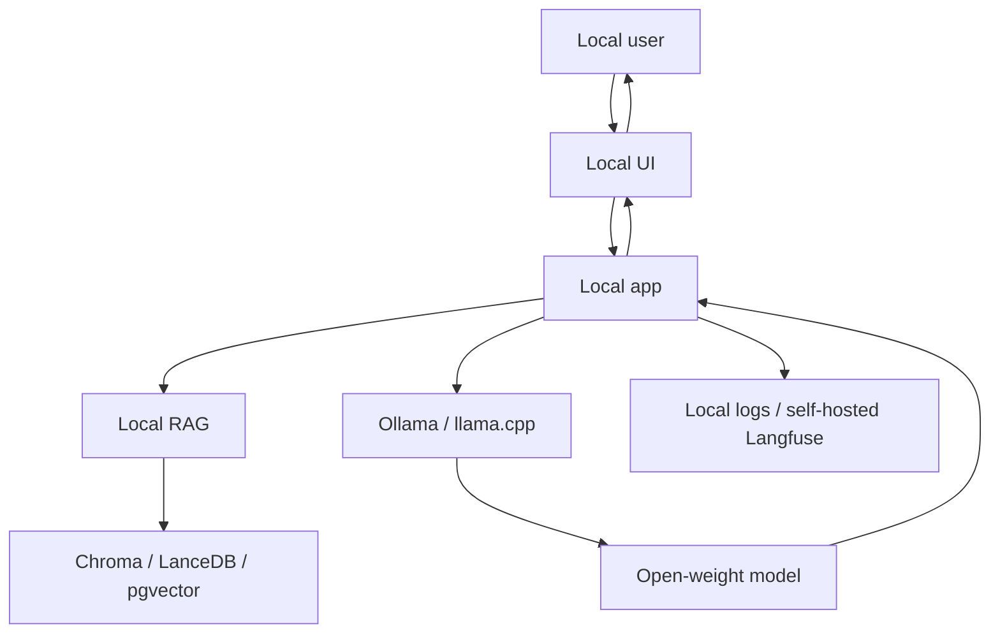

## Overview

This reference stack is an opinionated baseline for privacy-first, offline, or cost-controlled AI applications where no data or inference call leaves the local device or network. It keeps data and inference under local control by construction, at the cost of a capability ceiling versus frontier hosted models — a tradeoff worth making explicitly rather than assuming, since the size of that gap varies by task and shifts over time.

## The Decision

The forcing function for this stack is almost always data residency, offline operation, or cost-per-token sensitivity at high volume — if none of these apply, a cloud API stack likely serves the same application shape with less operational burden and a higher capability ceiling. The one factor genuinely worth checking per-task rather than assuming is model capability: local open-weight models have closed much of the gap with frontier hosted models for many tasks, but hard reasoning tasks may still favor a hosted model, and this should be validated against your specific use case rather than treated as settled.

## Decision Framework

| Layer | Tool | Why This Choice |
|---|---|---|
| LLM Runtime | Ollama | Fastest local model UX for developers |
| Low-level Runtime | llama.cpp | Portable GGUF inference and edge deployment |
| Models | Llama / Qwen / Gemma / Phi | Open-weight families with local variants |
| RAG Framework | LlamaIndex or txtai | Local indexing and retrieval workflows |
| Vector DB | Chroma / LanceDB / pgvector | Local-first vector storage options |
| UI | Gradio / Open WebUI-style frontend | Local user interface |
| Observability | Langfuse self-host or local logs | Trace locally when data cannot leave environment |



Getting started:
```bash
ollama pull llama3.1
ollama run llama3.1
pip install llama-index chromadb gradio
# Keep all documents, embeddings, and traces local.
```

## Approach Deep-Dives

**The local-first stack** works well for demos, private corpora, and offline use, and can graduate to self-hosted server inference (see [Choosing a Deployment Target](../serving-patterns/choose-deployment-target.md)'s self-hosted high-throughput serving path) without changing the overall architecture, just the inference layer's scale. **A cloud API stack** covering the same application shape (see [Lean MVP Stack](./lean-mvp.md) or [Production RAG Stack](./production-rag.md)) removes the local-hardware capability ceiling and per-hardware maintenance burden, at the cost of per-token billing and data leaving the local environment.

## Common Mistakes

- **Committing to local-first for a task that needs frontier reasoning quality**, discovering the gap only after building — check this against your specific task upfront.
- **Deploying to weak local hardware with no server fallback**, producing an unacceptably slow experience a hybrid approach would avoid.
- **Assuming local-first is automatically cheaper at scale.** Local hardware has real procurement/maintenance costs that can exceed cloud billing for certain usage patterns — calculate rather than assume.

## When This Guidance Might Be Outdated

Confidence is `evolving` because the capability gap between local open-weight models and frontier hosted models continues to shift — the "When NOT to Use" guidance about needing frontier quality should be re-checked against current open-weight model benchmarks for your specific task category, not assumed to remain the same gap indefinitely.

## Related Decisions

Directly related to [Choosing a Model](../model-selection/choose-llm.md)'s local-vs-cloud fork (this stack is essentially the local-first path fully realized as a complete stack), and to [Lean MVP Stack](./lean-mvp.md) as the closest cloud-API-based equivalent in scope and complexity.

## Resources

- [Ollama](../../projects/inference-engines/ollama.md)
- [llama.cpp](../../projects/inference-engines/llama-cpp.md)
- [Llama 3.x](../../projects/foundation-models/llama-3.md)
- [Qwen 2.5 / QwQ](../../projects/foundation-models/qwen-2-5.md)
- [Gemma 3](../../projects/foundation-models/gemma-3.md)
- [Chroma](../../projects/data-and-retrieval/chroma.md)
- [LanceDB](../../projects/data-and-retrieval/lancedb.md)

---
*Last reviewed: 2026-07-06 by @maintainer*
