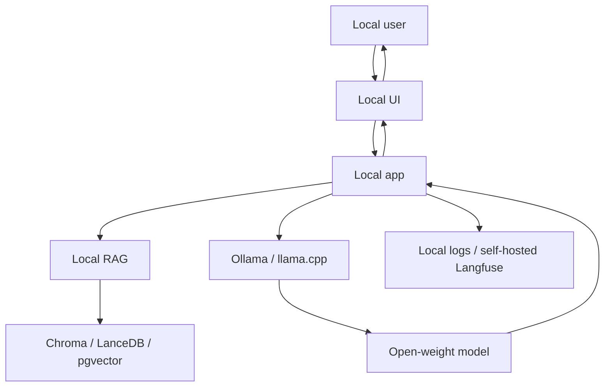

> **TL;DR:** Privacy-first stack for local or offline AI applications. Uses Ollama or llama.cpp, local embeddings, local vector storage, and optional self-hosted observability.

## Overview

This reference stack is an opinionated baseline. It is not the only valid architecture, but it gives teams a coherent starting point with known component boundaries.

## Stack at a Glance

| Layer | Tool | Why This Choice |
|---|---|---|
| LLM Runtime | Ollama | Fastest local model UX for developers |
| Low-level Runtime | llama.cpp | Portable GGUF inference and edge deployment |
| Models | Llama / Qwen / Gemma / Phi | Open-weight families with local variants |
| RAG Framework | LlamaIndex or txtai | Local indexing and retrieval workflows |
| Vector DB | Chroma / LanceDB / pgvector | Local-first vector storage options |
| UI | Gradio / Open WebUI-style frontend | Local user interface |
| Observability | Langfuse self-host or local logs | Trace locally when data cannot leave environment |

## Why It's in the Arsenal

A stack is more useful than a list of tools when the components are selected to work together. This page shows the tradeoffs, operating assumptions, and links to canonical entries.

## Key Features

- Keeps data and inference under local control
- Works well for demos, private corpora, and offline use
- Can graduate to self-hosted server inference later

## Architecture / How It Works



## When to Use This Stack

1. **Scenario**: Sensitive data cannot leave the device or network
2. **Scenario**: Offline demos and field deployments
3. **Scenario**: Cost-controlled prototypes without per-token cloud billing

## When NOT to Use This Stack

- Need frontier-model quality on hard reasoning tasks
- Need centralized multi-tenant governance immediately
- Users have weak local hardware and no server option

## Getting Started

```bash
ollama pull llama3.1
ollama run llama3.1
pip install llama-index chromadb gradio
# Keep all documents, embeddings, and traces local.
```

## Cost Estimate

| Usage Level | Expected Monthly Cost | Main Cost Drivers |
|---|---:|---|
| Hobbyist | $0-$50 | Local hardware and optional UI hosting |
| Small startup | $100-$1,000 | Local server/GPU, storage, ops |
| Scale | Varies widely | Hardware procurement, maintenance, support |

> Cost estimates are directional. Verify provider pricing, token volume, GPU availability, data storage, and observability retention before committing.

## Use Cases

1. **Scenario**: Sensitive data cannot leave the device or network
2. **Scenario**: Offline demos and field deployments
3. **Scenario**: Cost-controlled prototypes without per-token cloud billing

## Strengths

- Components map cleanly to responsibilities, making the system easier to debug.
- Each major layer has a canonical Arsenal entry for deeper comparison.
- The stack can be simplified or scaled without changing the whole architecture at once.

## Limitations / When NOT to Use

- Need frontier-model quality on hard reasoning tasks
- Need centralized multi-tenant governance immediately
- Users have weak local hardware and no server option

## Component Deep Dives

- **Ollama**: [Ollama](../../projects/inference-engines/ollama.md)
- **llama.cpp**: [llama.cpp](../../projects/inference-engines/llama-cpp.md)
- **Llama 3.x**: [Llama 3.x](../../projects/foundation-models/llama-3.md)
- **Qwen 2.5 / QwQ**: [Qwen 2.5 / QwQ](../../projects/foundation-models/qwen-2-5.md)
- **Gemma 3**: [Gemma 3](../../projects/foundation-models/gemma-3.md)
- **Chroma**: [Chroma](../../projects/rag/vector-databases/chroma.md)
- **LanceDB**: [LanceDB](../../projects/rag/vector-databases/lancedb.md)

## Integration Patterns

- Keep application code, model serving, retrieval, and observability as separate layers.
- Attach trace IDs across user requests, retrieval calls, model calls, and tool calls.
- Promote production failures into evaluation datasets before changing prompts or retrievers.
- Start with managed components when speed matters; move to self-hosted components only when control or economics justify it.

## Resources

- [Ollama](../../projects/inference-engines/ollama.md)
- [llama.cpp](../../projects/inference-engines/llama-cpp.md)
- [Llama 3.x](../../projects/foundation-models/llama-3.md)
- [Qwen 2.5 / QwQ](../../projects/foundation-models/qwen-2-5.md)
- [Gemma 3](../../projects/foundation-models/gemma-3.md)
- [Chroma](../../projects/rag/vector-databases/chroma.md)
- [LanceDB](../../projects/rag/vector-databases/lancedb.md)

## Buzz & Reception

Reference stacks are maintained as opinionated starting points. They should be revisited whenever model pricing, tool maturity, or deployment patterns change.

---
*Last reviewed: 2026-06-13 by @maintainer*

