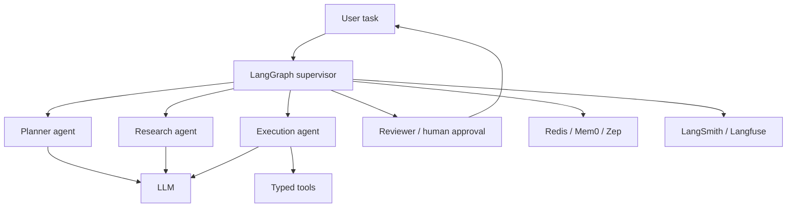

> **TL;DR:** Multi-agent stack for complex task automation with explicit state, tools, memory, and human review. Uses LangGraph as the control plane and observability for every agent run.

## Overview

This reference stack is an opinionated baseline. It is not the only valid architecture, but it gives teams a coherent starting point with known component boundaries.

## Stack at a Glance

| Layer | Tool | Why This Choice |
|---|---|---|
| Orchestration | LangGraph | Explicit graph state, branching, retries, and human-in-the-loop |
| Role Patterns | CrewAI / MetaGPT patterns | Useful mental model for role decomposition |
| LLM | Hosted model or self-hosted Qwen/Llama | Quality-first for planning; self-host where privacy requires |
| Tools | Instructor / Pydantic AI | Typed tool inputs and structured outputs |
| Memory | Redis + Mem0/Zep as needed | Fast state plus optional long-term semantic memory |
| Observability | LangSmith or Langfuse | Trace agent steps, tool calls, and eval outcomes |

## Why It's in the Arsenal

A stack is more useful than a list of tools when the components are selected to work together. This page shows the tradeoffs, operating assumptions, and links to canonical entries.

## Key Features

- Prioritizes controllability over agent novelty
- Uses typed tool contracts to reduce unsafe execution
- Separates short-term state from long-term memory

## Architecture / How It Works



## When to Use This Stack

1. **Scenario**: Long-running tasks with multiple stages
2. **Scenario**: Workflows requiring approval or rollback
3. **Scenario**: Automation where tool calls must be validated and traced

## When NOT to Use This Stack

- Simple chatbot or single-step workflow
- Tasks without clear success criteria
- Systems where autonomous actions cannot be sandboxed safely

## Getting Started

```bash
pip install langgraph langfuse instructor redis
# Model roles first, then state transitions, then tools, then memory.
# Add human approval before high-impact actions.
```

## Cost Estimate

| Usage Level | Expected Monthly Cost | Main Cost Drivers |
|---|---:|---|
| Hobbyist | $20-$150 | LLM calls and local Redis |
| Small startup | $500-$3,000 | Token volume, traces, evals, tool execution |
| Scale | $3,000+ | Agent loops, observability volume, human review ops |

> Cost estimates are directional. Verify provider pricing, token volume, GPU availability, data storage, and observability retention before committing.

## Use Cases

1. **Scenario**: Long-running tasks with multiple stages
2. **Scenario**: Workflows requiring approval or rollback
3. **Scenario**: Automation where tool calls must be validated and traced

## Strengths

- Components map cleanly to responsibilities, making the system easier to debug.
- Each major layer has a canonical Arsenal entry for deeper comparison.
- The stack can be simplified or scaled without changing the whole architecture at once.

## Limitations / When NOT to Use

- Simple chatbot or single-step workflow
- Tasks without clear success criteria
- Systems where autonomous actions cannot be sandboxed safely

## Component Deep Dives

- **LangGraph**: [LangGraph](../../projects/agents/frameworks/langgraph.md)
- **CrewAI**: [CrewAI](../../projects/agents/frameworks/crewai.md)
- **MetaGPT**: [MetaGPT](../../projects/agents/frameworks/metagpt.md)
- **Instructor**: [Instructor](../../tools/by-job/instructor.md)
- **Pydantic AI**: [Pydantic AI](../../tools/by-job/pydantic-ai-tool.md)
- **Redis**: [Redis](../../tools/by-job/redis-memory.md)
- **Langfuse**: [Langfuse](../../projects/observability/tracing/langfuse.md)

## Integration Patterns

- Keep application code, model serving, retrieval, and observability as separate layers.
- Attach trace IDs across user requests, retrieval calls, model calls, and tool calls.
- Promote production failures into evaluation datasets before changing prompts or retrievers.
- Start with managed components when speed matters; move to self-hosted components only when control or economics justify it.

## Resources

- [LangGraph](../../projects/agents/frameworks/langgraph.md)
- [CrewAI](../../projects/agents/frameworks/crewai.md)
- [MetaGPT](../../projects/agents/frameworks/metagpt.md)
- [Instructor](../../tools/by-job/instructor.md)
- [Pydantic AI](../../tools/by-job/pydantic-ai-tool.md)
- [Redis](../../tools/by-job/redis-memory.md)
- [Langfuse](../../projects/observability/tracing/langfuse.md)

## Buzz & Reception

Reference stacks are maintained as opinionated starting points. They should be revisited whenever model pricing, tool maturity, or deployment patterns change.

---
*Last reviewed: 2026-06-13 by @maintainer*

