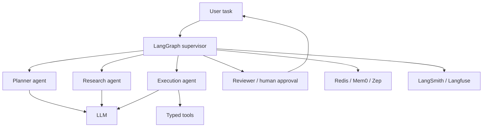

## Overview

This reference stack is an opinionated baseline for complex task automation requiring multiple AI roles and durable state — it prioritizes controllability over agent novelty, using typed tool contracts to reduce unsafe execution and separating short-term state from long-term memory. It is a strictly heavier architecture than a single-agent loop, and that added weight should be justified by genuine task structure, not adopted as a default "more sophisticated must be better" choice.

## The Decision

The forcing function for this stack is genuine multi-stage task structure — distinct planning, research, execution, and review responsibilities that benefit from separate state tracking and, often, separate permission scopes. If a task is actually a single bounded tool-calling loop, the multi-agent stack's role decomposition adds cost and debugging surface without a corresponding benefit; see [Simple ReAct Agent](../../build-examples/agent-systems/starter-simple-react-agent.md) and [Multi-Tool Agent](../../build-examples/agent-systems/intermediate-multi-tool-agent.md) for what that simpler shape looks like concretely before assuming you need the full stack described here.

## Decision Framework

| Layer | Tool | Why This Choice |
|---|---|---|
| Orchestration | LangGraph | Explicit graph state, branching, retries, and human-in-the-loop |
| Role Patterns | CrewAI / MetaGPT patterns | Useful mental model for role decomposition |
| LLM | Hosted model or self-hosted Qwen/Llama | Quality-first for planning; self-host where privacy requires |
| Tools | Instructor / Pydantic AI | Typed tool inputs and structured outputs |
| Memory | Redis + Mem0/Zep as needed | Fast state plus optional long-term semantic memory |
| Observability | LangSmith or Langfuse | Trace agent steps, tool calls, and eval outcomes |



Getting started:
```bash
pip install langgraph langfuse instructor redis
# Model roles first, then state transitions, then tools, then memory.
# Add human approval before high-impact actions.
```

## Approach Deep-Dives

**The multi-agent system stack** is justified specifically by multi-stage task structure that benefits from separate roles, separate permission scopes, and explicit review checkpoints — [Multi-Agent Research System](../../build-examples/agent-systems/advanced-multi-agent-research.md) shows this pattern concretely with a planner/researcher/writer/reviewer graph and a bounded review-retry loop. **A single-agent loop** covers a large share of real agent use cases more simply and cheaply — the temptation to reach for full role decomposition before confirming a task actually needs it is one of this stack's most common misapplications.

## Common Mistakes

- **Adopting full role decomposition for a single bounded tool-calling task.** This multiplies cost and debugging surface for no benefit — start with the simpler shape.
- **Expecting orchestration structure to compensate for an ill-defined success criterion.** It doesn't; a poorly specified task fails in a multi-agent system too, with more moving parts.
- **Treating the human-review stage as decorative.** The stack's own guidance calls for human approval before high-impact actions — skipping this undermines its safety rationale.

## When This Guidance Might Be Outdated

Confidence is `evolving` because agent framework APIs and multi-agent orchestration patterns are changing quickly across the ecosystem (see [Choosing an Agent Framework](../model-selection/choose-agent-framework.md) for specific examples of recent API churn) — this stack's specific component recommendations should be re-checked against current framework versions at each review.

## Related Decisions

Directly related to [Choosing an Agent Framework](../model-selection/choose-agent-framework.md) (this stack's orchestration layer is a specific instance of that decision) and [Choosing an Agent Memory Architecture](../system-design/choose-memory-solution.md) (this stack's memory layer choice follows that decision's framework directly).

## Resources

- [LangGraph](../../projects/frameworks/langgraph.md)
- [CrewAI](../../projects/frameworks/crewai.md)
- [MetaGPT](../../projects/frameworks/metagpt.md)
- [Instructor](../../tools/dx-and-tooling/instructor.md)
- [Pydantic AI](../../tools/orchestration/pydantic-ai-tool.md)
- [Redis](../../tools/orchestration/redis-memory.md)
- [Langfuse](../../projects/benchmarks-and-evals/langfuse.md)

---
*Last reviewed: 2026-07-06 by @maintainer*
