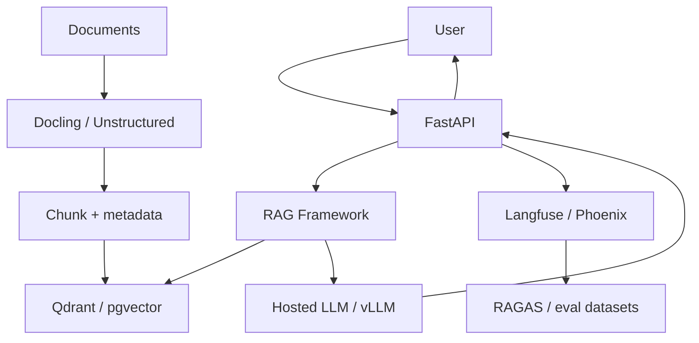

## Overview

This reference stack is the opinionated baseline for production-shaped, user-facing RAG systems. It separates ingestion, retrieval, generation, evaluation, and observability into distinct, independently scalable layers — a deliberately heavier architecture than a prototype needs, justified specifically once real users depend on answer quality and source attribution.

## The Decision

This is a progressive decision from the [Lean MVP Stack](./lean-mvp.md): most RAG products should start lean and graduate here once three conditions are met — real users depending on answer quality, a document corpus stable enough that investing in production ingestion won't be wasted, and team capacity to actually operate the eval and observability layers this stack adds. Adopting this stack's full weight before those conditions hold means paying its complexity cost for infrastructure that either gets rebuilt (unstable corpus) or goes unused (no operational capacity).

## Decision Framework

| Layer | Tool | Why This Choice |
|---|---|---|
| API | FastAPI | Typed Python API around retrieval/generation workflows |
| RAG Framework | LlamaIndex or LangChain | Retrieval pipeline and query orchestration |
| Document Processing | Docling or Unstructured | Reliable parsing before chunking/indexing |
| Vector DB | Qdrant or pgvector | Qdrant for vector workload, pgvector for Postgres-first teams |
| LLM | Hosted API or vLLM | Hosted for fastest launch, vLLM for self-hosted economics/control |
| Evaluation | RAGAS + Phoenix | Measure retrieval and answer quality |
| Observability | Langfuse / Phoenix | Trace retrieval, prompts, cost, and evals |



Getting started:
```bash
pip install fastapi llama-index qdrant-client ragas arize-phoenix langfuse
# 1. Parse docs
# 2. Build index
# 3. Add traces
# 4. Create eval dataset before launch
```

This is a direct implementation reference for [Production RAG API](../../build-examples/rag-systems/intermediate-production-rag-api.md) and [Document Q&A Pipeline](../../build-examples/data-pipelines/intermediate-document-qa-pipeline.md), which build the ingestion and API layers concretely.

## Approach Deep-Dives

**The production RAG stack** treats ingestion as a first-class system rather than a one-off script specifically because document parsing quality dominates downstream retrieval quality — see [Store Parser and Chunker Version With Every Chunk](../../tips-and-tricks/rag-and-retrieval/store-parser-version-with-every-chunk.md) for why this matters in practice. Evaluation and observability are present from day one, not added after a quality incident, which is the entire point of graduating to this stack rather than continuing to iterate on a lean prototype. **The lean MVP stack** remains the correct choice until the specific triggers above (real users, stable corpus, operational capacity) are met — see [Lean MVP Stack](./lean-mvp.md) for the lighter-weight alternative and its own decision criteria.

## Common Mistakes

- **Building the full stack before the corpus stabilizes**, then rebuilding significant portions once the corpus changes shape.
- **Adopting eval/observability layers without the capacity to operate them.** Unused infrastructure costs money without providing reliability benefit.
- **Skipping the eval layer because retrieval "looks good" in manual testing**, then discovering a regression only after a chunking or prompt change ships.

## When This Guidance Might Be Outdated

Confidence is `established` for the overall layering pattern (ingestion/retrieval/generation/eval/observability as separate concerns is a stable RAG architecture principle), but specific tool recommendations at each layer should be re-checked periodically, and cost estimates should be re-verified against current provider pricing at each review cycle.

## Related Decisions

Directly follows from [Lean MVP Stack](./lean-mvp.md) as the natural graduation path, and interacts with [Choosing a Vector Database](../data-strategy/choose-vector-db.md) and [Choosing an Evaluation Strategy](../evaluation-strategy/choose-eval-framework.md) for the specific component decisions within this stack.

## Resources

- [LlamaIndex](../../projects/frameworks/llamaindex.md)
- [LangChain for RAG](../../projects/frameworks/langchain.md)
- [Qdrant](../../projects/data-and-retrieval/qdrant.md)
- [pgvector](../../projects/data-and-retrieval/pgvector.md)
- [Docling](../../projects/data-and-retrieval/docling.md)
- [RAGAS](../../projects/benchmarks-and-evals/ragas-rag-evaluation.md)
- [Phoenix](../../projects/benchmarks-and-evals/phoenix.md)

---
*Last reviewed: 2026-07-06 by @maintainer*
