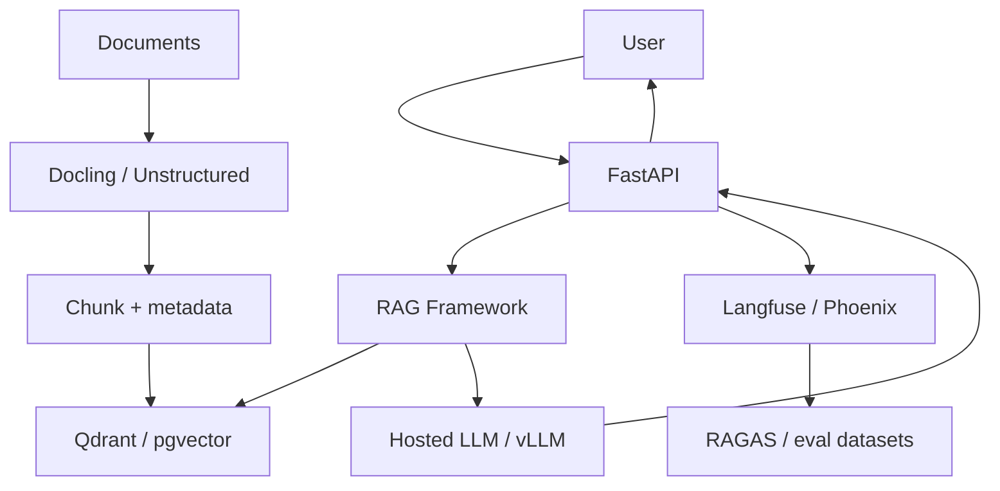

> **TL;DR:** Production stack for user-facing RAG systems. Separates ingestion, retrieval, generation, evaluation, serving, and observability.

## Overview

This reference stack is an opinionated baseline. It is not the only valid architecture, but it gives teams a coherent starting point with known component boundaries.

## Stack at a Glance

| Layer | Tool | Why This Choice |
|---|---|---|
| API | FastAPI | Typed Python API around retrieval/generation workflows |
| RAG Framework | LlamaIndex or LangChain | Retrieval pipeline and query orchestration |
| Document Processing | Docling or Unstructured | Reliable parsing before chunking/indexing |
| Vector DB | Qdrant or pgvector | Qdrant for vector workload, pgvector for Postgres-first teams |
| LLM | Hosted API or vLLM | Hosted for fastest launch, vLLM for self-hosted economics/control |
| Evaluation | RAGAS + Phoenix | Measure retrieval and answer quality |
| Observability | Langfuse / Phoenix | Trace retrieval, prompts, cost, and evals |

## Why It's in the Arsenal

A stack is more useful than a list of tools when the components are selected to work together. This page shows the tradeoffs, operating assumptions, and links to canonical entries.

## Key Features

- Treats ingestion as a first-class system, not a script
- Includes eval and observability from day one
- Supports managed or self-hosted model serving

## Architecture / How It Works



## When to Use This Stack

1. **Scenario**: Startup deploying document Q&A to real users
2. **Scenario**: Internal knowledge assistant with measurable quality needs
3. **Scenario**: RAG app that must support source attribution and regression tests

## When NOT to Use This Stack

- No stable document corpus yet
- Need only a simple FAQ bot
- No team capacity for evals, tracing, or ingestion operations

## Getting Started

```bash
pip install fastapi llama-index qdrant-client ragas arize-phoenix langfuse
# 1. Parse docs
# 2. Build index
# 3. Add traces
# 4. Create eval dataset before launch
```

## Cost Estimate

| Usage Level | Expected Monthly Cost | Main Cost Drivers |
|---|---:|---|
| Hobbyist | $20-$100 | Hosted LLM calls and small vector DB |
| Small startup | $300-$2,000 | Token volume, vector DB, observability retention |
| Scale | $2,000+ | Inference, reranking, storage, eval/trace volume |

> Cost estimates are directional. Verify provider pricing, token volume, GPU availability, data storage, and observability retention before committing.

## Use Cases

1. **Scenario**: Startup deploying document Q&A to real users
2. **Scenario**: Internal knowledge assistant with measurable quality needs
3. **Scenario**: RAG app that must support source attribution and regression tests

## Strengths

- Components map cleanly to responsibilities, making the system easier to debug.
- Each major layer has a canonical Arsenal entry for deeper comparison.
- The stack can be simplified or scaled without changing the whole architecture at once.

## Limitations / When NOT to Use

- No stable document corpus yet
- Need only a simple FAQ bot
- No team capacity for evals, tracing, or ingestion operations

## Component Deep Dives

- **LlamaIndex**: [LlamaIndex](../../projects/frameworks/llamaindex.md)
- **LangChain for RAG**: [LangChain for RAG](../../projects/frameworks/langchain.md)
- **Qdrant**: [Qdrant](../../projects/data-and-retrieval/qdrant.md)
- **pgvector**: [pgvector](../../projects/data-and-retrieval/pgvector.md)
- **Docling**: [Docling](../../projects/data-and-retrieval/docling.md)
- **RAGAS**: [RAGAS](../../projects/benchmarks-and-evals/ragas-rag-evaluation.md)
- **Phoenix**: [Phoenix](../../projects/benchmarks-and-evals/phoenix.md)

## Integration Patterns

- Keep application code, model serving, retrieval, and observability as separate layers.
- Attach trace IDs across user requests, retrieval calls, model calls, and tool calls.
- Promote production failures into evaluation datasets before changing prompts or retrievers.
- Start with managed components when speed matters; move to self-hosted components only when control or economics justify it.

## Resources

- [LlamaIndex](../../projects/frameworks/llamaindex.md)
- [LangChain for RAG](../../projects/frameworks/langchain.md)
- [Qdrant](../../projects/data-and-retrieval/qdrant.md)
- [pgvector](../../projects/data-and-retrieval/pgvector.md)
- [Docling](../../projects/data-and-retrieval/docling.md)
- [RAGAS](../../projects/benchmarks-and-evals/ragas-rag-evaluation.md)
- [Phoenix](../../projects/benchmarks-and-evals/phoenix.md)

## Buzz & Reception

Reference stacks are maintained as opinionated starting points. They should be revisited whenever model pricing, tool maturity, or deployment patterns change.

---
*Last reviewed: 2026-06-13 by @maintainer*

