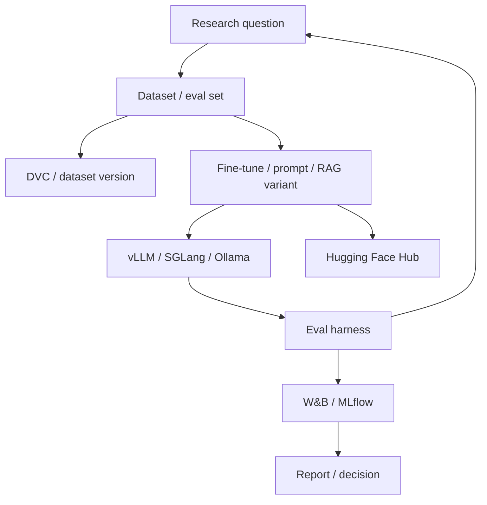

## Overview

This reference stack is the opinionated baseline for repeatable model, agent, and retrieval experiments. It prioritizes reproducibility over minimal setup, making datasets and evals first-class artifacts — the correct tradeoff for systematic research and comparison work, and the wrong one for a product MVP where shipping speed is the actual priority.

## The Decision

The fork here is about primary goal, not maturity stage the way Lean MVP → Production RAG is: this isn't "start simple, graduate later," it's "these serve genuinely different purposes." If the immediate need is comparing model, prompt, or fine-tuning variants systematically and tracing results back to specific configurations, the research platform's tracking and versioning discipline is the right investment. If the immediate need is shipping a working product to users, a product stack ([Lean MVP](./lean-mvp.md) or [Production RAG](./production-rag.md)) serves that goal better, and adopting research-platform rigor at that stage is misapplied effort.

## Decision Framework

| Layer | Tool | Why This Choice |
|---|---|---|
| Experiment Tracking | Weights & Biases or MLflow | Track runs, metrics, artifacts, and comparisons |
| Model Hub | Hugging Face Hub | Publish and consume models/datasets |
| Training/Fine-tuning | torchtune / PEFT / Unsloth | Open-model adaptation experiments |
| Inference | vLLM / SGLang / Ollama | Serve models for evaluation and demos |
| Evaluation | RAGAS / DeepEval / Phoenix | Measure model/RAG/agent behavior |
| Data Versioning | DVC | Version datasets and eval fixtures |
| Compute | Local GPU / cloud GPU / Modal | Match hardware to experiment size |



Getting started:
```bash
pip install wandb mlflow dvc peft torchtune vllm ragas
# Version eval data, run baseline, change one variable, compare results.
```

## Approach Deep-Dives

**The research platform stack** treats datasets and evaluation results as versioned artifacts specifically because the value of a comparison depends on knowing exactly what changed between experiments — this discipline is real process overhead, and it only pays off if a team actually sustains it, not merely installs the tooling. Fine-tuning experiments run through this stack connect directly to [RAG vs Fine-Tuning](../system-design/rag-vs-fine-tuning.md)'s decision framework — the platform is where you'd generate the evidence (labeled example counts, quality deltas) that decision framework asks for. **A product stack** ([Lean MVP](./lean-mvp.md) or [Production RAG](./production-rag.md)) fits better whenever the immediate goal is a working, shippable system rather than a systematic comparison — these are not stages of the same journey the way lean-to-production is, but genuinely different primary goals.

## Common Mistakes

- **Adopting full experiment-tracking rigor for a product MVP**, slowing shipping for reproducibility that isn't the current priority.
- **Installing the tools without the team discipline to version datasets/evals consistently.** The tools provide no benefit without the sustained habit.
- **Using this stack for production serving rather than experimentation.** Its components optimize for iteration speed on research questions, not serving reliability.

## When This Guidance Might Be Outdated

Confidence is `established` for the overall research-vs-product tooling split, which is a stable methodological distinction independent of the specific AI tooling landscape — but the specific tool recommendations (particularly in the fast-moving fine-tuning tooling space) should be re-checked periodically, since faster or more capable alternatives to any named tool here could emerge.

## Related Decisions

Directly related to [RAG vs Fine-Tuning](../system-design/rag-vs-fine-tuning.md), since this platform is where the evidence for that decision (dataset size thresholds, quality deltas from fine-tuning experiments) would actually be generated, and to [Production RAG Stack](./production-rag.md) as the contrasting product-focused stack.

## Resources

- [Weights & Biases](../../tools/model-layer/weights-biases.md)
- [MLflow](../../tools/model-layer/mlflow.md)
- [Hugging Face Hub](../../tools/model-layer/hugging-face-hub.md)
- [DVC](../../tools/model-layer/dvc.md)
- [PEFT](../../tools/model-layer/peft.md)
- [torchtune](../../tools/model-layer/torchtune.md)
- [vLLM](../../projects/inference-engines/vllm.md)
- [RAGAS](../../projects/benchmarks-and-evals/ragas-rag-evaluation.md)

---
*Last reviewed: 2026-07-06 by @maintainer*
