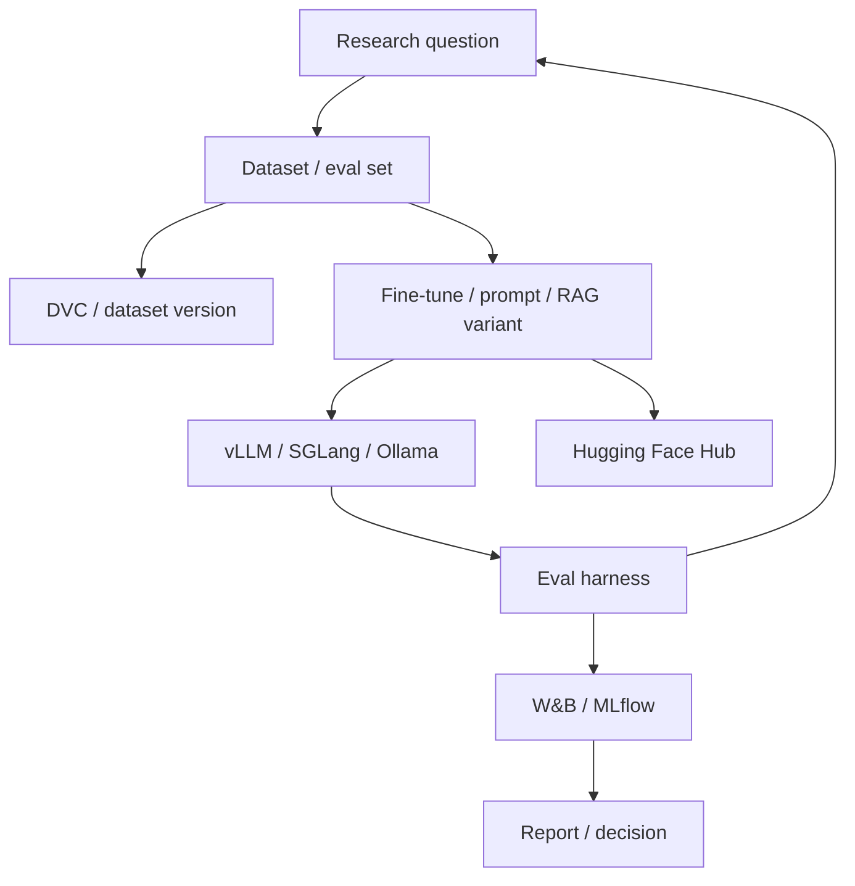

> **TL;DR:** Research stack for repeatable experiments, open-model evaluation, and rapid iteration. Prioritizes notebooks, datasets, experiment tracking, model registries, and reproducible training/eval runs.

## Overview

This reference stack is an opinionated baseline. It is not the only valid architecture, but it gives teams a coherent starting point with known component boundaries.

## Stack at a Glance

| Layer | Tool | Why This Choice |
|---|---|---|
| Experiment Tracking | Weights & Biases or MLflow | Track runs, metrics, artifacts, and comparisons |
| Model Hub | Hugging Face Hub | Publish and consume models/datasets |
| Training/Fine-tuning | torchtune / PEFT / Unsloth | Open-model adaptation experiments |
| Inference | vLLM / SGLang / Ollama | Serve models for evaluation and demos |
| Evaluation | RAGAS / DeepEval / Phoenix | Measure model/RAG/agent behavior |
| Data Versioning | DVC | Version datasets and eval fixtures |
| Compute | Local GPU / cloud GPU / Modal | Match hardware to experiment size |

## Why It's in the Arsenal

A stack is more useful than a list of tools when the components are selected to work together. This page shows the tradeoffs, operating assumptions, and links to canonical entries.

## Key Features

- Optimized for reproducibility over minimal setup
- Makes datasets and evals first-class artifacts
- Supports both prompt/RAG experiments and fine-tuning

## Architecture / How It Works



## When to Use This Stack

1. **Scenario**: Researcher comparing model or prompt variants
2. **Scenario**: Team building eval benchmarks for RAG/agents
3. **Scenario**: Open-source model fine-tuning experiments

## When NOT to Use This Stack

- Strict production uptime requirements as the primary goal
- No time to maintain datasets/eval harnesses
- Pure product MVP where speed matters more than reproducibility

## Getting Started

```bash
pip install wandb mlflow dvc peft torchtune vllm ragas
# Version eval data, run baseline, change one variable, compare results.
```

## Cost Estimate

| Usage Level | Expected Monthly Cost | Main Cost Drivers |
|---|---:|---|
| Hobbyist | $0-$200 | Local GPU/API tokens/storage |
| Small startup | $500-$5,000 | Cloud GPUs, tracking, eval volume |
| Scale | $5,000+ | GPU clusters, datasets, experiment storage |

> Cost estimates are directional. Verify provider pricing, token volume, GPU availability, data storage, and observability retention before committing.

## Use Cases

1. **Scenario**: Researcher comparing model or prompt variants
2. **Scenario**: Team building eval benchmarks for RAG/agents
3. **Scenario**: Open-source model fine-tuning experiments

## Strengths

- Components map cleanly to responsibilities, making the system easier to debug.
- Each major layer has a canonical Arsenal entry for deeper comparison.
- The stack can be simplified or scaled without changing the whole architecture at once.

## Limitations / When NOT to Use

- Strict production uptime requirements as the primary goal
- No time to maintain datasets/eval harnesses
- Pure product MVP where speed matters more than reproducibility

## Component Deep Dives

- **Weights & Biases**: [Weights & Biases](../../tools/by-job/weights-biases.md)
- **MLflow**: [MLflow](../../tools/by-job/mlflow.md)
- **Hugging Face Hub**: [Hugging Face Hub](../../tools/by-job/hugging-face-hub.md)
- **DVC**: [DVC](../../tools/by-job/dvc.md)
- **PEFT**: [PEFT](../../tools/by-job/peft.md)
- **torchtune**: [torchtune](../../tools/by-job/torchtune.md)
- **vLLM**: [vLLM](../../projects/llms/inference-engines/vllm.md)
- **RAGAS**: [RAGAS](../../projects/rag/frameworks/ragas-rag-evaluation.md)

## Integration Patterns

- Keep application code, model serving, retrieval, and observability as separate layers.
- Attach trace IDs across user requests, retrieval calls, model calls, and tool calls.
- Promote production failures into evaluation datasets before changing prompts or retrievers.
- Start with managed components when speed matters; move to self-hosted components only when control or economics justify it.

## Resources

- [Weights & Biases](../../tools/by-job/weights-biases.md)
- [MLflow](../../tools/by-job/mlflow.md)
- [Hugging Face Hub](../../tools/by-job/hugging-face-hub.md)
- [DVC](../../tools/by-job/dvc.md)
- [PEFT](../../tools/by-job/peft.md)
- [torchtune](../../tools/by-job/torchtune.md)
- [vLLM](../../projects/llms/inference-engines/vllm.md)
- [RAGAS](../../projects/rag/frameworks/ragas-rag-evaluation.md)

## Buzz & Reception

Reference stacks are maintained as opinionated starting points. They should be revisited whenever model pricing, tool maturity, or deployment patterns change.

---
*Last reviewed: 2026-06-13 by @maintainer*

