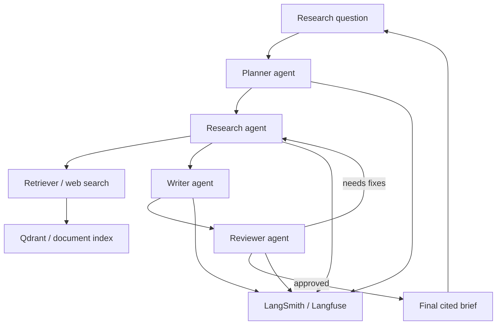

> **TL;DR:** Builds a multi-agent research assistant. Stack: LangGraph, retrieval, reviewer loop, LangSmith or Langfuse. Best for complex research workflows.

## What You're Building

You will build a system where a planner decomposes a research question, a researcher gathers evidence, a writer drafts an answer, and a reviewer checks claims before final output. Users receive a cited research brief rather than a raw chat answer.

## Architecture Overview

## Stack

| Component | Tool | Why |
|---|---|---|
| Agent graph | LangGraph | Explicit state and review loops |
| Role pattern | CrewAI-style roles | Clear planning/research/writing/review responsibilities |
| Retriever | Qdrant + RAG framework | Evidence gathering over indexed sources |
| Observability | LangSmith or Langfuse | Trace every agent step |
| Evaluation | Golden research questions | Regression checks for citation quality |

## Prerequisites

- [ ] A trusted document corpus or approved web source list
- [ ] Clear citation requirements
- [ ] Human review policy for high-impact outputs
- [ ] Trace storage and eval dataset

## Key Implementation Steps

1. **Define roles** — Planner, researcher, writer, and reviewer should have separate responsibilities and permissions.
2. **Create graph state** — Persist plan, evidence, draft, review comments, and final answer.
3. **Add retrieval** — Limit sources to approved indexes or tools.
4. **Add review loop** — Reviewer must cite missing evidence or approve final answer.
5. **Evaluate outputs** — Score citation coverage, faithfulness, and completeness.

## Gotchas & Tips

- Do not let the writer invent citations.
- Reviewer must inspect evidence, not only prose.
- Limit loop count to avoid runaway research.
- Human approval is required for regulated or external-facing reports.

## Full Reference Implementations

- [LangGraph repository](https://github.com/langchain-ai/langgraph) — Graph orchestration
- [CrewAI repository](https://github.com/crewAIInc/crewAI) — Role-based agent patterns
- [Qdrant repository](https://github.com/qdrant/qdrant) — Vector retrieval

## Related Entries

- Stack reference: [Multi-agent system](../../architectures/reference-stacks/multi-agent-system.md)
- Framework: [LangGraph](../../projects/frameworks/langgraph.md)
- Framework: [CrewAI](../../projects/frameworks/crewai.md)
- Tip: [Cap retries](../../tips-and-tricks/cap-agent-tool-retries.md)

---
*Last reviewed: 2026-06-14 by @maintainer*

