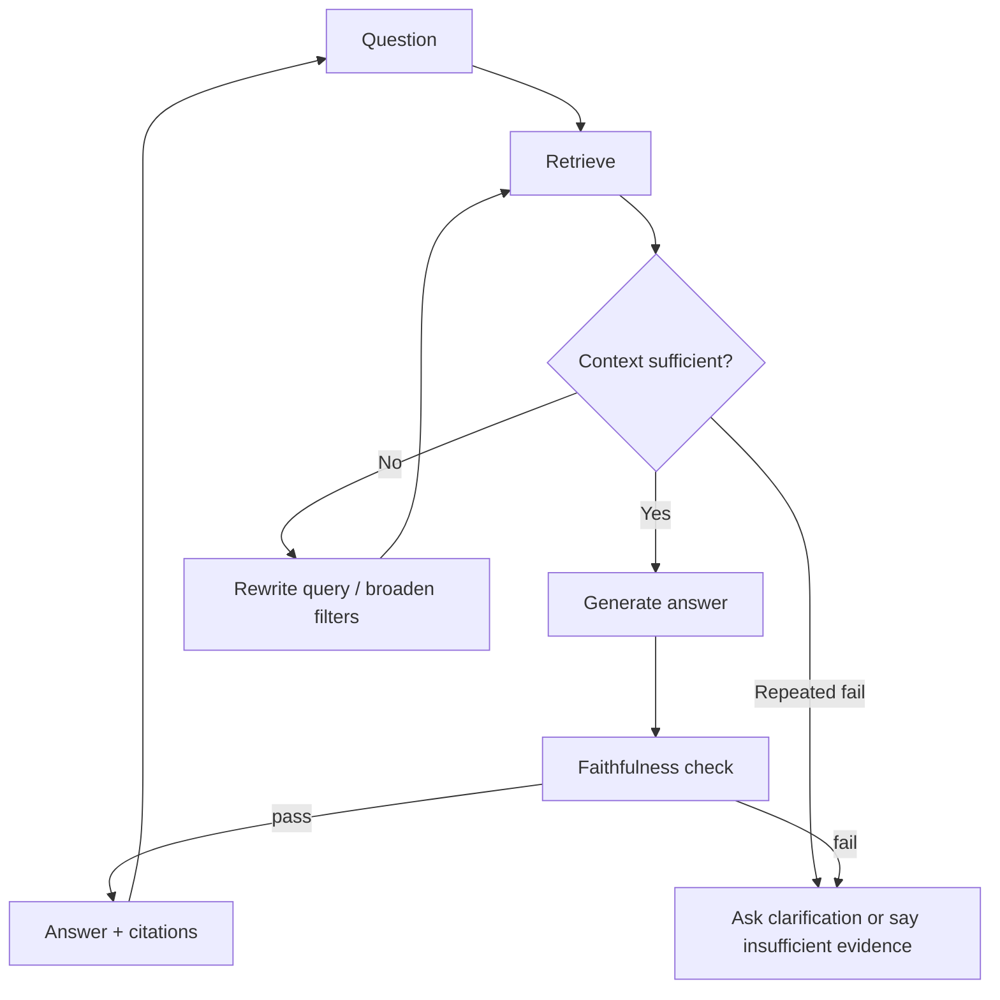

> **TL;DR:** Builds a RAG system with a correction loop. Stack: LangGraph, Qdrant, RAGAS/Phoenix-style evals. Best for high-stakes retrieval quality.

## What You're Building

You will build a RAG workflow that retrieves context, grades whether the context can answer the question, rewrites the query or changes retrieval strategy when weak, and only then generates an answer. Users get fewer unsupported answers and better fallback behavior.

## Architecture Overview

## Stack

| Component | Tool | Why |
|---|---|---|
| Control flow | LangGraph | Correction loops and bounded retries |
| Vector DB | Qdrant | Filtered retrieval and production search |
| Evaluation | RAGAS / Phoenix | Context and answer quality scoring |
| Generator | Hosted LLM or vLLM | Answer synthesis after retrieval passes |
| Observability | Langfuse / Phoenix | Trace retries and failure reasons |

## Prerequisites

- [ ] Baseline RAG system already working
- [ ] Golden questions with known evidence
- [ ] Defined failure policy
- [ ] Max retry count and latency budget

## Key Implementation Steps

1. **Add context grader** — Check if retrieved chunks contain answer evidence before generation.
2. **Add query rewrite** — Rewrite vague queries or use HyDE/step-back prompts after weak retrieval.
3. **Add retry budget** — Limit correction attempts to avoid latency spirals.
4. **Add fallback** — Ask for clarification or state insufficient evidence when retrieval still fails.
5. **Evaluate regression** — Track success, retry rate, unsupported answer rate, and latency.

## Gotchas & Tips

- Correction loops improve quality but add latency.
- A bad grader can block good answers.
- Fallback behavior must be product-approved.
- Trace every retry reason or the loop becomes impossible to debug.

## Full Reference Implementations

- [LangGraph repository](https://github.com/langchain-ai/langgraph) — Correction loop orchestration
- [RAGAS repository](https://github.com/vibrantlabsai/ragas) — RAG evaluation
- [Qdrant repository](https://github.com/qdrant/qdrant) — Vector database

## Related Entries

- Decision tree: [RAG vs Fine-Tuning](../../architectures/decision-trees/rag-vs-fine-tuning.md)
- Framework: [LangGraph](../../projects/frameworks/langgraph.md)
- Evaluation: [RAGAS](../../projects/rag/frameworks/ragas-rag-evaluation.md)
- Tip: [Prefer reranking before rechunking](../../tips-and-tricks/prefer-reranking-before-rechunking.md)

---
*Last reviewed: 2026-06-14 by @maintainer*

