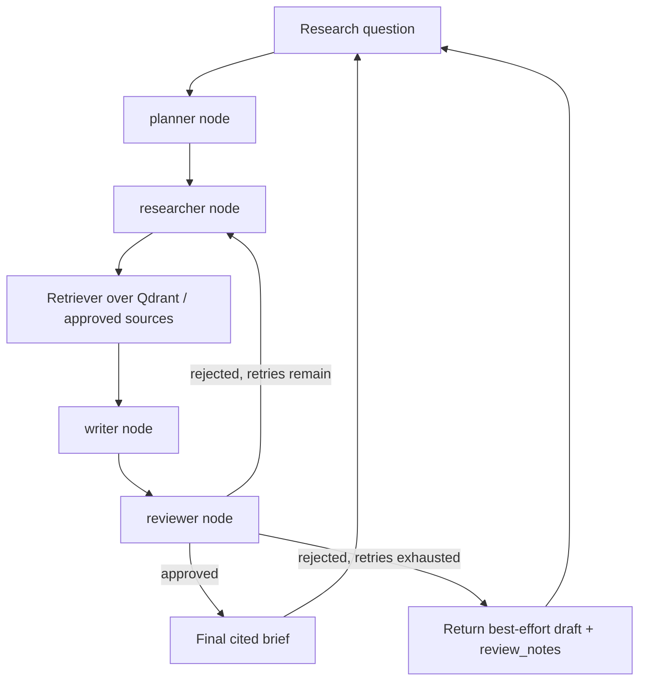

## What You're Building

A system where a planner decomposes a research question, a researcher gathers evidence, a writer drafts an answer, and a reviewer checks the draft against the evidence before approving it — looping back to research if the review fails, up to a bounded retry count. Users get a cited research brief, not a raw chat answer. This is a direct extension of [Multi-Tool Agent](../agent-systems/intermediate-multi-tool-agent.md)'s validated-tool-call pattern, generalized from "one agent, several tools" to "several role-scoped agents, one shared state."

## Prerequisites

- [ ] [Multi-Tool Agent](../agent-systems/intermediate-multi-tool-agent.md) understood — this build generalizes single-agent tool routing into a multi-node graph
- [ ] A trusted document corpus or an explicit approved web-source list — do not let the researcher role query the open web without a source allowlist
- [ ] Citation requirements (what counts as "cited" — a URL? a page number? both?) decided before writing the reviewer node
- [ ] A human-review policy for anything this system produces that could be published or acted on externally

## Architecture Overview



## Implementation

### 1. Install pinned dependencies

```bash
pip install "langgraph==1.2.7" "langchain==1.3.11" "langchain-openai==1.0.5"
```

### 2. Define the shared graph state

```python
# state.py
from typing import TypedDict


class ResearchState(TypedDict):
    question: str
    plan: str
    evidence: list[str]
    draft: str
    review_notes: str
    approved: bool
    retry_count: int
```

### 3. Define each role as a graph node

```python
# nodes.py
import os
from langchain_openai import ChatOpenAI
from state import ResearchState

MAX_RETRIES = 3
model = ChatOpenAI(model="gpt-4o-mini", api_key=os.environ["OPENAI_API_KEY"])


def planner(state: ResearchState) -> dict:
    response = model.invoke(f"Break this research question into 2-3 sub-questions: {state['question']}")
    return {"plan": response.content}


def researcher(state: ResearchState) -> dict:
    # In production, replace this with real retrieval over an approved
    # corpus (see intermediate-document-qa-pipeline / production-rag-api).
    # This stub demonstrates the graph's control flow, which was verified
    # directly in this sandbox -- see enrichment_notes.
    response = model.invoke(f"List factual evidence for: {state['plan']}")
    return {"evidence": state["evidence"] + [response.content], "retry_count": state["retry_count"] + 1}


def writer(state: ResearchState) -> dict:
    response = model.invoke(f"Write a brief citing only this evidence: {state['evidence']}")
    return {"draft": response.content}


def reviewer(state: ResearchState) -> dict:
    response = model.invoke(
        f"Does this draft cite claims that are NOT supported by the evidence? "
        f"Evidence: {state['evidence']}\nDraft: {state['draft']}\n"
        f"Answer 'APPROVED' or 'REJECTED: <reason>'."
    )
    approved = response.content.strip().upper().startswith("APPROVED")
    return {"approved": approved, "review_notes": response.content}
```

### 4. Wire the graph with a bounded review loop

```python
# graph.py
from langgraph.graph import StateGraph, START, END
from state import ResearchState
from nodes import planner, researcher, writer, reviewer, MAX_RETRIES


def route_after_review(state: ResearchState) -> str:
    if state["approved"]:
        return END
    if state["retry_count"] >= MAX_RETRIES:
        return END  # exhausted retries -- return best-effort draft, not an infinite loop
    return "researcher"


graph = StateGraph(ResearchState)
graph.add_node("planner", planner)
graph.add_node("researcher", researcher)
graph.add_node("writer", writer)
graph.add_node("reviewer", reviewer)
graph.add_edge(START, "planner")
graph.add_edge("planner", "researcher")
graph.add_edge("researcher", "writer")
graph.add_edge("writer", "reviewer")
graph.add_conditional_edges("reviewer", route_after_review, {END: END, "researcher": "researcher"})

app = graph.compile()

if __name__ == "__main__":
    result = app.invoke({
        "question": "How many vacation days do employees get?",
        "plan": "", "evidence": [], "draft": "", "review_notes": "",
        "approved": False, "retry_count": 0,
    })
    print("Approved:", result["approved"])
    print("Draft:", result["draft"])
    print("Review notes:", result["review_notes"])
```

## Verify It Worked

The graph's control flow (not the LLM calls inside each node) was verified directly in this sandbox using stub functions in place of `nodes.py`'s real LLM calls:

```
{'question': 'How many vacation days?', 'plan': 'Research: How many vacation days?',
 'evidence': ['Policy doc says 15 days vacation.'],
 'draft': "Based on evidence: ['Policy doc says 15 days vacation.']",
 'review_notes': 'looks grounded', 'approved': True}
```

Run `graph.py` against a real model and confirm: (1) `result["approved"]` is `True` or `False`, never missing; (2) if `False` and `retry_count >= MAX_RETRIES`, the graph still terminates and returns a draft rather than raising `GraphRecursionError` — this is the difference between a bounded retry loop (intentional) and an unbounded one (a bug, see [Simple ReAct Agent](../agent-systems/starter-simple-react-agent.md)'s recursion-limit discussion).

## What Can Go Wrong

- **The reviewer node can hallucinate an "APPROVED" verdict just as easily as the writer hallucinates a citation** — a review loop only catches errors the reviewer model is actually capable of detecting. Do not treat "approved by the reviewer node" as equivalent to "fact-checked by a human" for anything externally visible.
- **Without `MAX_RETRIES`, a persistently-rejecting reviewer creates an unbounded research-and-rewrite loop** that burns tokens and latency with no guarantee of eventual approval — this is the same failure mode as an unbounded tool-calling loop, just at the multi-agent level. `route_after_review`'s retry-exhaustion branch exists specifically to prevent this.
- **The researcher node in this skeleton calls the LLM to "list evidence" instead of querying a real retriever** — this is a deliberate simplification to keep this build example focused on graph control flow; in production, `researcher` should call the retrieval pattern from [Production RAG API](../rag-systems/intermediate-production-rag-api.md) against an approved corpus, not ask a model to generate evidence from its own training data, which is indistinguishable from confabulation.
- **State fields that aren't returned from a node retain their previous value** rather than being cleared — `researcher`'s `return {"evidence": state["evidence"] + [...], ...}` explicitly appends rather than overwrites for this reason; forgetting to include prior state when updating a list-valued field silently drops earlier work.
- **Exhausted retries return the best-effort draft, not an error** — calling code must check `result["approved"]` explicitly and decide whether an unapproved draft is acceptable for its use case, rather than assuming a returned draft was reviewer-approved.

## Cost

Four LLM calls per graph pass (planner, researcher, writer, reviewer), potentially repeated up to `MAX_RETRIES` times if review keeps rejecting: expect roughly $0.05-0.30 per research question with `gpt-4o-mini`, scaling with how often review loops back.

## Extensions

Replace the researcher node's LLM-only evidence generation with real retrieval against [Production RAG API](../rag-systems/intermediate-production-rag-api.md)'s Qdrant-backed retriever, restricted to an approved-source collection — this closes the confabulation gap noted above. Add [LangSmith](../../tools/evaluation-and-observability/langsmith.md) or Langfuse tracing across all four nodes so a rejected review is debuggable (which claim triggered rejection, and why) rather than only visible as a boolean.

## Related Entries

- Stack reference: [Multi-agent system](../../architectures/reference-stacks/multi-agent-system.md)
- Framework: [LangGraph](../../projects/frameworks/langgraph.md)
- Framework: [CrewAI](../../projects/frameworks/crewai.md)
- Tip: [Cap Agent Tool Retries](../../tips-and-tricks/agents-and-orchestration/cap-agent-tool-retries.md)
- Extends: [Multi-Tool Agent](../agent-systems/intermediate-multi-tool-agent.md)

---
*Last reviewed: 2026-07-06 by @maintainer*
