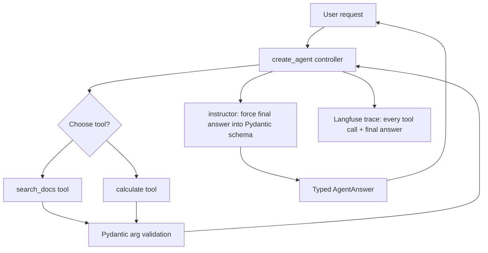

## What You're Building

An agent that chooses among multiple validated tools, produces a Pydantic-typed final answer (not free-text), and traces every tool call to Langfuse. This extends [Simple ReAct Agent](../agent-systems/starter-simple-react-agent.md) by adding: a second tool so the model has to route between them, `instructor` to force the final answer into a typed schema instead of trusting free-text parsing, and Langfuse tracing so a failed run is debuggable after the fact instead of only in your terminal.

## Prerequisites

- [ ] [Simple ReAct Agent](../agent-systems/starter-simple-react-agent.md) working already — this build assumes that loop is understood
- [ ] Two safe, read-only tools (adding a third makes routing errors easier to spot in testing)
- [ ] Comfort writing a Pydantic `BaseModel` for the expected final-answer shape
- [ ] A Langfuse API key (cloud free tier at [langfuse.com](https://langfuse.com) or self-hosted)
- [ ] A hard step/tool-call budget decided before running against a real model

## Architecture Overview



## Implementation

### 1. Install pinned dependencies

```bash
pip install "langchain==1.3.11" "langgraph==1.2.7" "langchain-openai==1.0.5" \
  "instructor==1.15.4" "langfuse==4.13.0" "pydantic==2.13.4"
```

### 2. Define typed tools and the final-answer schema

```python
# schema.py
from pydantic import BaseModel, Field
from typing import Literal


class AgentAnswer(BaseModel):
    answer: str = Field(description="The final answer to the user's question")
    tools_used: list[str] = Field(description="Names of tools that contributed to this answer")
    confidence: Literal["low", "medium", "high"] = Field(description="Self-reported confidence")
```

```python
# tools.py
from langchain_core.tools import tool

_KB = {"vacation": "15 days per year.", "remote": "Up to 3 days/week without approval."}


@tool
def search_docs(query: str) -> str:
    """Search company policy docs for a query."""
    for key, val in _KB.items():
        if key in query.lower():
            return val
    return "No match found."


@tool
def calculate(expression: str) -> float:
    """Evaluate a simple arithmetic expression, e.g. '15 * 12'."""
    allowed = set("0123456789+-*/(). ")
    if not set(expression) <= allowed:
        raise ValueError(f"Rejected unsafe expression: {expression!r}")
    return eval(expression, {"__builtins__": {}})
```

### 3. Wire the agent with tracing and structured output

```python
# agent.py
import os
import instructor
from langfuse import observe
from langchain.agents import create_agent
from langchain_openai import ChatOpenAI
from openai import OpenAI
from schema import AgentAnswer
from tools import search_docs, calculate

model = ChatOpenAI(model="gpt-4o-mini", api_key=os.environ["OPENAI_API_KEY"])
agent = create_agent(model, tools=[search_docs, calculate])

# Separate client for the structured-output extraction pass -- Instructor
# wraps a raw OpenAI client, not the LangChain ChatOpenAI wrapper.
structured_client = instructor.from_openai(OpenAI(api_key=os.environ["OPENAI_API_KEY"]))


@observe()  # Langfuse: traces this function and every call inside it
def run(task: str, max_steps: int = 10) -> AgentAnswer:
    result = agent.invoke(
        {"messages": [{"role": "user", "content": task}]},
        config={"recursion_limit": max_steps},
    )
    raw_answer = result["messages"][-1].content
    tool_names = sorted({
        tc["name"]
        for m in result["messages"]
        for tc in (getattr(m, "tool_calls", None) or [])
    })

    # Force the free-text agent output into a validated, typed shape.
    structured = structured_client.chat.completions.create(
        model="gpt-4o-mini",
        response_model=AgentAnswer,
        messages=[{
            "role": "user",
            "content": f"Tools used: {tool_names}. Raw agent answer: {raw_answer}. "
                        f"Produce the AgentAnswer.",
        }],
    )
    return structured


if __name__ == "__main__":
    print(run("How many vacation days per year, and what is that times 2?"))
```

## Verify It Worked

```python
result = run("How many vacation days per year, and what is that times 2?")
assert isinstance(result.answer, str) and len(result.answer) > 0
assert result.confidence in ("low", "medium", "high")
print(result)
```

A successful run prints a validated `AgentAnswer` object — if `instructor` cannot coerce the model's output into the schema after its internal retries, it raises a `pydantic.ValidationError` rather than returning malformed data, which is the entire point of using it here instead of parsing free text yourself. Check the Langfuse dashboard for the trace: you should see one top-level span for `run`, with nested spans for each tool call and the final structured-extraction call.

## What Can Go Wrong

- **`calculate`'s `eval()` looks dangerous, and it would be if the character allowlist were missing.** The allowlist (`0-9+-*/(). `) is not decorative — remove it and this tool becomes an arbitrary-code-execution vector the moment a prompt-injected document or adversarial user reaches it. See [Sandbox Code Execution Tools](../../tips-and-tricks/agents-and-orchestration/sandbox-code-execution-tools.md).
- **Two similarly-named/described tools cause the model to route to the wrong one intermittently.** This is a prompt-engineering problem in the tool docstrings, not a bug in `create_agent` — tighten the docstrings until routing is consistent across repeated runs before adding a third tool.
- **The `instructor` structured-output call is a second, separate LLM call** from the agent's own reasoning — this doubles latency and cost per run. Do not skip validating whether you actually need typed output, or whether parsing the agent's final message directly is good enough for your use case.
- **`instructor.from_openai()` wraps a raw `openai.OpenAI` client, not `langchain_openai.ChatOpenAI`.** Passing the LangChain-wrapped client into `instructor.from_openai()` will fail — they are different client types with different method signatures, confirmed directly against `instructor==1.15.4`.
- **Langfuse's `@observe()` decorator requires `LANGFUSE_PUBLIC_KEY`/`LANGFUSE_SECRET_KEY` env vars set**, or it silently no-ops rather than raising — check your Langfuse dashboard actually received a trace before assuming tracing is working.

## Cost

Two LLM calls per run (the agent loop itself, plus one `instructor` structured-extraction call) roughly doubles the cost versus [Simple ReAct Agent](../agent-systems/starter-simple-react-agent.md): expect ~$0.01-0.05 per run with `gpt-4o-mini` and 2-4 tool calls. Langfuse's free cloud tier covers development-scale tracing volume at no cost.

## Extensions

Add a third tool with an overlapping description on purpose, then use the Langfuse trace to see exactly which reasoning step caused a misroute — this is the fastest way to build intuition for tool-description quality. Add human approval before executing `calculate` on anything beyond a fixed complexity budget, per [Require Human Approval for Irreversible Actions](../../tips-and-tricks/agents-and-orchestration/require-human-approval-for-irreversible-actions.md), once tools stop being purely read-only.

## Related Entries

- Framework: [LangGraph](../../projects/frameworks/langgraph.md)
- Tool: [Instructor](../../tools/dx-and-tooling/instructor.md)
- Observability: [Langfuse](../../projects/benchmarks-and-evals/langfuse.md)
- Tip: [Validate Tool Arguments Before Execution](../../tips-and-tricks/agents-and-orchestration/validate-tool-arguments-before-execution.md)
- Tip: [Separate Planner and Executor Permissions](../../tips-and-tricks/agents-and-orchestration/separate-planner-and-executor-permissions.md)
- Extends: [Simple ReAct Agent](../agent-systems/starter-simple-react-agent.md)

---
*Last reviewed: 2026-07-06 by @maintainer*
