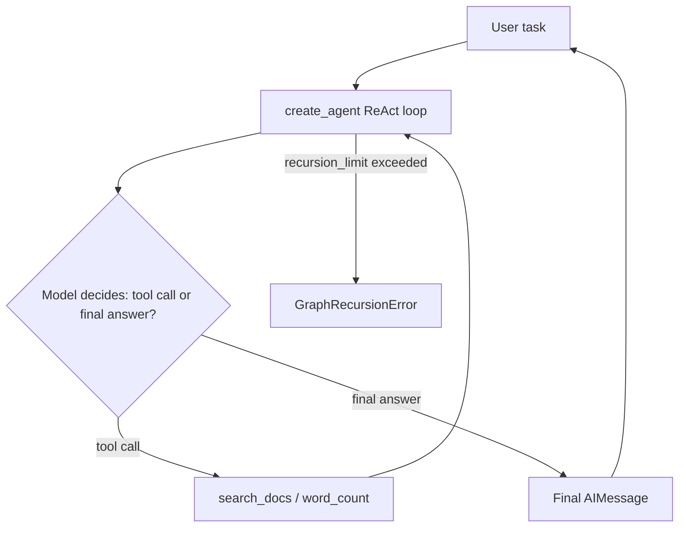

## What You're Building

An agent that reasons about a task, calls one or two safe tools, and returns a final answer with a bounded, traceable number of steps -- exposed as a small CLI. This deliberately does not use `langgraph.prebuilt.create_react_agent`: as of LangGraph 1.0, that function is deprecated in favor of `langchain.agents.create_agent`, which is what this build uses and what LangChain's own deprecation warning at import time points you to (confirmed directly against the installed `langgraph==1.2.7` / `langchain==1.3.11` pair -- see What Can Go Wrong).

## Prerequisites

- [ ] Python 3.11+
- [ ] One read-only tool defined before you touch anything that writes, deletes, or spends money
- [ ] `OPENAI_API_KEY` set, or a local model client (see [Local LLM Chat](../production-deployment/starter-local-llm-chat.md))
- [ ] A decision on max step count before you run this against a real model (this build hardcodes `recursion_limit=10`)

## Architecture Overview



## Implementation

### 1. Install pinned dependencies

```bash
python3 -m venv .venv
source .venv/bin/activate
pip install "langchain==1.3.11" "langgraph==1.2.7" "langchain-openai==1.0.5"
```

### 2. Define tools

```python
# tools.py
from langchain_core.tools import tool

_KB = {
    "vacation": "Employees accrue 15 days of paid vacation per year.",
    "remote": "Remote work is allowed up to 3 days per week without prior approval.",
}


@tool
def search_docs(query: str) -> str:
    """Search the company policy knowledge base for a query and return the best match."""
    for key, val in _KB.items():
        if key in query.lower():
            return val
    return "No matching policy found."


@tool
def word_count(text: str) -> int:
    """Count the number of words in a string."""
    return len(text.split())
```

### 3. Build the agent with a step budget

```python
# agent.py
import os
from langchain.agents import create_agent
from langchain_openai import ChatOpenAI
from tools import search_docs, word_count

model = ChatOpenAI(model="gpt-4o-mini", api_key=os.environ["OPENAI_API_KEY"])

agent = create_agent(model, tools=[search_docs, word_count])


def run(task: str, max_steps: int = 10):
    result = agent.invoke(
        {"messages": [{"role": "user", "content": task}]},
        config={"recursion_limit": max_steps},
    )
    for m in result["messages"]:
        role = type(m).__name__
        tool_calls = getattr(m, "tool_calls", None)
        print(f"[{role}] {m.content!r}" + (f" tool_calls={tool_calls}" if tool_calls else ""))
    return result["messages"][-1].content


if __name__ == "__main__":
    print(run("How many vacation days do employees get?"))
```

### 4. Run it

```bash
python agent.py
```

## Verify It Worked

A working run prints the full message trace (HumanMessage, then one or more AIMessage/ToolMessage pairs, ending in a final AIMessage with no tool calls), and the final printed line is a plain-language answer grounded in `search_docs`'s output. This trace pattern was confirmed directly in a sandboxed test using a scripted fake model in place of a real LLM:

```
[HumanMessage] "How many letters in 'arsenal'?"
[AIMessage] '' tool_calls=[{'name': 'get_word_length', 'args': {'word': 'arsenal'}, ...}]
[ToolMessage] '7'
[AIMessage] "The word 'arsenal' has 7 letters."
```

If the trace never reaches a final `AIMessage` with empty `tool_calls` and instead raises, that's the step-budget working as intended (see What Can Go Wrong) — not a bug in the agent.

## What Can Go Wrong

- **`from langgraph.prebuilt import create_react_agent` still works but is deprecated** as of LangGraph 1.0/LangChain 1.x and prints `LangGraphDeprecatedSinceV10` at call time; it will be removed in LangGraph 2.0. Use `from langchain.agents import create_agent` instead (confirmed directly: the old import path raised `NotImplementedError` inside `bind_tools` when combined with a fake/custom chat model in this sandbox, while the new path worked cleanly).
- **Infinite tool-calling loops raise `GraphRecursionError`, not a silent hang.** Confirmed directly: a model that always re-calls the same tool with `recursion_limit=6` raises `GraphRecursionError: Recursion limit of 6 reached without hitting a stop condition` after exactly 6 steps. This is the mechanism [Add a Max Step Budget to Every Agent](../../tips-and-tricks/agents-and-orchestration/add-a-max-step-budget-to-every-agent.md) is describing — treat this exception as an expected, catchable failure mode in production code, not an unhandled crash.
- **Tool docstrings are part of the prompt the model sees**, not just documentation for humans — a vague docstring (`"""Search stuff."""`) measurably degrades the model's tool-selection accuracy. Write docstrings as if the model is a new engineer reading only that one line.
- **Giving the agent a write/delete/spend tool before the read-only loop is proven** is the most common way this pattern turns into an incident. Start with `search_docs`-style read-only tools; only add mutating tools after you trust the step-budget and validation behavior.
- **`OPENAI_API_KEY` missing raises `KeyError` at `ChatOpenAI(...)` construction time**, before the agent ever runs — this is deliberate (fail fast) but can look like an unrelated import error if you don't read the traceback.

## Cost

With `gpt-4o-mini` and a 1-2 tool-call trace, a single run costs roughly $0.001-0.01 depending on how much conversation history accumulates. Swapping `ChatOpenAI` for a local Ollama-backed chat model (see [Local LLM Chat](../production-deployment/starter-local-llm-chat.md)) makes this free to run repeatedly during development.

## Extensions

Add a second, different tool and observe how the model chooses between them (this is the natural next step and exactly what [Multi-Tool Agent](../agent-systems/intermediate-multi-tool-agent.md) builds on). Add tracing (Langfuse or LangSmith) once you have more than one tool, so you can see tool-selection decisions, not just final answers — see [Trace Tool Call Arguments and Return Values](../../tips-and-tricks/debugging-and-observability/trace-tool-inputs-and-outputs.md).

## Related Entries

- Framework: [LangGraph](../../projects/frameworks/langgraph.md)
- Decision tree: [Choose Agent Framework](../../architectures/decision-trees/choose-agent-framework.md)
- Tip: [Validate Tool Arguments Before Execution](../../tips-and-tricks/agents-and-orchestration/validate-tool-arguments-before-execution.md)
- Tip: [Add a Max Step Budget to Every Agent](../../tips-and-tricks/agents-and-orchestration/add-a-max-step-budget-to-every-agent.md)
- Extends into: [Multi-Tool Agent](../agent-systems/intermediate-multi-tool-agent.md)

---
*Last reviewed: 2026-07-06 by @maintainer*
