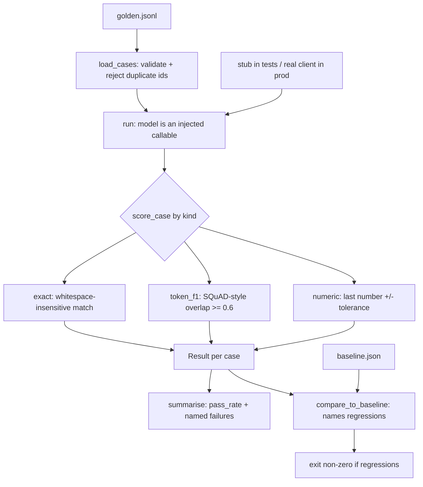

## What You're Building

An evaluation harness that answers one question in CI: *did this change make the task worse?* It loads a golden dataset from JSONL, runs each case through a model, scores the output with one of three deterministic scorers, and diffs the result against a stored baseline to name exactly which cases regressed.

The design decision that makes the whole thing testable is that **the model is an injected callable**, not an import. Production passes a real client; the test suite passes a stub. That single choice means the harness has real coverage instead of a test file that mocks so much it verifies nothing, and it means `pytest` runs in milliseconds with no API key and no network.

This is the artefact that [Add Evals Before Refactors](../../tips-and-tricks/evaluation/add-evals-before-refactors.md) tells you to build first.

## Prerequisites

- [ ] A task where "correct" is decidable — if you cannot write the expected answer down, you cannot score it deterministically and this is the wrong build
- [ ] 20–50 hand-written cases. Fewer than that and a single case swings the pass rate enough to hide a regression
- [ ] Python 3.10+ and `pytest`
- [ ] Decided *in advance* what pass rate counts as a regression — see [Set Pass/Fail Thresholds Before Running Evals](../../tips-and-tricks/evaluation/set-pass-fail-thresholds-before-running-evals.md)

## Architecture Overview



Three scorers cover most checkable tasks. A case that raises is recorded as a **failure**, not an abort — one rate-limited call must not silently skip the rest of the suite.

## Implementation

### 1. Install pinned dependencies

```bash
# Python 3.11.2 verified; the harness uses only the standard library.
pip install "pytest==9.1.1"
```

### 2. The harness

```python
# harness.py
from __future__ import annotations

import json
import re
from dataclasses import dataclass
from pathlib import Path
from typing import Callable, Iterable

Model = Callable[[str], str]


@dataclass(frozen=True)
class Case:
    id: str
    prompt: str
    expected: str
    kind: str = "exact"          # exact | token_f1 | numeric
    tolerance: float = 0.0
    tags: tuple[str, ...] = ()


@dataclass
class Result:
    case_id: str
    passed: bool
    score: float
    detail: str


_TOKEN = re.compile(r"[a-z0-9]+")


def token_f1(prediction: str, expected: str) -> float:
    """Token-level F1, the standard SQuAD-style overlap metric."""
    p = _TOKEN.findall(prediction.lower())
    e = _TOKEN.findall(expected.lower())
    if not p or not e:
        return 1.0 if p == e else 0.0
    common: dict[str, int] = {}
    for tok in e:
        common[tok] = common.get(tok, 0) + 1
    overlap = 0
    for tok in p:
        if common.get(tok, 0) > 0:
            common[tok] -= 1
            overlap += 1
    if overlap == 0:
        return 0.0
    precision = overlap / len(p)
    recall = overlap / len(e)
    return 2 * precision * recall / (precision + recall)


def _number(text: str) -> float | None:
    """Pull the last number out of a string; None if there isn't one."""
    matches = re.findall(r"-?\d+(?:\.\d+)?", text.replace(",", ""))
    return float(matches[-1]) if matches else None


def score_case(case: Case, prediction: str) -> tuple[bool, float, str]:
    if case.kind == "exact":
        ok = prediction.strip() == case.expected.strip()
        return ok, 1.0 if ok else 0.0, (
            "exact match" if ok else f"expected {case.expected!r}, got {prediction.strip()!r}"
        )
    if case.kind == "token_f1":
        f1 = token_f1(prediction, case.expected)
        return f1 >= 0.6, round(f1, 4), f"token F1 {f1:.4f} (pass >= 0.6)"
    if case.kind == "numeric":
        got, want = _number(prediction), _number(case.expected)
        if want is None:
            return False, 0.0, f"case {case.id}: expected value has no number"
        if got is None:
            return False, 0.0, f"no number in prediction {prediction!r}"
        ok = abs(got - want) <= case.tolerance
        return ok, round(1.0 - min(abs(got - want) / max(abs(want), 1e-9), 1.0), 4), (
            f"got {got}, want {want} +/-{case.tolerance}"
        )
    raise ValueError(f"case {case.id}: unknown kind {case.kind!r}")


def load_cases(path: Path) -> list[Case]:
    cases: list[Case] = []
    seen: set[str] = set()
    for lineno, line in enumerate(path.read_text().splitlines(), 1):
        if not line.strip():
            continue
        raw = json.loads(line)
        if raw["id"] in seen:
            raise ValueError(f"{path}:{lineno}: duplicate case id {raw['id']!r}")
        seen.add(raw["id"])
        cases.append(Case(
            id=raw["id"], prompt=raw["prompt"], expected=raw["expected"],
            kind=raw.get("kind", "exact"), tolerance=float(raw.get("tolerance", 0.0)),
            tags=tuple(raw.get("tags", [])),
        ))
    if not cases:
        raise ValueError(f"{path}: golden dataset is empty")
    return cases


def run(cases: Iterable[Case], model: Model) -> list[Result]:
    results = []
    for case in cases:
        try:
            prediction = model(case.prompt)
        except Exception as exc:          # a crash is a failure, not an abort
            results.append(Result(case.id, False, 0.0, f"model raised {type(exc).__name__}: {exc}"))
            continue
        passed, score, detail = score_case(case, prediction)
        results.append(Result(case.id, passed, score, detail))
    return results


def compare_to_baseline(results: list[Result], baseline: dict[str, bool]) -> list[str]:
    """Names cases that passed before and fail now -- the regression set."""
    return sorted(r.case_id for r in results if baseline.get(r.case_id) and not r.passed)


def summarise(results: list[Result]) -> dict:
    return {
        "total": len(results),
        "passed": sum(1 for r in results if r.passed),
        "pass_rate": round(sum(1 for r in results if r.passed) / len(results), 4) if results else 0.0,
        "mean_score": round(sum(r.score for r in results) / len(results), 4) if results else 0.0,
        "failures": [{"id": r.case_id, "detail": r.detail} for r in results if not r.passed],
    }
```

### 3. The golden dataset

```jsonl
{"id": "capital-fr", "prompt": "Capital of France?", "expected": "Paris", "kind": "exact", "tags": ["geography"]}
{"id": "capital-jp", "prompt": "Capital of Japan?", "expected": "Tokyo", "kind": "exact", "tags": ["geography"]}
{"id": "sum", "prompt": "What is 17 + 25?", "expected": "42", "kind": "numeric", "tolerance": 0, "tags": ["arithmetic"]}
{"id": "approx", "prompt": "Roughly how many days in a year?", "expected": "365", "kind": "numeric", "tolerance": 2, "tags": ["arithmetic"]}
{"id": "describe", "prompt": "Describe water in five words.", "expected": "clear wet liquid essential for life", "kind": "token_f1", "tags": ["generation"]}
```

### 4. The test suite

```python
# test_harness.py
import pathlib
import pytest
from harness import Case, compare_to_baseline, load_cases, run, score_case, summarise, token_f1

GOLDEN = pathlib.Path("golden.jsonl")


def test_token_f1_rewards_overlap_and_punishes_disjoint():
    assert token_f1("clear wet liquid essential for life", "clear wet liquid essential for life") == 1.0
    assert token_f1("fire dry solid", "clear wet liquid essential for life") == 0.0
    assert 0.0 < token_f1("clear wet liquid", "clear wet liquid essential for life") < 1.0


def test_numeric_honours_tolerance():
    case = Case(id="a", prompt="p", expected="365", kind="numeric", tolerance=2)
    assert score_case(case, "365 days")[0] is True
    assert score_case(case, "366")[0] is True          # inside tolerance
    assert score_case(case, "370")[0] is False         # outside


def test_numeric_reports_a_prediction_with_no_number():
    case = Case(id="a", prompt="p", expected="365", kind="numeric", tolerance=0)
    ok, _, detail = score_case(case, "I am not sure")
    assert ok is False and "no number" in detail


def test_exact_is_whitespace_insensitive_but_not_case_insensitive():
    case = Case(id="a", prompt="p", expected="Paris", kind="exact")
    assert score_case(case, "  Paris \n")[0] is True
    assert score_case(case, "paris")[0] is False


def test_unknown_kind_raises_rather_than_silently_passing():
    with pytest.raises(ValueError, match="unknown kind"):
        score_case(Case(id="a", prompt="p", expected="x", kind="vibes"), "x")


def test_load_cases_rejects_duplicate_ids_and_empty_files(tmp_path):
    dup = tmp_path / "dup.jsonl"
    dup.write_text('{"id":"a","prompt":"p","expected":"x"}\n{"id":"a","prompt":"q","expected":"y"}\n')
    with pytest.raises(ValueError, match="duplicate case id"):
        load_cases(dup)
    empty = tmp_path / "e.jsonl"
    empty.write_text("\n")
    with pytest.raises(ValueError, match="empty"):
        load_cases(empty)


def test_a_model_that_raises_counts_as_failure_not_abort():
    def bad(_prompt): raise RuntimeError("rate limited")
    results = run([Case(id="a", prompt="p", expected="x")], bad)
    assert len(results) == 1 and results[0].passed is False
    assert "RuntimeError" in results[0].detail


def test_stub_model_passes_the_golden_set_end_to_end():
    answers = {"capital-fr": "Paris", "capital-jp": "Tokyo", "sum": "42",
               "approx": "365", "describe": "clear wet liquid essential for life"}
    cases = load_cases(GOLDEN)
    summary = summarise(run(cases, lambda p: answers[[c for c in cases if c.prompt == p][0].id]))
    assert summary["total"] == 5 and summary["passed"] == 5
    assert summary["pass_rate"] == 1.0


def test_a_regressed_case_is_detected_against_baseline():
    cases = load_cases(GOLDEN)
    baseline = {c.id: True for c in cases}          # everything used to pass
    regressions = compare_to_baseline(run(cases, lambda p: "Paris" if "France" in p else "WRONG"), baseline)
    assert "capital-fr" not in regressions
    assert {"capital-jp", "sum", "approx", "describe"} <= set(regressions)


def test_summary_breaks_out_failures_with_reasons():
    results = run([Case(id="a", prompt="p", expected="Paris", kind="exact")], lambda p: "Lyon")
    s = summarise(results)
    assert s["passed"] == 0 and s["pass_rate"] == 0.0
    assert s["failures"][0]["id"] == "a" and "Lyon" in s["failures"][0]["detail"]
```

### 5. Run it

```bash
$ python -m pytest test_harness.py -q
..........                                                               [100%]
10 passed in 0.03s
```

## Verify It Worked

The suite above **is** the success criterion, and it was run: `10 passed in 0.03s` on Python 3.11.2 / pytest 9.1.1, with no network access and no API key.

Three assertions carry the weight, so check them individually rather than trusting the green bar:

```python
# 1. the golden set runs end-to-end through the injected stub
assert summarise(run(load_cases(GOLDEN), stub))["pass_rate"] == 1.0

# 2. a deliberately broken model is caught by the baseline diff
assert "capital-jp" in compare_to_baseline(run(load_cases(GOLDEN), broken), baseline)

# 3. a crashing model is a recorded failure, not a skipped case
assert run([case], crashing_model)[0].passed is False
```

If (2) comes back empty, the harness cannot detect regressions and is only measuring the current run — that is the failure mode worth checking first.

## What Can Go Wrong

- **The golden set silently rots into the dev set.** Every case you add to chase a failing test is a case you have now tuned against. Keep a frozen holdout you never edit — see [Separate a Frozen Holdout From Your Dev Eval Set](../../tips-and-tricks/evaluation/separate-a-frozen-holdout-from-your-dev-eval-set.md).
- **`token_f1 >= 0.6` is a guess, not a measurement.** The threshold was picked to be plausible, not calibrated. Plot the F1 distribution for answers you know are good and bad before trusting it, or you will pass outputs that a human would reject.
- **A small golden set makes the pass rate useless as a gate.** With 5 cases, one flip moves the rate 20 points. Either grow the set or gate on named regressions from `compare_to_baseline` rather than on the aggregate rate.
- **`exact` matching fails on defensible variation.** `"Paris"` vs `"Paris, France"` is a false negative that will cost you an afternoon. Reach for `token_f1`, or normalise deliberately — but never by loosening every scorer at once.
- **Skipping the `try/except` in `run()` turns one rate-limited call into a suite-wide abort.** A crash must be recorded as a failure for that case; otherwise the run reports 4 of 4 passed and nobody notices the fifth never ran.
- **A single run of a stochastic model proves nothing.** If you swap the stub for a real model, deltas below the run-to-run noise are meaningless — see [Run Evals Multiple Times Before Trusting Deltas](../../tips-and-tricks/evaluation/run-evals-multiple-times-before-trusting-deltas.md).

## Cost

Free as built. The harness is deterministic, the test suite runs against a stub model, and the only dependencies are the standard library plus `pytest`. Cost arrives only when you inject a real model: at that point it is one call per case per run, so a 50-case suite is 50 calls — cheap, but it is why [Run a Fast Eval Per Commit and a Full Eval Nightly](../../tips-and-tricks/evaluation/run-a-fast-eval-per-commit-and-a-full-eval-nightly.md) splits the two.

## Extensions

Add an LLM-as-judge scorer for open-ended cases the three deterministic scorers cannot handle. **This section was not executed during authoring** — no model API key was available in the sandbox — so validate the judge against human labels before trusting its scores, per [Validate LLM Judges Against Human Labels](../../tips-and-tricks/evaluation/validate-llm-judges-against-human-labels.md).

```python
def judge_case(case: Case, prediction: str, judge: Model) -> tuple[bool, float, str]:
    """LLM-as-judge scorer. Returns (passed, score, rationale).

    The rationale is returned, not discarded: a score with no explanation
    cannot be audited when the judge disagrees with a human.
    """
    verdict = judge(
        f"Question: {case.prompt}\n"
        f"Reference answer: {case.expected}\n"
        f"Candidate answer: {prediction}\n"
        "Reply with one word PASS or FAIL, then a one-sentence reason."
    )
    passed = verdict.strip().upper().startswith("PASS")
    return passed, 1.0 if passed else 0.0, verdict.strip()
```

Log the rationale alongside the score — see [Log Judge Rationales, Not Only Scores](../../tips-and-tricks/evaluation/log-judge-rationales-not-only-scores.md). Then slice results by the `tags` field already on each `Case`; an aggregate pass rate hides a category that quietly collapsed, per [Slice Eval Metrics by Input Segment](../../tips-and-tricks/evaluation/slice-eval-metrics-by-input-segment.md).

## Related Entries

- Build: [Production RAG API](../rag-systems/intermediate-production-rag-api.md) — the kind of system you would point this harness at
- Project: [DeepEval](../../projects/benchmarks-and-evals/deepeval.md) — a batteries-included alternative when you want metrics you did not write
- Project: [OpenCompass](../../projects/benchmarks-and-evals/opencompass.md) — for broad public-corpus scoring rather than your own task
- Tool: [promptfoo](../../tools/evaluation-and-observability/promptfoo.md) — config-driven evals if you would rather not own the harness
- Tip: [Pair Every Eval Score With a Baseline](../../tips-and-tricks/evaluation/pair-every-eval-score-with-a-baseline.md)
- Tip: [Version Your Eval Datasets](../../tips-and-tricks/evaluation/version-your-eval-datasets.md)

---
*Last reviewed: 2026-09-03 by @maintainer — deterministic path executed in the Arsenal sandbox (Python 3.11.2, pytest 9.1.1, 10/10 tests passing); LLM-judge extension not executed.*
