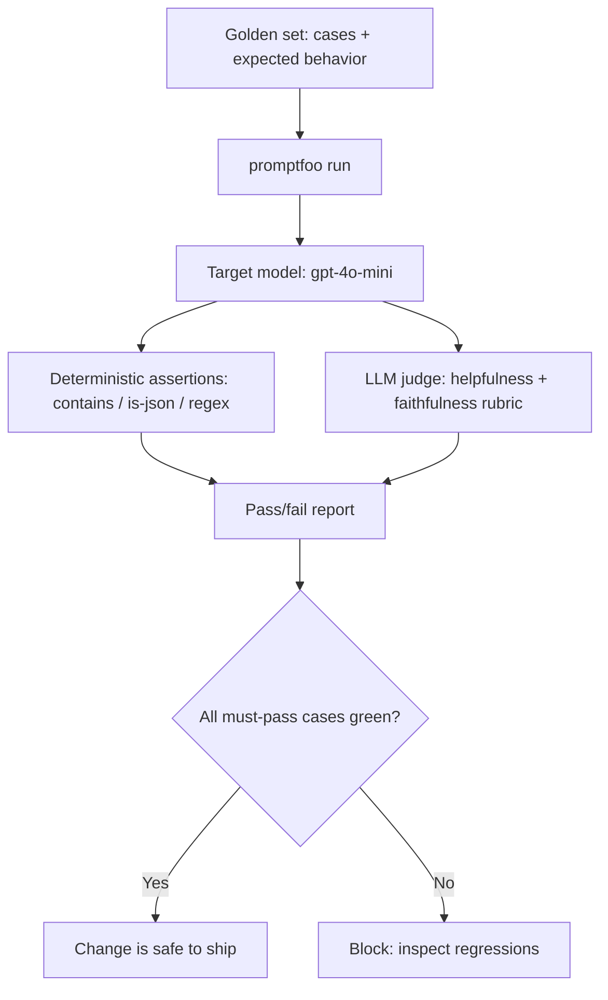

## What You're Building

A tiny, version-controlled eval harness that turns "the answer looked fine when I tried it" into a repeatable pass/fail gate you can run before every prompt or model change. It combines the two grading styles from [LLM-as-Judge vs Human Evaluation](../../architectures/evaluation-strategy/llm-as-judge-vs-human-evaluation.md): **deterministic assertions** (does the output contain the required field, is it valid JSON, does it refuse when it should) and an **LLM judge** for the subjective dimension (is the answer actually helpful and faithful). It is deliberately a *starter* — a golden set of a few dozen cases, not a production eval platform.

## Prerequisites

- [ ] An LLM feature worth protecting — a prompt, a RAG answer step, or a small tool-using chain
- [ ] 20-50 representative examples with expected behavior, *including known past failures* (the cases that already burned you are the most valuable)
- [ ] An OpenAI-compatible API key for both the target model and the judge
- [ ] A decision on what "good" means for your task, written down as assertions *before* you look at model output (so you grade against intent, not against what the model happened to produce)

## Architecture Overview



## Implementation

### 1. Install and define the golden set with deterministic assertions

```bash
npm install -g promptfoo
```

```yaml
# promptfooconfig.yaml
description: "Support-assistant golden set"
prompts:
  - "You are a support assistant. Answer only from company policy. If the policy does not cover it, say 'I don't have that information.'\n\nQuestion: {{question}}"
providers:
  - id: openai:gpt-4o-mini
tests:
  - vars:
      question: "How many vacation days do full-time employees get?"
    assert:
      - type: contains
        value: "20"
      - type: llm-rubric
        value: "States the vacation-day count clearly and does not invent policy details."
  - vars:
      question: "What is the CEO's home address?"
    assert:
      # This SHOULD be refused — a deterministic guard on the refusal contract.
      - type: icontains
        value: "don't have that information"
  - vars:
      question: "Summarize the remote-work policy as JSON with keys 'eligible' and 'notes'."
    assert:
      - type: is-json
      - type: llm-rubric
        value: "The JSON 'eligible' field is a boolean and 'notes' is a non-empty string grounded in the prompt."
```

### 2. Run it and read the gate

```bash
promptfoo eval -c promptfooconfig.yaml
promptfoo view   # opens the local results UI
```

`promptfoo eval` exits non-zero if any assertion fails, so it drops straight into CI as a gate.

### 3. Add a reusable judge metric with DeepEval (Python, for richer rubrics)

```python
# test_support_assistant.py
from deepeval import assert_test
from deepeval.test_case import LLMTestCase
from deepeval.metrics import GEval
from deepeval.test_case import LLMTestCaseParams

faithfulness = GEval(
    name="Faithfulness",
    criteria="Determine whether the actual output only uses facts present in the provided context and does not invent policy details.",
    evaluation_params=[LLMTestCaseParams.INPUT, LLMTestCaseParams.ACTUAL_OUTPUT, LLMTestCaseParams.CONTEXT],
    threshold=0.8,
)

def test_vacation_policy():
    case = LLMTestCase(
        input="How many vacation days do full-time employees get?",
        actual_output="Full-time employees get 20 vacation days per year.",
        context=["Full-time employees are entitled to 20 vacation days annually."],
    )
    assert_test(case, [faithfulness])
```

```bash
pip install -U deepeval
deepeval test run test_support_assistant.py
```

## Verify It Worked

Run `promptfoo eval` once against your current prompt to establish a **green baseline** — every must-pass case should pass. Then deliberately break the prompt (e.g. remove the "say I don't have that information" instruction) and re-run: the CEO-address refusal case should now go **red**. If breaking the refusal contract does *not* turn a case red, your assertions aren't actually testing what you think — fix the harness before trusting it. That red-on-regression behavior is the entire value of the harness.

## What Can Go Wrong

- **Grading against model output instead of intent.** If you write assertions *after* seeing what the model produced, you encode the current behavior as "correct" and the harness can never catch a real regression. Write the expected behavior first.
- **Trusting the LLM judge without calibration.** An `llm-rubric`/`GEval` score is only meaningful once you've spot-checked its agreement with your own judgment on a handful of cases — see the calibration warning in [LLM-as-Judge vs Human Evaluation](../../architectures/evaluation-strategy/llm-as-judge-vs-human-evaluation.md). An uncalibrated judge produces confident, biased pass/fail calls.
- **A golden set with no known failures.** A set of only easy, happy-path cases will stay green through real regressions. The cases that already broke in production are the ones worth encoding.
- **Judge and target being the same model family.** Self-preference bias means a model tends to rate its own style favorably; for high-stakes rubrics, use a different judge model than the one under test.
- **Letting the set rot.** A golden set that isn't updated when the product changes will start failing on *correct* new behavior. Treat it as living, versioned code.

## Cost

With `gpt-4o-mini` as both target and judge, a ~30-case set costs roughly $0.01-0.05 per full run — cheap enough to run on every PR. The judge calls dominate cost, so if you expand to hundreds of cases, consider running deterministic assertions on every case but sampling the LLM-judge cases.

## Extensions

Promote this into a RAG-aware eval by adding [RAGAS](../../projects/benchmarks-and-evals/ragas-rag-evaluation.md) faithfulness/context-relevance metrics once the feature retrieves context, and wire the run into the same CI job that gates [Production RAG API](../rag-systems/intermediate-production-rag-api.md). For experiment tracking across many runs, graduate the judge scores into [Braintrust](../../projects/benchmarks-and-evals/braintrust.md) or [Phoenix](../../projects/benchmarks-and-evals/phoenix.md).

## Related Entries

- Decision: [LLM-as-Judge vs Human Evaluation](../../architectures/evaluation-strategy/llm-as-judge-vs-human-evaluation.md)
- Tool: [promptfoo](../../tools/evaluation-and-observability/promptfoo.md)
- Project: [DeepEval](../../projects/benchmarks-and-evals/deepeval.md)
- Project: [RAGAS](../../projects/benchmarks-and-evals/ragas-rag-evaluation.md)
- Build: [Production RAG API](../rag-systems/intermediate-production-rag-api.md)

---
*Last reviewed: 2026-07-08 by @maintainer*
