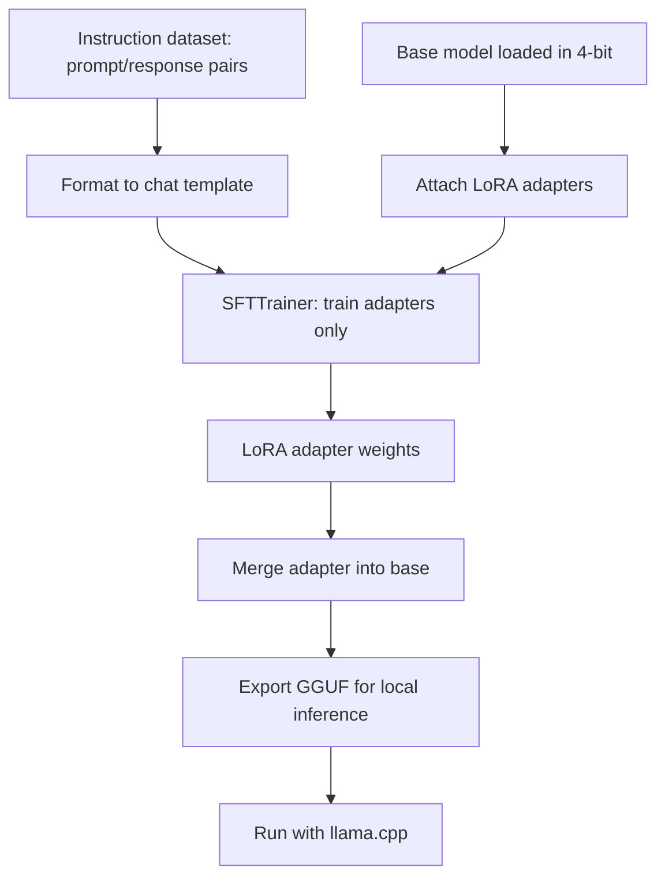

## What You're Building

A complete single-GPU LoRA fine-tuning run: load a small open-weight model in 4-bit, attach low-rank adapters, train on a few hundred instruction examples, and export a merged model you can run locally. This is the cheapest honest on-ramp to fine-tuning — the entire point of LoRA + 4-bit is that it fits on one consumer GPU instead of a cluster. Before you build this, read the caveat in [RAG vs Fine-Tuning](../../architectures/system-design/rag-vs-fine-tuning.md): fine-tuning teaches *behavior, format, and style*, not fresh facts — if you need the model to know new information, you want RAG, not this.

## Prerequisites

- [ ] One NVIDIA GPU with ~12-24GB VRAM — a 7-8B model in 4-bit LoRA fits comfortably; a free cloud notebook GPU also works
- [ ] A small, clean instruction dataset (hundreds to low thousands of prompt/response pairs) — quality and consistency matter far more than volume at this scale
- [ ] A concrete, checkable success criterion (e.g. "outputs always follow our JSON schema"), ideally captured as a [golden-set eval](../evaluation-pipelines/starter-golden-set-eval-harness.md) *before* you train
- [ ] Confirmation that fine-tuning is the right tool — see [RAG vs Fine-Tuning](../../architectures/system-design/rag-vs-fine-tuning.md)

## Architecture Overview



## Implementation

### 1. Install Unsloth

```bash
pip install "unsloth"
```

### 2. Load a small model in 4-bit and attach LoRA adapters

```python
# train.py
from unsloth import FastLanguageModel
import torch

model, tokenizer = FastLanguageModel.from_pretrained(
    model_name="unsloth/llama-3.1-8b-instruct-bnb-4bit",  # pre-quantized 4-bit
    max_seq_length=2048,
    load_in_4bit=True,
)

# Attach LoRA adapters — only these ~1% of params train.
model = FastLanguageModel.get_peft_model(
    model,
    r=16,                      # LoRA rank; 8-32 is the usual range
    lora_alpha=16,
    target_modules=["q_proj", "k_proj", "v_proj", "o_proj",
                    "gate_proj", "up_proj", "down_proj"],
    use_gradient_checkpointing="unsloth",
)
```

### 3. Format the dataset to the chat template and train

```python
from datasets import load_dataset
from trl import SFTTrainer, SFTConfig

dataset = load_dataset("json", data_files="my_instructions.jsonl", split="train")

def to_text(example):
    msgs = [
        {"role": "user", "content": example["prompt"]},
        {"role": "assistant", "content": example["response"]},
    ]
    return {"text": tokenizer.apply_chat_template(msgs, tokenize=False)}

dataset = dataset.map(to_text)

trainer = SFTTrainer(
    model=model,
    tokenizer=tokenizer,
    train_dataset=dataset,
    args=SFTConfig(
        per_device_train_batch_size=2,
        gradient_accumulation_steps=4,
        warmup_steps=5,
        num_train_epochs=1,          # start with 1; more epochs risk overfitting a small set
        learning_rate=2e-4,
        logging_steps=1,
        output_dir="outputs",
    ),
)
trainer.train()
```

### 4. Merge and export for local inference

```python
# Merge adapters into the base weights and export GGUF for llama.cpp.
model.save_pretrained_gguf("merged-model", tokenizer, quantization_method="q4_k_m")
```

```bash
# Run the fine-tuned model locally with llama.cpp.
llama-cli -m merged-model/*.gguf -p "Your test prompt here"
```

## Verify It Worked

Before training, run 5-10 of your golden-set prompts through the *base* model and save the outputs. After training, run the same prompts through the merged model. You should see the specific behavior you trained for (format adherence, tone, refusal pattern) appear — and you should confirm that **general capability didn't collapse** by also running a few unrelated prompts. If the model now produces your target format but has become incoherent on everything else, you've overfit: reduce epochs, lower the learning rate, or add more diverse data. "The loss went down" is not verification — behavior on held-out prompts is.

## What Can Go Wrong

- **Fine-tuning to inject knowledge.** The most common and most expensive mistake. LoRA fine-tuning reliably changes *style and format*, but is a poor and unreliable way to teach new facts — those get hallucinated confidently. Use [RAG](../../architectures/system-design/rag-vs-fine-tuning.md) for knowledge.
- **Overfitting a tiny dataset.** With only a few hundred examples, 3-5 epochs will often memorize the set and degrade general ability. Start at 1 epoch and increase only if a held-out eval improves.
- **Wrong or missing chat template.** Training on raw prompt/response text without the model's chat template produces a model that behaves oddly at inference because the training and serving formats diverge. Always format with `apply_chat_template`.
- **Evaluating on the training set.** If your only check is training-set outputs, you're measuring memorization, not generalization. Hold out examples the model never saw.
- **VRAM OOM at merge/export time.** Merging to 16-bit can need more memory than 4-bit training. If merge OOMs, export the adapter separately or merge on a larger machine.

## Cost

On an owned consumer GPU the marginal cost is electricity. A short run (1 epoch, a few hundred examples, an 8B model in 4-bit) on a rented ~24GB cloud GPU typically finishes in tens of minutes for well under a couple of dollars. The 4-bit + LoRA combination is what keeps this on one card — see [Choosing a Quantization Strategy](../../architectures/serving-patterns/choose-quantization-strategy.md) for why 4-bit fits where full precision won't.

## Extensions

Once the adapter works, serve it at scale by hot-swapping LoRA adapters on [vLLM](../../projects/inference-engines/vllm.md) rather than merging a separate model per use case. Gate every future fine-tune behind the [golden-set eval harness](../evaluation-pipelines/starter-golden-set-eval-harness.md) so a retrain can't silently regress behavior. If you outgrow a single GPU, the same LoRA recipe scales to multi-GPU training frameworks.

## Related Entries

- Decision: [RAG vs Fine-Tuning](../../architectures/system-design/rag-vs-fine-tuning.md)
- Decision: [Choosing a Quantization Strategy](../../architectures/serving-patterns/choose-quantization-strategy.md)
- Tool: [Unsloth](../../tools/model-layer/unsloth.md)
- Project: [llama.cpp](../../projects/inference-engines/llama-cpp.md)
- Build: [Golden-Set Eval Harness](../evaluation-pipelines/starter-golden-set-eval-harness.md)

---
*Last reviewed: 2026-07-08 by @maintainer*
