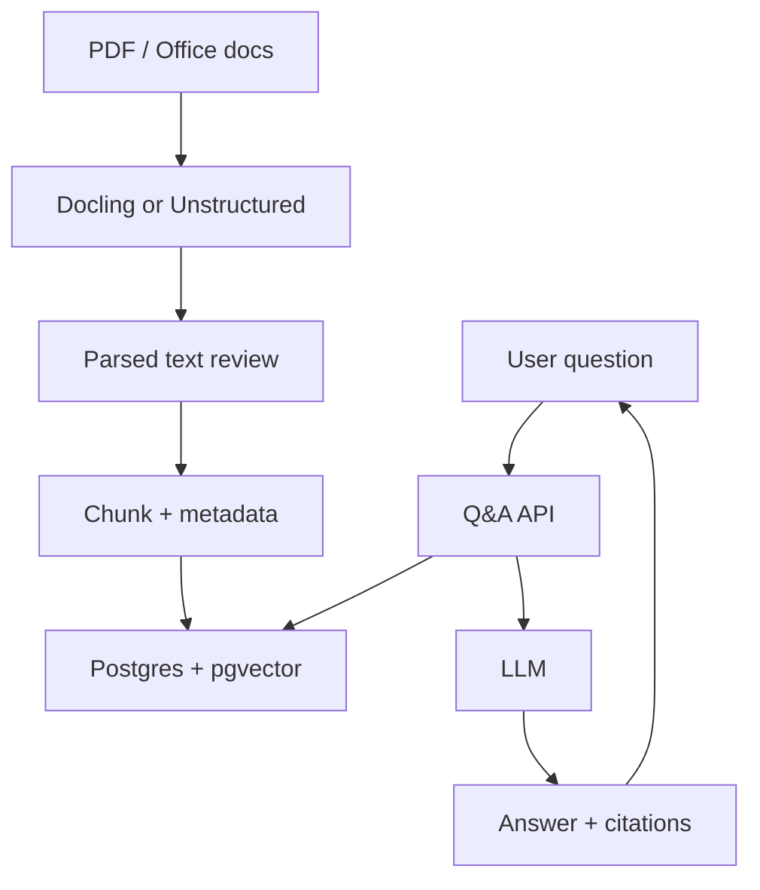

> **TL;DR:** Builds a document Q&A pipeline. Stack: Docling or Unstructured, LlamaIndex, pgvector. Best for teams already using Postgres.

## What You're Building

You will build a pipeline that parses documents, exports text/metadata, chunks content, stores embeddings in Postgres via pgvector, and answers questions with citations. Users experience a document-grounded Q&A endpoint or UI.

## Architecture Overview

## Stack

| Component | Tool | Why |
|---|---|---|
| Parser | Docling or Unstructured | Better document structure before retrieval |
| RAG framework | LlamaIndex | Index/query abstractions |
| Vector DB | pgvector | Use existing Postgres operations |
| API | FastAPI | Simple service boundary |
| Evaluation | RAGAS / golden questions | Catch ingestion and retrieval regressions |

## Prerequisites

- [ ] Postgres available
- [ ] Representative documents with layout complexity
- [ ] Decision on citation granularity
- [ ] Embedding model selected

## Key Implementation Steps

1. **Parse and inspect** — Convert documents and manually inspect Markdown/text output.
2. **Chunk with metadata** — Keep page, section, source, parser, and chunk-version metadata.
3. **Index in pgvector** — Store vectors alongside relational metadata and access-control fields.
4. **Build Q&A endpoint** — Retrieve filtered context and generate answer with citations.
5. **Evaluate parsing failures** — Add examples where tables, headings, or scanned pages fail.

## Gotchas & Tips

- Parsing quality often dominates retrieval quality.
- Do not skip parsed-text review.
- Use Postgres row-level security if tenant isolation matters.
- Version parser and chunker settings.

## Full Reference Implementations

- [Docling repository](https://github.com/docling-project/docling) — Document parsing
- [Unstructured repository](https://github.com/Unstructured-IO/unstructured) — Document ETL
- [pgvector repository](https://github.com/pgvector/pgvector) — Postgres vector search

## Related Entries

- Parser: [Docling](../../projects/rag/document-processing/docling.md)
- Parser: [Unstructured](../../projects/rag/document-processing/unstructured.md)
- Vector DB: [pgvector](../../projects/rag/vector-databases/pgvector.md)
- Tip: [Store parser version](../../tips-and-tricks/store-parser-version-with-every-chunk.md)

---
*Last reviewed: 2026-06-14 by @maintainer*

