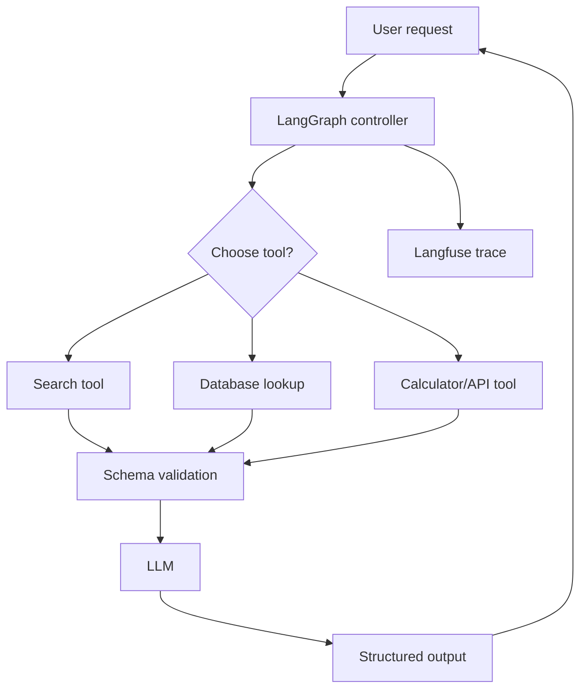

> **TL;DR:** Builds a bounded multi-tool agent. Stack: LangGraph, validated Python tools, Instructor, Langfuse. Best for controlled automation.

## What You're Building

You will build an agent that can choose among multiple tools, validate tool arguments, produce structured outputs, and stop safely when budget or policy limits are reached. The user sees a final answer plus optionally trace/debug metadata.

## Architecture Overview

## Stack

| Component | Tool | Why |
|---|---|---|
| Orchestration | LangGraph | State and routing control |
| Structured output | Instructor | Typed responses and validation |
| Tools | Python functions | Small auditable tool surface |
| Observability | Langfuse | Trace each tool call and model step |

## Prerequisites

- [ ] At least two safe tools
- [ ] Pydantic schema knowledge
- [ ] Clear success criteria
- [ ] Tool timeouts and max-step policy

## Key Implementation Steps

1. **Define tool schemas** — Specify exact inputs, outputs, permissions, and failure modes for each tool.
2. **Build routing graph** — Use LangGraph nodes/edges or a prebuilt agent with step budgets.
3. **Validate outputs** — Use Instructor/Pydantic schemas for final answers.
4. **Add observability** — Record state, tool args, tool outputs, and model choices.
5. **Add human approval** — Gate risky or irreversible tools.

## Gotchas & Tips

- Tool descriptions are part of the prompt surface; keep them precise.
- Validate before execution, not after.
- Separate planner and executor permissions.
- Make success criteria machine-checkable.

## Full Reference Implementations

- [LangGraph repository](https://github.com/langchain-ai/langgraph) — Agent orchestration
- [Instructor repository](https://github.com/instructor-ai/instructor) — Structured output
- [Langfuse repository](https://github.com/langfuse/langfuse) — Observability

## Related Entries

- Framework: [LangGraph](../../projects/agents/frameworks/langgraph.md)
- Tool: [Instructor](../../tools/dx-and-tooling/instructor.md)
- Tip: [Validate tool arguments](../../tips-and-tricks/validate-tool-arguments-before-execution.md)
- Tip: [Separate planner and executor](../../tips-and-tricks/separate-planner-and-executor-permissions.md)

---
*Last reviewed: 2026-06-14 by @maintainer*

