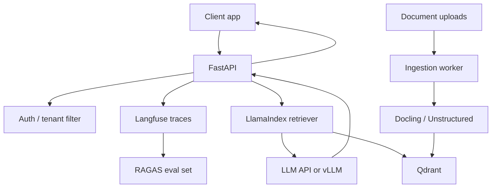

> **TL;DR:** Builds a production RAG API. Stack: FastAPI, LlamaIndex, Qdrant, Langfuse, Docker. Best for startups shipping document Q&A.

## What You're Building

You will build an HTTP API that ingests documents, indexes chunks with metadata, retrieves relevant evidence, generates source-grounded answers, and records traces/evals. Users interact through an API or frontend calling the API.

## Architecture Overview

## Stack

| Component | Tool | Why |
|---|---|---|
| API | FastAPI | Typed production API surface |
| RAG | LlamaIndex | Document ingestion and retrieval abstractions |
| Vector DB | Qdrant | Production vector search with filtering |
| Observability | Langfuse | Trace requests and prompt versions |
| Evaluation | RAGAS | Regression checks for retrieval quality |
| Deployment | Docker | Repeatable service packaging |

## Prerequisites

- [ ] Docker and Python service experience
- [ ] Representative document corpus
- [ ] Authentication/tenant model
- [ ] Basic eval dataset before launch

## Key Implementation Steps

1. **Separate ingestion and query** — Run document parsing/indexing asynchronously from user queries.
2. **Store metadata** — Persist tenant, source URL, page, heading, parser version, and chunk version.
3. **Add API contracts** — Validate request/response schemas and return source citations.
4. **Instrument traces** — Trace retriever inputs, retrieved chunks, prompt version, model, cost, and latency.
5. **Gate changes with evals** — Run RAGAS/Golden questions before changing chunking, embeddings, or prompts.

## Gotchas & Tips

- Do not parse documents during user requests.
- Metadata filters prevent cross-tenant retrieval leaks.
- Trace retrieved chunks, not just final answers.
- Start with recall before adding reranking.

## Full Reference Implementations

- [Qdrant examples](https://github.com/qdrant/examples) — Vector DB examples
- [LlamaIndex repository](https://github.com/run-llama/llama_index) — RAG framework
- [FastAPI repository](https://github.com/fastapi/fastapi) — API framework
- [Langfuse repository](https://github.com/langfuse/langfuse) — Observability

## Related Entries

- Stack reference: [Production RAG](../../architectures/reference-stacks/production-rag.md)
- Vector DB: [Qdrant](../../projects/rag/vector-databases/qdrant.md)
- Observability: [Langfuse](../../projects/observability/tracing/langfuse.md)
- Evaluation: [Ragas](../../projects/rag/frameworks/ragas-rag-evaluation.md)

---
*Last reviewed: 2026-06-14 by @maintainer*

