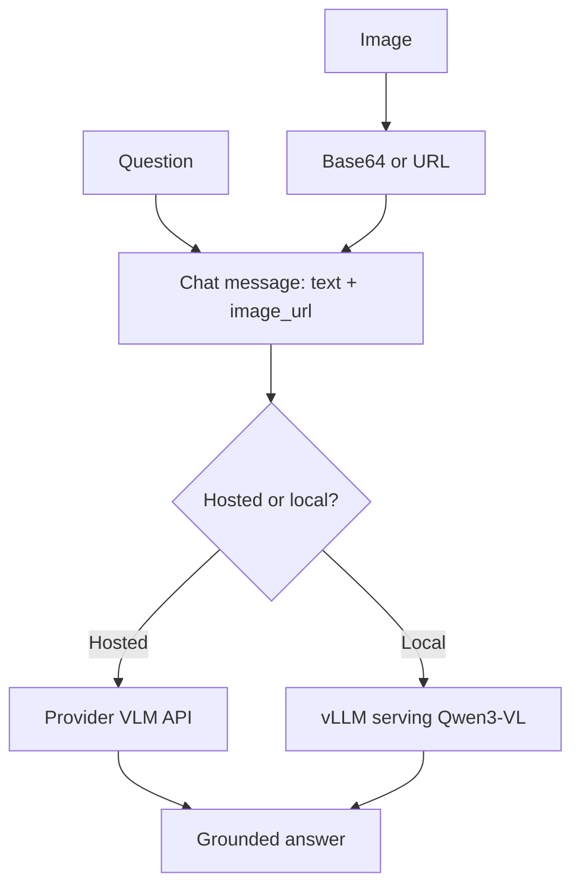

## What You're Building

A minimal image question-answering service: pass an image plus a question and get a grounded text answer. You'll build it twice — once against a **hosted VLM API** (fastest to a working prototype) and once **self-hosted** with an open vision-language model on [vLLM](../../projects/inference-engines/vllm.md). Building both makes the [Self-Host vs Hosted API](../../architectures/model-selection/self-host-vs-hosted-api.md) tradeoff concrete: the hosted path is running in minutes; the local path costs more setup but keeps images inside your environment and has near-zero marginal cost.

## Prerequisites

- [ ] Images and the questions you want to ask about them (a handful is enough to start)
- [ ] Hosted path: an API key for a provider serving a vision-language model
- [ ] Local path: an NVIDIA GPU with ~16-24GB VRAM for a 7-8B-class VLM
- [ ] A sense of your data-sensitivity constraint — if images contain PII or regulated content, that likely forces the local path (this is exactly the governance factor in [Self-Host vs Hosted API](../../architectures/model-selection/self-host-vs-hosted-api.md))

## Architecture Overview



## Implementation

### Path A — Hosted VLM API (fastest prototype)

Vision-language models use the standard chat API with an image content part. Base64-encode a local image (or pass a public URL):

```python
# hosted.py
import base64, os
from openai import OpenAI

client = OpenAI(api_key=os.environ["OPENAI_API_KEY"])

with open("chart.png", "rb") as f:
    b64 = base64.b64encode(f.read()).decode()

resp = client.chat.completions.create(
    model="gpt-4o-mini",  # any vision-capable model
    max_tokens=300,        # cap output — VLMs happily over-describe
    messages=[{
        "role": "user",
        "content": [
            {"type": "text", "text": "What is the highest value in this chart, and in which month?"},
            {"type": "image_url", "image_url": {"url": f"data:image/png;base64,{b64}"}},
        ],
    }],
)
print(resp.choices[0].message.content)
```

### Path B — Self-host an open VLM with vLLM

```bash
pip install "vllm"
# Serve an open vision-language model with an OpenAI-compatible endpoint.
vllm serve Qwen/Qwen3-VL-8B-Instruct \
  --limit-mm-per-prompt image=1 \
  --port 8000
```

The server exposes the *same* OpenAI-compatible schema, so the client is Path A's code pointed at your endpoint:

```python
# local.py — identical message format, different base_url
from openai import OpenAI
client = OpenAI(base_url="http://localhost:8000/v1", api_key="EMPTY")
# ...same messages=[...] payload as hosted.py, model="Qwen/Qwen3-VL-8B-Instruct"
```

That the payload is byte-for-byte identical across paths is the point: you can prototype hosted and cut over to local without rewriting the application.

## Verify It Worked

Ask a question whose answer you can check *from the image yourself* — "how many people are in this photo?", "what does the error dialog say?", "what's the largest bar in this chart?". A correct, specific answer confirms the pipeline. Then run a **grounding check**: ask about something *not* in the image ("what brand is the car?" when there is no car). A well-behaved setup says it can't determine that; a hallucinated confident answer tells you to tighten the prompt ("answer only from what is visible; say 'not visible' otherwise") and to treat VLM outputs as needing the same faithfulness discipline as text RAG.

## What Can Go Wrong

- **Unbounded output length.** VLMs love to narrate the entire image. Without `max_tokens`, a "what's the total?" question returns three paragraphs and costs more — cap output (see [Cap Max Output Tokens](../../tips-and-tricks/cost-and-performance/cap-max-output-tokens-per-request.md)).
- **Silent resolution downscaling drives both cost and accuracy.** Providers tile/resize images, and fine detail (small text, dense charts) can be lost or can balloon token cost at high resolution. Check the provider's image-handling rules before trusting OCR-like tasks.
- **Confident hallucination on absent content.** VLMs answer even when the image doesn't support it. Prompt for grounding and verify, exactly as you would for text RAG.
- **Local VLM OOM from the vision tower + KV cache.** VLMs need memory for image features on top of the language model; a model that fits as text-only may OOM as a VLM. Start with a smaller model or reduce max image count/resolution.
- **Wrong message format.** The image must be a structured `image_url` content part, not pasted into the text string — a data URI in plain text is treated as literal characters, not decoded.

## Cost

Hosted VLM calls run roughly $0.001-0.01 per image depending on resolution and the provider's tiling — higher-resolution images cost meaningfully more because they expand into more image tokens. Local serving on an owned GPU is near-zero marginal cost but carries the fixed cost and operational burden covered in [Self-Host vs Hosted API](../../architectures/model-selection/self-host-vs-hosted-api.md).

## Extensions

Turn single-image Q&A into document understanding by pairing the VLM with a parser and retrieval, or batch-process an image corpus through the async pattern in [Synchronous vs Streaming vs Asynchronous](../../architectures/serving-patterns/choose-response-delivery-pattern.md). Add a [golden-set eval](../evaluation-pipelines/starter-golden-set-eval-harness.md) with human-verified answers to catch grounding regressions when you change models.

## Related Entries

- Decision: [Self-Host vs Hosted API](../../architectures/model-selection/self-host-vs-hosted-api.md)
- Project: [Qwen3-VL](../../projects/multimodal/qwen3-vl.md)
- Project: [vLLM](../../projects/inference-engines/vllm.md)
- Paper: [LLaVA: Visual Instruction Tuning](../../research/multimodal/liu-2023-llava.md)
- Build: [Golden-Set Eval Harness](../evaluation-pipelines/starter-golden-set-eval-harness.md)

---
*Last reviewed: 2026-07-08 by @maintainer*
