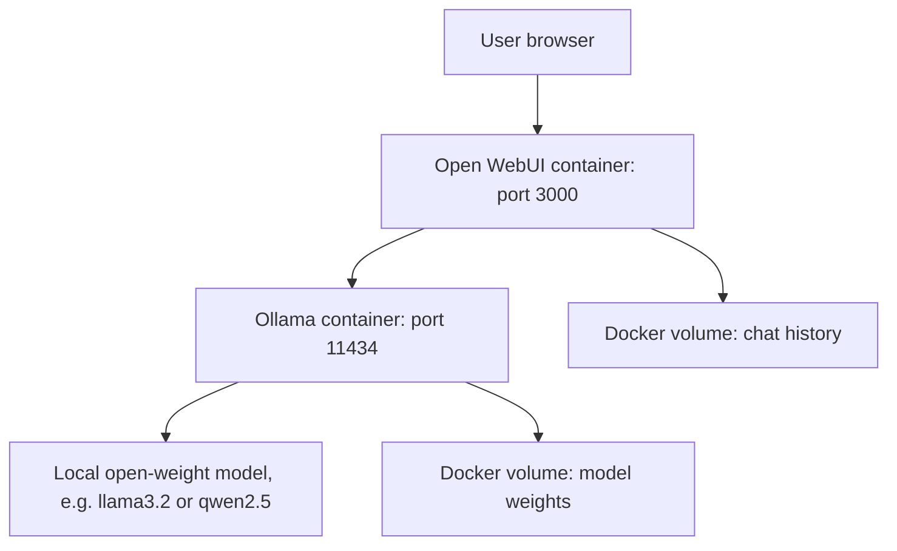

## What You're Building

A private, fully local chat stack: Ollama serving an open-weight model, and Open WebUI as the browser-based chat interface, connected via Docker Compose. No data leaves your machine. This is the deployment/setup pattern most of the other build examples in this catalog fall back to when you want to run them without a hosted API key.

## Prerequisites

- [ ] Docker and Docker Compose v2 installed (`docker compose version` should print a version, not an error)
- [ ] At least 8GB system RAM free for a small quantized model (7-8B parameters, 4-bit quantized); more for larger models
- [ ] ~5-10GB free disk for the model download plus container images
- [ ] No GPU required to start, but expect noticeably slower generation on CPU-only hardware — see [Benchmark on the Actual User Hardware](../../tips-and-tricks/inference-and-serving/benchmark-on-the-user-hardware.md)

## Architecture Overview



## Implementation

### 1. Docker Compose file

Current shape from [open-webui/open-webui](https://github.com/open-webui/open-webui)'s `main` branch, trimmed to two services:

```yaml
# docker-compose.yml
services:
  ollama:
    image: ollama/ollama:latest
    container_name: ollama
    volumes:
      - ollama:/root/.ollama
    restart: unless-stopped
    ports:
      - "11434:11434"

  open-webui:
    image: ghcr.io/open-webui/open-webui:main
    container_name: open-webui
    depends_on:
      - ollama
    volumes:
      - open-webui:/app/backend/data
    ports:
      - "3000:8080"
    environment:
      - OLLAMA_BASE_URL=http://ollama:11434
    extra_hosts:
      - host.docker.internal:host-gateway
    restart: unless-stopped

volumes:
  ollama:
  open-webui:
```

### 2. Start the stack

```bash
docker compose up -d
```

### 3. Pull a small model

```bash
docker exec -it ollama ollama pull llama3.2:3b
```

Start smallest-first (`llama3.2:3b` or `qwen2.5:3b`); move up only after confirming latency/memory, per [Start With a Smaller Quantized Model](../../tips-and-tricks/inference-and-serving/start-with-a-smaller-quantized-model.md).

### 4. Open the UI

```text
http://localhost:3000
```

Create a local admin account (stored only in the `open-webui` volume) and select `llama3.2:3b` from the model dropdown.

## Verify It Worked

```bash
# Confirm both containers are running:
docker compose ps
# Expected: both "ollama" and "open-webui" show STATUS "Up".

# Confirm Ollama is actually serving the model, independent of the UI:
curl http://localhost:11434/api/generate -d '{
  "model": "llama3.2:3b",
  "prompt": "Say OK if you can read this.",
  "stream": false
}'
# Expected: a JSON response with a non-empty "response" field.
```

If the `curl` command returns a connection-refused error, the Ollama container itself isn't healthy yet — check `docker compose logs ollama` before touching the UI. A working build shows a plain-text reply in the Open WebUI chat window within a few seconds of sending a message (longer on first request, while the model loads into memory).

## What Can Go Wrong

- **`curl` to port 11434 works but the UI shows "model not found."** The UI container talks to Ollama via `OLLAMA_BASE_URL=http://ollama:11434` (the Docker service name), not `localhost` — this only resolves correctly inside the Docker network, which is why the compose file's `depends_on` and service naming matter.
- **First response after pulling a new model is extremely slow, then fast.** The model has to load from disk into memory on first use; subsequent requests reuse the loaded model until Ollama's idle-unload timer evicts it.
- **Out-of-memory kills the Ollama container silently.** Check `docker compose logs ollama` for OOM-kill messages if the container restarts unexpectedly — this means the chosen model is too large for available RAM; move down a size, not up.
- **Promising cloud-model-level quality from a laptop-class 3B-7B model** is the most common expectation mismatch with this pattern — set expectations accordingly, especially for anything requiring multi-step reasoning.
- **Do not commit model weights to Git.** They live in the `ollama` Docker volume, not your working directory, but double-check `.gitignore` if you later add scripts that download models outside Docker.

## Cost

Free — everything runs on hardware you already control. The only cost is your own compute/electricity and the time spent choosing an appropriately sized model for your hardware.

## Extensions

Once this works, natural next steps are adding a local vector store (Chroma or LanceDB) for a fully offline RAG setup — see [Basic RAG Chatbot](../rag-systems/starter-basic-rag-chatbot.md) and swap its `Settings.llm` for an Ollama-backed client instead of a hosted API.

## Related Entries

- Runtime: [Ollama](../../projects/inference-engines/ollama.md)
- Runtime: [llama.cpp](../../projects/inference-engines/llama-cpp.md)
- Stack reference: [Local-first](../../architectures/reference-stacks/local-first.md)
- Tip: [Benchmark Local Models on the Actual Hardware Class Users Will Run](../../tips-and-tricks/inference-and-serving/benchmark-on-the-user-hardware.md)
- Tip: [Start With a Smaller Quantized Model](../../tips-and-tricks/inference-and-serving/start-with-a-smaller-quantized-model.md)

---
*Last reviewed: 2026-07-06 by @maintainer*
