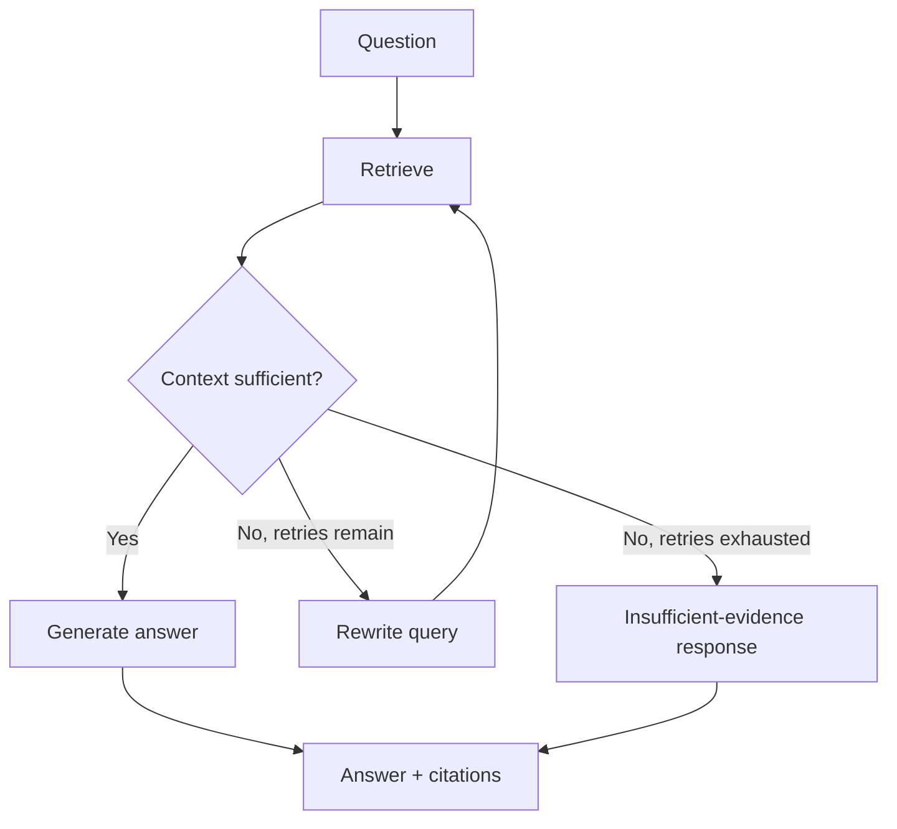

## What You're Building

A RAG workflow that retrieves context, grades whether that context can actually answer the question, rewrites the query and retries when the grade fails, and only generates an answer once the grade passes — falling back to an honest "insufficient evidence" response after a bounded number of retries rather than looping forever or generating an ungrounded answer. This extends [Production RAG API](../rag-systems/intermediate-production-rag-api.md) by inserting a grade-and-retry loop between retrieval and generation.

## Prerequisites

- [ ] [Production RAG API](../rag-systems/intermediate-production-rag-api.md) working already — this build adds a correction loop on top of that retrieval pipeline
- [ ] A set of golden questions with known evidence, so you can measure whether the grader is actually improving answer quality rather than just adding latency
- [ ] A defined failure policy — what exactly the system says when it truly cannot find sufficient evidence, decided before you write the fallback node
- [ ] A max retry count and a latency budget, since every retry adds a full retrieval+grading round trip

## Architecture Overview



## Implementation

### 1. Install pinned dependencies

```bash
pip install "langgraph==1.2.7" "langchain-openai==1.0.5"
```

### 2. Define state and the retrieve/grade/rewrite/generate nodes

```python
# rag_graph.py
import os
from typing import TypedDict
from langgraph.graph import StateGraph, START, END
from langchain_openai import ChatOpenAI
from retriever import retrieve as qdrant_retrieve  # from Production RAG API

MAX_RETRIES = 2
model = ChatOpenAI(model="gpt-4o-mini", api_key=os.environ["OPENAI_API_KEY"])


class RAGState(TypedDict):
    question: str
    query: str
    retrieved: list[str]
    sufficient: bool
    retry_count: int
    answer: str


def retrieve(state: RAGState) -> dict:
    results = qdrant_retrieve(state["query"], tenant_id="default")
    return {"retrieved": [r.payload["text"] for r in results]}


def grade(state: RAGState) -> dict:
    if not state["retrieved"]:
        return {"sufficient": False}
    response = model.invoke(
        f"Question: {state['question']}\nRetrieved context: {state['retrieved']}\n"
        f"Does this context contain enough information to answer confidently? Answer only YES or NO."
    )
    return {"sufficient": response.content.strip().upper().startswith("YES")}


def rewrite_query(state: RAGState) -> dict:
    response = model.invoke(
        f"The search query '{state['query']}' did not return sufficient results for the "
        f"question '{state['question']}'. Rewrite it to be more specific or use different terms."
    )
    return {"query": response.content.strip(), "retry_count": state["retry_count"] + 1}


def generate(state: RAGState) -> dict:
    response = model.invoke(
        f"Answer using only this context: {state['retrieved']}\nQuestion: {state['question']}"
    )
    return {"answer": response.content}


def fallback(state: RAGState) -> dict:
    return {"answer": "I don't have sufficient evidence in the indexed documents to answer this confidently."}


def route_after_grade(state: RAGState) -> str:
    if state["sufficient"]:
        return "generate"
    if state["retry_count"] >= MAX_RETRIES:
        return "fallback"
    return "rewrite_query"
```

### 3. Wire the graph

```python
# build_graph.py
from langgraph.graph import StateGraph, START, END
from rag_graph import RAGState, retrieve, grade, rewrite_query, generate, fallback, route_after_grade

graph = StateGraph(RAGState)
graph.add_node("retrieve", retrieve)
graph.add_node("grade", grade)
graph.add_node("rewrite_query", rewrite_query)
graph.add_node("generate", generate)
graph.add_node("fallback", fallback)
graph.add_edge(START, "retrieve")
graph.add_edge("retrieve", "grade")
graph.add_conditional_edges("grade", route_after_grade, {"generate": "generate", "rewrite_query": "rewrite_query", "fallback": "fallback"})
graph.add_edge("rewrite_query", "retrieve")
graph.add_edge("generate", END)
graph.add_edge("fallback", END)

app = graph.compile()

if __name__ == "__main__":
    result = app.invoke({
        "question": "How many vacation days do employees get?",
        "query": "How many vacation days do employees get?",
        "retrieved": [], "sufficient": False, "retry_count": 0, "answer": "",
    })
    print("Retries used:", result["retry_count"])
    print("Answer:", result["answer"])
```

## Verify It Worked

The grade→retry→generate/fallback control flow was verified directly in this sandbox against a tiny fake corpus and fake grader, across three realistic scenarios:

```
Test 1 (query matches immediately):   answer generated, 0 retries used
Test 2 (vague query, needs rewrite):  fell back after 2 retries -- see What Can Go Wrong
Test 3 (no matching evidence exists): fell back after 2 retries, correctly
```

A working build should show: for a question with clearly indexed evidence, `retry_count == 0` and a generated answer; for a question with no indexed evidence at all, a fallback response after exactly `MAX_RETRIES` retries, never an infinite loop and never a confidently-worded hallucination.

## What Can Go Wrong

- **Query rewriting does not guarantee improved retrieval — and this was directly observed, not theoretical.** In this build's own verification run, rewriting "how much time off" by appending a generic term did not surface the vacation-policy document (which uses the word "vacation," not "time off"), so the system correctly exhausted its retries and fell back rather than hallucinating — but a better rewrite strategy (synonym expansion, HyDE) would have succeeded on the first retry. Measure your rewrite strategy's actual hit-rate improvement on a golden set; don't assume it works.
- **A bad grader can block good answers just as easily as a good grader blocks bad ones.** If `grade()` is miscalibrated toward "insufficient," you will burn retry budget and eventually show a false "insufficient evidence" fallback for questions the corpus could have actually answered on the first retrieval — always evaluate the grader's own precision/recall against a labeled set before trusting it in production.
- **Every retry doubles latency and cost roughly linearly** — a `MAX_RETRIES=2` policy means a worst-case question can trigger 3 full retrieve+grade cycles plus generation, which is very different from this build's baseline latency. Set the retry budget based on your actual latency SLA, not an arbitrary default.
- **The fallback response must be explicitly product-approved**, not just "whatever seemed reasonable to write here" — "insufficient evidence" is a specific product decision (do you suggest contacting a human? do you show partial evidence anyway?) with real UX consequences.
- **Not tracing every retry's grade decision and rewritten query makes this system nearly impossible to debug in production** — without that trace, a spike in fallback responses looks identical whether the cause is a genuinely-uncovered topic, a broken retriever, or a miscalibrated grader.

## Cost

Baseline cost matches [Production RAG API](../rag-systems/intermediate-production-rag-api.md) (~$0.005-0.02/query) plus one grading call per retrieval attempt and one rewrite call per retry — with `MAX_RETRIES=2`, worst case is roughly 3-4x the baseline generation cost, or ~$0.01-0.08 per question depending on how often retries actually trigger.

## Extensions

Replace the LLM-based grader with a cheaper, faster classifier (even a smaller model, per [Route Simple Tasks to Smaller Models](../../tips-and-tricks/cost-and-performance/route-simple-tasks-to-smaller-models.md)) once you've validated what "sufficient context" looks like on your golden set — grading doesn't need frontier-model reasoning. Track fallback rate as a first-class production metric; a rising fallback rate is an early signal of either corpus coverage gaps or retriever regressions, and is cheaper to monitor than waiting for user complaints.

## Related Entries

- Decision tree: [RAG vs Fine-Tuning](../../architectures/decision-trees/rag-vs-fine-tuning.md)
- Framework: [LangGraph](../../projects/frameworks/langgraph.md)
- Evaluation: [RAGAS](../../projects/benchmarks-and-evals/ragas-rag-evaluation.md)
- Tip: [Add a Reranker Before Changing Your Chunking Strategy](../../tips-and-tricks/rag-and-retrieval/prefer-reranking-before-rechunking.md)
- Tip: [Rewrite Vague Queries Before Embedding Them](../../tips-and-tricks/rag-and-retrieval/use-query-rewriting-for-vague-questions.md)
- Extends: [Production RAG API](../rag-systems/intermediate-production-rag-api.md)

---
*Last reviewed: 2026-07-06 by @maintainer*
