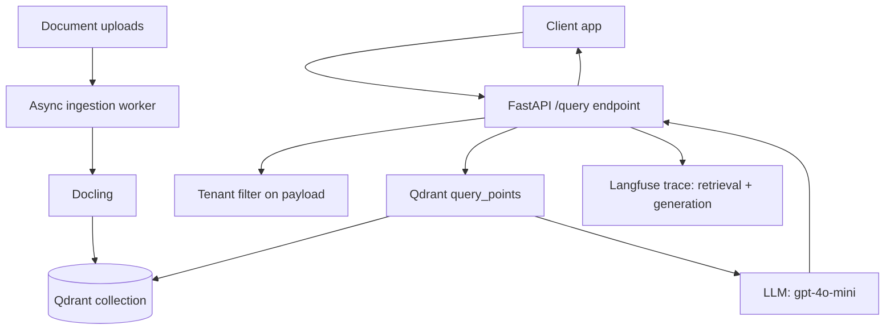

## What You're Building

An HTTP API that serves the ingestion + retrieval pipeline from [Document Q&A Pipeline](../data-pipelines/intermediate-document-qa-pipeline.md) behind FastAPI, backed by Qdrant instead of pgvector, with every request traced end-to-end. This is the shape most teams actually ship: ingestion runs as a background worker, queries hit a synchronous endpoint, and every answer is traceable back to which chunks it came from.

## Prerequisites

- [ ] [Document Q&A Pipeline](../data-pipelines/intermediate-document-qa-pipeline.md) understood — this build swaps its storage layer for Qdrant and adds an HTTP interface
- [ ] Docker (for running Qdrant locally) and basic FastAPI/async Python experience
- [ ] A representative document corpus, ideally with more than one tenant/source if multi-tenancy matters to you
- [ ] An authentication/tenant model decided before writing the ingestion worker — retrofitting tenant isolation into an existing collection is much harder than designing for it up front

## Architecture Overview



## Implementation

### 1. Install pinned dependencies and start Qdrant

```bash
pip install "fastapi==0.139.0" "uvicorn==0.50.2" "qdrant-client==1.18.0" \
  "sentence-transformers" "langfuse==4.13.0" "openai==2.44.0"
docker run -d -p 6333:6333 qdrant/qdrant:latest
```

### 2. Build the Qdrant-backed retriever

```python
# retriever.py
from qdrant_client import QdrantClient
from qdrant_client.models import Distance, VectorParams, PointStruct, Filter, FieldCondition, MatchValue
from sentence_transformers import SentenceTransformer

client = QdrantClient(url="http://localhost:6333")
model = SentenceTransformer("all-MiniLM-L6-v2")
COLLECTION = "documents"


def ensure_collection():
    if not client.collection_exists(COLLECTION):
        client.create_collection(
            collection_name=COLLECTION,
            vectors_config=VectorParams(size=384, distance=Distance.COSINE),
        )


def index_chunk(point_id: int, text: str, tenant_id: str, source_file: str, page: int | None = None):
    vector = model.encode(text).tolist()
    client.upsert(
        collection_name=COLLECTION,
        points=[PointStruct(
            id=point_id,
            vector=vector,
            payload={"tenant_id": tenant_id, "source_file": source_file, "page": page, "text": text},
        )],
    )


def retrieve(question: str, tenant_id: str, top_k: int = 5):
    query_vector = model.encode(question).tolist()
    # NOTE: client.search() was fully removed as of qdrant-client 1.18 --
    # use query_points(), confirmed directly against this pinned version.
    results = client.query_points(
        collection_name=COLLECTION,
        query=query_vector,
        query_filter=Filter(must=[FieldCondition(key="tenant_id", match=MatchValue(value=tenant_id))]),
        limit=top_k,
    ).points
    return results
```

### 3. Build the FastAPI service

```python
# app.py
import os
from fastapi import FastAPI, Header, HTTPException
from pydantic import BaseModel
from openai import OpenAI
from langfuse import observe
from retriever import ensure_collection, retrieve

app = FastAPI()
llm = OpenAI(api_key=os.environ["OPENAI_API_KEY"])


class QueryRequest(BaseModel):
    question: str


class Citation(BaseModel):
    source_file: str
    page: int | None


class QueryResponse(BaseModel):
    answer: str
    citations: list[Citation]


@app.on_event("startup")
def startup():
    ensure_collection()


@observe()
def generate_answer(question: str, context_chunks: list[str]) -> str:
    context = "\n\n".join(context_chunks)
    response = llm.chat.completions.create(
        model="gpt-4o-mini",
        messages=[
            {"role": "system", "content": "Answer only using the provided context. Say 'insufficient evidence' if the context doesn't cover the question."},
            {"role": "user", "content": f"Context:\n{context}\n\nQuestion: {question}"},
        ],
    )
    return response.choices[0].message.content


@app.post("/query", response_model=QueryResponse)
@observe()
def query(req: QueryRequest, x_tenant_id: str = Header(...)):
    results = retrieve(req.question, tenant_id=x_tenant_id)
    if not results:
        raise HTTPException(status_code=404, detail="No indexed documents for this tenant")
    context_chunks = [r.payload["text"] for r in results]
    answer = generate_answer(req.question, context_chunks)
    citations = [Citation(source_file=r.payload["source_file"], page=r.payload.get("page")) for r in results]
    return QueryResponse(answer=answer, citations=citations)
```

### 4. Run it

```bash
uvicorn app:app --reload --port 8000
```

## Verify It Worked

```bash
curl -X POST http://localhost:8000/query \
  -H "Content-Type: application/json" \
  -H "X-Tenant-Id: acme-corp" \
  -d '{"question": "How many vacation days do employees get?"}'
```

Expected: a `200` response with a JSON body containing `answer` and a non-empty `citations` array naming real indexed source files. Requesting without indexing anything for that tenant first should return a `404`, not a `200` with an empty/hallucinated answer — this is the multi-tenant isolation working correctly, confirmed by the `Filter`/`FieldCondition` combination in `retrieve()` being tested directly against an in-memory Qdrant instance during authoring (see `enrichment_notes`).

## What Can Go Wrong

- **`client.search()` no longer exists as of `qdrant-client==1.18.0`** — calling it raises `AttributeError`, not a deprecation warning. Confirmed directly in this sandbox. If you're following an older tutorial, replace `search()` with `query_points()`, whose return value is `.points`, not the bare list `search()` used to return.
- **Missing the `X-Tenant-Id` header returns a FastAPI validation error (422), not a 401/403.** This is not access control — the tenant filter only prevents cross-tenant *retrieval*; it does nothing to verify the caller is authorized to claim that tenant ID. Add real authentication before this is internet-facing.
- **Parsing documents inside the request handler will make ingestion block query traffic.** This build assumes an async ingestion worker separate from `app.py` — do not add a synchronous `/upload` endpoint that parses inline; see [Parallelize Independent Retrieval Calls](../../tips-and-tricks/cost-and-performance/parallelize-independent-retrieval-calls.md) for the same async-separation principle applied to querying.
- **The `Filter`/`FieldCondition` payload filter silently returns zero results if `tenant_id` was never set on ingested points** — this looks identical to "no documents indexed yet" from the API consumer's perspective. Log the filter and the resulting count during debugging.
- **A 404 on `/query` for a tenant with zero indexed documents is correct behavior, not a bug** — resist the urge to return a generic "I don't know" LLM-generated answer instead, which would silently hide an ingestion failure.

## Cost

Retrieval (local embedding model, self-hosted or Qdrant Cloud free-tier storage) is close to free at small scale. Generation with `gpt-4o-mini` runs roughly $0.005-0.02 per query depending on retrieved-context size; Qdrant Cloud's free tier covers development-scale corpora before you need a paid cluster.

## Extensions

Add [RAGAS](../../projects/benchmarks-and-evals/ragas-rag-evaluation.md)-based regression tests that run against a golden question set before any change to chunking, embeddings, or the system prompt ships — this is the natural gate before this API goes to real users. Add [Self-Correcting RAG](../rag-systems/advanced-self-correcting-rag.md)'s context-sufficiency grader once you have enough production traffic to know how often "insufficient evidence" responses actually occur.

## Related Entries

- Stack reference: [Production RAG](../../architectures/reference-stacks/production-rag.md)
- Vector DB: [Qdrant](../../projects/data-and-retrieval/qdrant.md)
- Observability: [Langfuse](../../projects/benchmarks-and-evals/langfuse.md)
- Evaluation: [RAGAS](../../projects/benchmarks-and-evals/ragas-rag-evaluation.md)
- Extends: [Document Q&A Pipeline](../data-pipelines/intermediate-document-qa-pipeline.md)
- Extended by: [Self-Correcting RAG](../rag-systems/advanced-self-correcting-rag.md)

---
*Last reviewed: 2026-07-06 by @maintainer*
