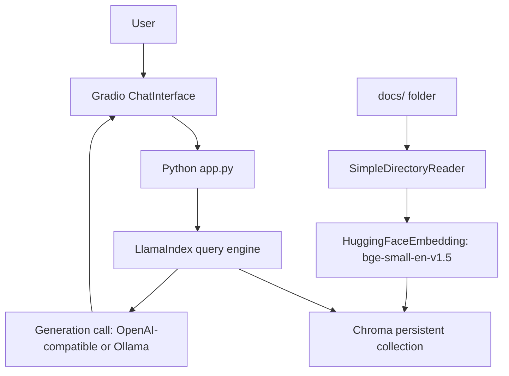

## What You're Building

A local web chat app where a user asks questions over a folder of documents and receives source-grounded answers, with retrieved source snippets visible for debugging. This is the smallest complete RAG loop in the catalog: one embedding model, one vector store, one generation call, no agent loop, no reranking, no eval harness. Everything more advanced (production-rag-api, self-correcting-rag) is built by adding a layer on top of this.

## Prerequisites

- [ ] Python 3.11 or newer (`python3 --version`)
- [ ] A folder of 2+ Markdown, PDF, or text documents (`docs/` in this guide) — using only 1 document means you can't tell retrieval apart from "there's only one thing to return"
- [ ] Either `OPENAI_API_KEY` set in your environment, or a running local Ollama instance (see [Local LLM Chat](../production-deployment/starter-local-llm-chat.md) if you don't have one yet)
- [ ] ~2GB of free disk for the embedding model download on first run

## Architecture Overview



## Implementation

### 1. Install pinned dependencies

```bash
python3 -m venv .venv
source .venv/bin/activate
pip install \
  "llama-index-core==0.14.23" \
  "llama-index-vector-stores-chroma==0.5.5" \
  "llama-index-embeddings-huggingface==0.7.0" \
  "chromadb==1.5.9" \
  "gradio==5.9.1" \
  "llama-index-llms-openai==0.6.6"
```

<!-- TODO: no catalog entry exists yet for chromadb as a standalone project/tool -->

### 2. Build the index (run once, or whenever `docs/` changes)

```python
# build_index.py
import chromadb
from llama_index.core import SimpleDirectoryReader, VectorStoreIndex, StorageContext, Settings
from llama_index.vector_stores.chroma import ChromaVectorStore
from llama_index.embeddings.huggingface import HuggingFaceEmbedding

# Local embedding model -- no API key required for this step.
Settings.embed_model = HuggingFaceEmbedding(model_name="BAAI/bge-small-en-v1.5")

docs = SimpleDirectoryReader("docs").load_data()
print(f"Loaded {len(docs)} source documents")

chroma_client = chromadb.PersistentClient(path="./chroma_db")
collection = chroma_client.get_or_create_collection("company_policies")
vector_store = ChromaVectorStore(chroma_collection=collection)
storage_context = StorageContext.from_defaults(vector_store=vector_store)

index = VectorStoreIndex.from_documents(docs, storage_context=storage_context)
print(f"Indexed {collection.count()} chunks into ./chroma_db")
```

Run it:

```bash
python build_index.py
# Loaded 2 source documents
# Indexed 2 chunks into ./chroma_db
```

Verified output above is from an actual run against a 2-document test corpus (one vacation-policy doc, one remote-work doc) on the pinned versions in `tested_on`.

### 3. Wrap the query engine

```python
# app.py
import os
import chromadb
import gradio as gr
from llama_index.core import VectorStoreIndex, Settings
from llama_index.vector_stores.chroma import ChromaVectorStore
from llama_index.embeddings.huggingface import HuggingFaceEmbedding
from llama_index.llms.openai import OpenAI

Settings.embed_model = HuggingFaceEmbedding(model_name="BAAI/bge-small-en-v1.5")

# Swap this line for a local Ollama LLM if you don't have an OpenAI key --
# see the Local LLM Chat build example for the Ollama-compatible client.
Settings.llm = OpenAI(model="gpt-4o-mini", api_key=os.environ["OPENAI_API_KEY"])

chroma_client = chromadb.PersistentClient(path="./chroma_db")
collection = chroma_client.get_or_create_collection("company_policies")
vector_store = ChromaVectorStore(chroma_collection=collection)
index = VectorStoreIndex.from_vector_store(vector_store)

query_engine = index.as_query_engine(similarity_top_k=3)


def answer(message, history):
    response = query_engine.query(message)
    sources = "\n".join(
        f"- {node.metadata.get('file_name', 'unknown')} (score {node.score:.2f})"
        for node in response.source_nodes
    )
    return f"{response.response}\n\n**Sources:**\n{sources}"


demo = gr.ChatInterface(fn=answer, title="Document Q&A")
```

### 4. Run it

```bash
python app.py
```

```python
# at the bottom of app.py
if __name__ == "__main__":
    demo.launch()
```

Open `http://127.0.0.1:7860` and ask a question about the contents of `docs/`.

## Verify It Worked

Run the retrieval step in isolation before trusting the full chat UI — this isolates "did indexing work" from "did the LLM call work":

```python
retriever = index.as_retriever(similarity_top_k=2)
results = retriever.retrieve("How many vacation days do I get?")
for r in results:
    print(r.score, r.node.get_content()[:80])
```

Expected: the top-scored result should be the chunk that actually contains the answer (in the verified test run above, the vacation-policy chunk scored 0.63 against a remote-work-policy distractor at 0.48). If the top result is unrelated to the question, stop and fix retrieval before touching the UI or the LLM call — see [Measure Retrieval Recall Before Blaming Answer Quality](../../tips-and-tricks/rag-and-retrieval/measure-retrieval-recall-before-answer-quality.md).

Once the UI is running, a successful build shows: your question in the chat box, a plausible answer, and a "Sources" list naming the actual file(s) the answer was grounded in.

## What Can Go Wrong

- **`collection.count()` is 0 after indexing.** Usually means `SimpleDirectoryReader` didn't find any files — check you passed the right relative path and that file extensions are supported (`.txt`, `.md`, `.pdf`, `.docx` by default).
- **Retrieval returns confident-looking but wrong chunks.** This is very often a parsing problem, not an embedding problem — inspect `docs[i].text` right after `SimpleDirectoryReader().load_data()`, before blaming the vector store. See [Inspect Retrieved Chunks Beside the Answer](../../tips-and-tricks/debugging-and-observability/inspect-retrieved-chunks-beside-the-answer.md).
- **`OPENAI_API_KEY` not set raises `KeyError` at import time, not at query time**, because `Settings.llm` is constructed eagerly at module load in `app.py`. If you're only testing retrieval, comment out the `Settings.llm` line and use the retriever directly, as in Verify It Worked above.
- **First run is slow (10-20 seconds) even on a tiny corpus.** This is the embedding model download and load, not your data — `BAAI/bge-small-en-v1.5` downloads ~130MB on first use and is cached afterward.
- **Answers ignore newly added documents.** The Chroma collection is only rebuilt when you re-run `build_index.py`; there is no file-watching in this starter version. Re-run Step 2 after editing `docs/`.

## Cost

Embedding (`BAAI/bge-small-en-v1.5`) runs locally and is free. Generation cost depends entirely on which LLM you point `Settings.llm` at: `gpt-4o-mini` at typical RAG-chatbot prompt sizes runs roughly $0.01-0.05 per question; swapping in a local Ollama model (see the Local LLM Chat build example) makes the entire pipeline free to run, at the cost of lower answer quality on a laptop-class model.

## Extensions

Once this works, the natural next steps (in roughly the order most teams take them) are: add a FastAPI layer so the RAG logic isn't coupled to the Gradio UI (see [Production RAG API](../rag-systems/intermediate-production-rag-api.md)); add retrieval evaluation before touching chunking (see [Measure Retrieval Recall Before Blaming Answer Quality](../../tips-and-tricks/rag-and-retrieval/measure-retrieval-recall-before-answer-quality.md)); and add a context-sufficiency check with retry (see [Self-Correcting RAG](../rag-systems/advanced-self-correcting-rag.md)) once you have a golden question set to measure against.

## Related Entries

- Framework: [LlamaIndex](../../projects/frameworks/llamaindex.md)
- Vector DB: [Chroma](../../projects/data-and-retrieval/chroma.md)
- Tool: [Gradio](../../tools/dx-and-tooling/gradio.md)
- Stack reference: [Lean MVP](../../architectures/reference-stacks/lean-mvp.md)
- Extends into: [Production RAG API](../rag-systems/intermediate-production-rag-api.md)

---
*Last reviewed: 2026-07-06 by @maintainer*
