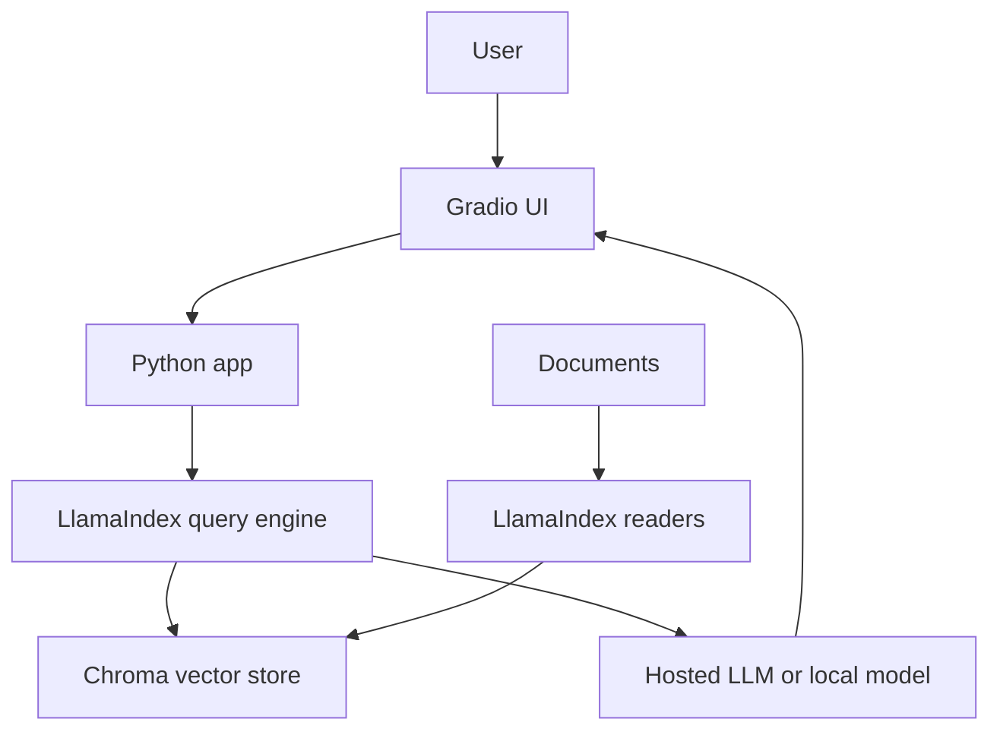

> **TL;DR:** Builds a simple document-grounded chatbot. Stack: Python, LlamaIndex, Chroma, Gradio. Best for first-time RAG builders.

## What You're Building

You will build a local web chat app where a user asks questions over a folder of documents and receives source-grounded answers. The user experience is a single text box plus retrieved-context-backed responses.

## Architecture Overview

## Stack

| Component | Tool | Why |
|---|---|---|
| UI | Gradio | Fastest way to expose a Python chatbot |
| RAG framework | LlamaIndex | Strong ingestion and query-engine abstractions |
| Vector store | Chroma | Local and simple for starter projects |
| LLM | Hosted API or Ollama | Easy baseline depending on privacy needs |

## Prerequisites

- [ ] Python 3.10+
- [ ] A small folder of Markdown/PDF/text documents
- [ ] API key for hosted model or local Ollama setup

## Key Implementation Steps

1. **Load documents** — Use LlamaIndex readers to load a small corpus and inspect parsed text before indexing.
2. **Create the index** — Chunk and embed documents into Chroma with stable document IDs and metadata.
3. **Build the query path** — Connect retriever, prompt, and LLM response synthesis.
4. **Wrap with Gradio** — Expose a minimal chat UI and print retrieved source snippets for debugging.
5. **Add traces later** — Add Langfuse or Phoenix once the happy path works.

## Gotchas & Tips

- Inspect parsed document text before blaming retrieval.
- Keep top_k small at first so bad chunks are obvious.
- Log retrieved chunks beside every answer.
- Do not add reranking until baseline retrieval recall is measured.

## Full Reference Implementations

- [LlamaIndex repository](https://github.com/run-llama/llama_index) — Canonical framework repository with examples
- [Chroma repository](https://github.com/chroma-core/chroma) — Local vector database used in many RAG tutorials
- [Gradio repository](https://github.com/gradio-app/gradio) — Common Python UI layer for AI demos

## Related Entries

- Framework: [LlamaIndex](../../projects/rag/frameworks/llamaindex.md)
- Vector DB: [Chroma](../../projects/rag/vector-databases/chroma.md)
- Tool: [Gradio](../../tools/dx-and-tooling/gradio.md)
- Stack reference: [Lean MVP](../../architectures/reference-stacks/lean-mvp.md)

---
*Last reviewed: 2026-06-14 by @maintainer*

