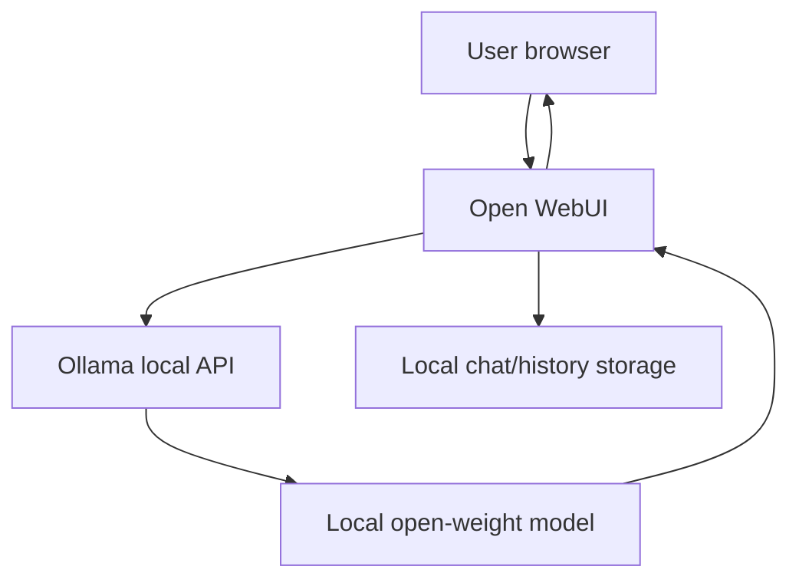

> **TL;DR:** Builds a local private chat setup. Stack: Ollama, local open-weight model, Open WebUI. Best for privacy-first demos.

## What You're Building

You will run a local model server and connect it to a browser chat interface. The user experience is similar to a hosted chatbot, but inference runs on local hardware or a private server.

## Architecture Overview

## Stack

| Component | Tool | Why |
|---|---|---|
| Runtime | Ollama | Low-friction local model runtime |
| UI | Open WebUI | Popular local browser interface for Ollama-style setups |
| Model | Llama / Qwen / Gemma / Phi | Open-weight options with local variants |
| Packaging | Docker | Simple local service deployment |

## Prerequisites

- [ ] Docker installed
- [ ] Enough RAM/VRAM for the chosen model
- [ ] A model selected based on actual hardware

## Key Implementation Steps

1. **Install Ollama** — Install the runtime and pull a small model first.
2. **Run the UI** — Start Open WebUI or equivalent local interface with Docker.
3. **Connect runtime** — Point the UI at the Ollama endpoint and test a small prompt.
4. **Tune model choice** — Move up in model size only after latency and memory are acceptable.
5. **Add local RAG later** — Add Chroma/LanceDB only after basic chat works.

## Gotchas & Tips

- Start with a small quantized model.
- Benchmark on the actual user hardware.
- Keep model files out of Git.
- Do not promise cloud-level quality from laptop-class models.

## Full Reference Implementations

- [Ollama repository](https://github.com/ollama/ollama) — Local runtime
- [Open WebUI repository](https://github.com/open-webui/open-webui) — Popular local web UI
- [llama.cpp repository](https://github.com/ggml-org/llama.cpp) — Low-level local inference runtime

## Related Entries

- Runtime: [Ollama](../../projects/inference-engines/ollama.md)
- Runtime: [llama.cpp](../../projects/inference-engines/llama-cpp.md)
- Stack reference: [Local-first](../../architectures/reference-stacks/local-first.md)
- Tip: [Benchmark on user hardware](../../tips-and-tricks/inference-and-serving/benchmark-on-the-user-hardware.md)

---
*Last reviewed: 2026-06-14 by @maintainer*

