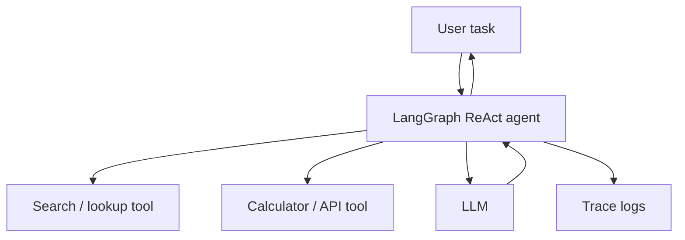

> **TL;DR:** Builds a minimal ReAct-style agent. Stack: Python, LangGraph, tool functions, structured tracing. Best for learning tool loops.

## What You're Building

You will build an agent that reasons about a task, calls one or two safe tools, and returns a final answer with traceable steps. The user experience is a small CLI or API endpoint for tool-assisted questions.

## Architecture Overview

## Stack

| Component | Tool | Why |
|---|---|---|
| Agent runtime | LangGraph | Prebuilt ReAct agent and graph primitives |
| Tools | Python functions | Small, inspectable, easy to validate |
| LLM | OpenAI-compatible model | Simple baseline for tool calling |
| Observability | LangSmith or Langfuse | Debug tool calls and agent steps |

## Prerequisites

- [ ] Python 3.10+
- [ ] One safe read-only tool
- [ ] API key or local model endpoint
- [ ] A max-step budget

## Key Implementation Steps

1. **Define tools** — Start with read-only deterministic tools before side-effecting actions.
2. **Create the agent** — Use LangGraph prebuilt ReAct agent or an explicit graph.
3. **Add validation** — Validate tool inputs before execution.
4. **Add budget** — Set max steps and timeout policies.
5. **Trace runs** — Log tool arguments, outputs, and final answer.

## Gotchas & Tips

- Do not give the first version write/delete/spend tools.
- Most agent bugs are tool validation or loop-control bugs.
- Keep success criteria explicit.
- Add human review before irreversible actions.

## Full Reference Implementations

- [LangGraph repository](https://github.com/langchain-ai/langgraph) — Agent graph framework
- [OpenAI Agents SDK repository](https://github.com/openai/openai-agents-python) — Alternative agent SDK
- [LangGraph docs](https://docs.langchain.com/oss/python/langgraph/) — Official docs

## Related Entries

- Framework: [LangGraph](../../projects/frameworks/langgraph.md)
- Decision tree: [Choose Agent Framework](../../architectures/decision-trees/choose-agent-framework.md)
- Tip: [Validate tool arguments](../../tips-and-tricks/validate-tool-arguments-before-execution.md)
- Tip: [Add max step budget](../../tips-and-tricks/add-a-max-step-budget-to-every-agent.md)

---
*Last reviewed: 2026-06-14 by @maintainer*

