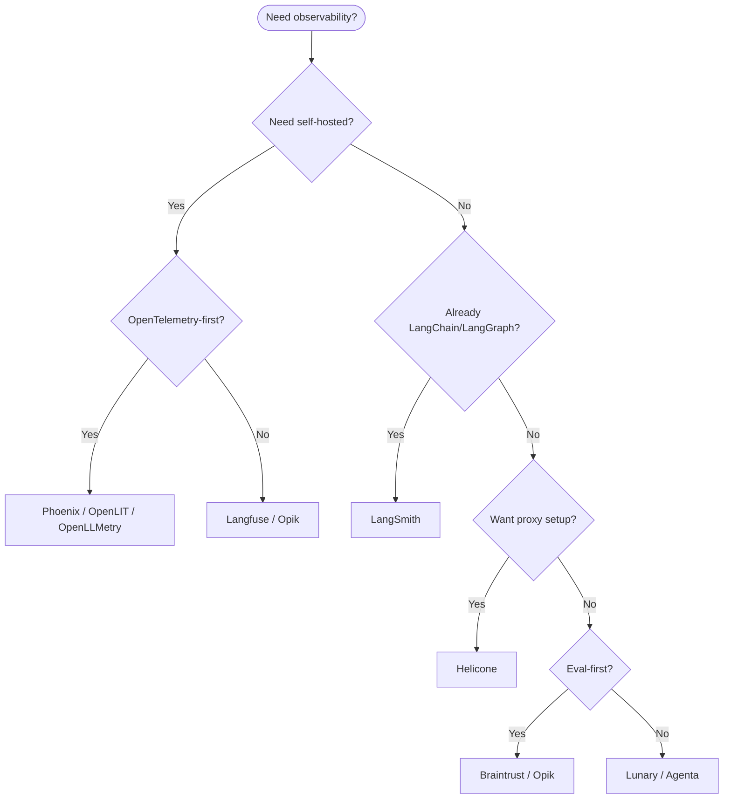

## Overview

LLM observability is the practice of recording enough context to explain why an AI system produced an answer, how much it cost, how long it took, and whether it met quality expectations.

For production AI systems, logs alone are not enough. You need traces across model calls, retrieval, tools, prompts, evaluations, costs, and user feedback.

## Why It's in the Arsenal

Observability is the trust layer for AI applications. Without it, teams cannot debug hallucinations, retrieval failures, tool errors, prompt regressions, or cost spikes.

## Key Features

- **Tracing**: model calls, prompts, retrieved context, tool calls, spans
- **Evaluation**: regression tests, scorers, datasets, human feedback
- **Cost tracking**: tokens, provider spend, feature/user attribution
- **Alerting**: latency, failures, quality drops, runaway usage

## Architecture / How It Works



Plain-language decision flow:

1. Need self-hosting and data ownership? Start with Langfuse, Phoenix, Opik, OpenLIT, or Lunary.
2. Already deep in LangChain/LangGraph? Start with LangSmith.
3. Want minimal code changes through a gateway? Evaluate Helicone.
4. Need OpenTelemetry alignment? Evaluate Phoenix, OpenLIT, or OpenLLMetry.
5. Need eval-first workflows? Evaluate Braintrust, Opik, Langfuse, or Phoenix.

## Getting Started

```bash
# Pick one tool, instrument one critical path, then inspect one trace end-to-end.
pnpm run check:links
```

## Use Cases

1. **Scenario**: Selecting an observability stack before launching an LLM application
2. **Scenario**: Debugging quality, cost, and latency problems in production

## Strengths

- Gives engineers a shared vocabulary for observability tradeoffs
- Links directly to canonical tool/project entries

## Limitations / When NOT to Use

- Does not replace hands-on evaluation with your own traces
- Pricing, limits, and hosted/self-hosted features must be verified before purchase

## Integration Patterns

- Instrument model calls, retrievers, tool calls, and agent state transitions.
- Attach user, session, environment, feature, model, and prompt-version metadata.
- Convert production failures into evaluation examples.

## Resources

- [Langfuse](../projects/benchmarks-and-evals/langfuse.md) — sdk/self-host
- [LangSmith](../projects/benchmarks-and-evals/langsmith-platform.md) — platform/managed
- [Phoenix](../projects/benchmarks-and-evals/phoenix.md) — otel-native
- [Helicone](../projects/benchmarks-and-evals/helicone.md) — proxy
- [Opik](../projects/benchmarks-and-evals/opik.md) — platform
- [OpenLIT](../projects/benchmarks-and-evals/openlit.md) — otel-native
- [OpenLLMetry](../projects/benchmarks-and-evals/openllmetry.md) — otel-native
- [Lunary](../projects/benchmarks-and-evals/lunary.md) — sdk
- [Braintrust](../projects/benchmarks-and-evals/braintrust.md) — platform/eval-first
- [Agenta](../projects/benchmarks-and-evals/agenta.md) — platform

## Buzz & Reception

Observability is now a core production requirement for LLM apps because model behavior, retrieval quality, latency, and cost can all regress independently.

---
*Last reviewed: 2026-06-13 by @maintainer*

