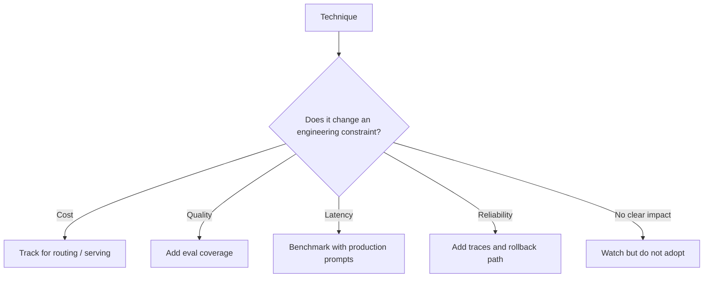

## Overview

This page tracks technique families that are likely to influence AI engineering decisions. It is a watchlist, not an endorsement list.

## Why It's in the Arsenal

Emerging techniques become useful only when they change architecture, cost, latency, reliability, or evaluation choices. This page filters research trends through that engineering lens.

## Key Features

- **Test-time compute / reasoning models**: spend more tokens or search steps at inference time for harder tasks.
- **Distilled reasoning models**: transfer reasoning behavior into smaller models for cheaper serving.
- **Graph-based RAG**: use entity/community graphs for global questions over large corpora.
- **Hierarchical retrieval**: summarize and retrieve at multiple levels of abstraction.
- **Speculative decoding**: use draft models to reduce generation latency.
- **Long-context engineering**: combine retrieval, compression, and long-window models instead of relying on context size alone.
- **Multimodal agents**: reason over images, documents, UI screens, audio, and video.
- **Small-model routing**: route simple tasks to small models and escalate only when needed.

## Architecture / How It Works



## Getting Started

```bash
# For each emerging technique, define the metric it should improve before adopting it.
```

## Use Cases

1. **Scenario**: You need a fast research reading path for AI engineering decisions
2. **Scenario**: You want to map papers to practical architecture and evaluation choices

## Strengths

- Organizes research by engineering relevance rather than publication date alone
- Links canonical paper entries where available
- Keeps benchmark and technique tracking separate from implementation guides

## Limitations / When NOT to Use

- Does not replace reading the original papers
- Benchmark leaderboards change frequently and should be verified before claims

## Integration Patterns

- Use paper entries as background context for architecture decisions.
- Link papers from projects, tools, tips, and reference stacks only when the connection is direct.
- Convert repeated research takeaways into tips or decision-tree updates.

## Resources

- [DeepSeek-R1](training-and-alignment/deepseek-ai-2025-r1.md)
- [RAPTOR](retrieval-and-memory/sarthi-2024-raptor.md)
- [GraphRAG](retrieval-and-memory/edge-2024-graphrag.md)
- [Speculative Decoding](inference-and-efficiency/leviathan-2022-speculative-decoding.md)

## Buzz & Reception

Research guide pages should be reviewed regularly because SOTA claims and active topics change quickly.

---
*Last reviewed: 2026-06-14 by @maintainer*

