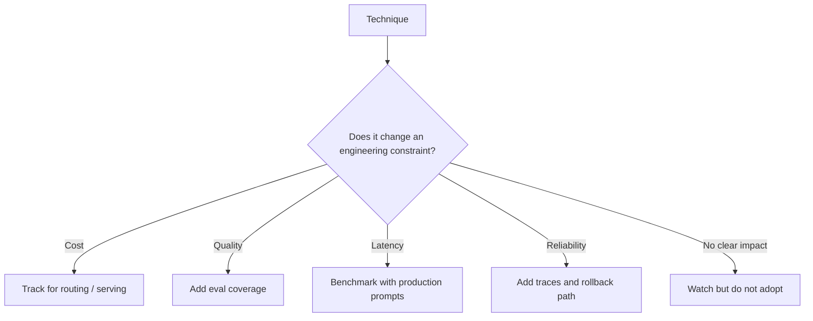

## Overview

This page tracks technique families that are likely to influence AI engineering decisions. It is a watchlist, not an endorsement list.

## Why It's in the Arsenal

Emerging techniques become useful only when they change architecture, cost, latency, reliability, or evaluation choices. This page filters research trends through that engineering lens.

## Key Features

- **Test-time compute / reasoning models**: spend more tokens or search steps at inference time for harder tasks.
- **Distilled reasoning models**: transfer reasoning behavior into smaller models for cheaper serving.
- **Graph-based RAG**: use entity/community graphs for global questions over large corpora.
- **Hierarchical retrieval**: summarize and retrieve at multiple levels of abstraction.
- **Speculative decoding**: use draft models to reduce generation latency.
- **Long-context engineering**: combine retrieval, compression, and long-window models instead of relying on context size alone.
- **Multimodal agents**: reason over images, documents, UI screens, audio, and video.
- **Small-model routing**: route simple tasks to small models and escalate only when needed.

## Architecture / How It Works


```mermaid
flowchart TD
    TECH[Technique] --> IMPACT{Does it change an engineering constraint?}
    IMPACT -->|Cost| COST[Track for routing / serving]
    IMPACT -->|Quality| EVAL[Add eval coverage]
    IMPACT -->|Latency| PERF[Benchmark with production prompts]
    IMPACT -->|Reliability| OPS[Add traces and rollback path]
    IMPACT -->|No clear impact| WATCH[Watch but do not adopt]
```

## Getting Started

```bash
# For each emerging technique, define the metric it should improve before adopting it.
```

## Use Cases

1. **Scenario**: a technique is trending in research and you need to decide whether it changes any architecture, cost or latency choice you have already made.
2. **Scenario**: you are planning a quarter's work and want to know which subfields are moving fast enough to be worth a prototype now.
3. **Scenario**: you have read a paper referenced by a tool entry and want to know whether it is load-bearing for that tool's design or incidental.

## Strengths

- Filters technique families by whether they change an architecture, cost, latency, reliability or evaluation decision, rather than by publication venue.
- Keeps a technique and its benchmark separate, so a promising result is not read as a settled capability.
- Is explicit that presence on the list is not a recommendation, which is the failure mode most technique roundups have.

## Limitations / When NOT to Use

- Entries are technique families, not settled results: a listed technique may still be research-only, and the maturity of each is not implied by its presence here.
- The list tracks direction rather than availability, so "emerging" here can mean a technique with no usable implementation yet.
- Being listed is not a recommendation; the engineering-lens filter is applied but the judgement is still a judgement.

## Integration Patterns

- Link a technique here from a decision-tree node when the technique is one of the options being weighed, so the reader can see why it is on the list.
- When a technique graduates from emerging to a shipped tool, create the tool entry and cross-link rather than expanding this page.

## Resources

- [DeepSeek-R1](training-and-alignment/deepseek-ai-2025-r1.md)
- [RAPTOR](retrieval-and-memory/sarthi-2024-raptor.md)
- [GraphRAG](retrieval-and-memory/edge-2024-graphrag.md)
- [Speculative Decoding](inference-and-efficiency/leviathan-2022-speculative-decoding.md)

## Buzz & Reception

Research guide pages should be reviewed regularly because SOTA claims and active topics change quickly.

---
*Last reviewed: 2026-06-14 by @maintainer*

