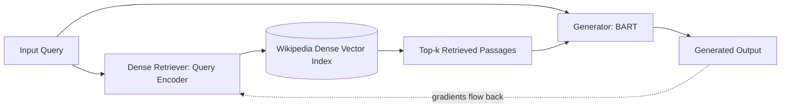

## Overview

This paper coined the term "retrieval-augmented generation" and established the general framing nearly every RAG paper and system since has built on: combine a pretrained language model's parametric memory with a non-parametric, updatable retrieval index so the system can incorporate knowledge without retraining. Note: the specific architecture this paper proposes — a jointly fine-tuned dense retriever (DPR) and generator (BART), trained end-to-end so gradients flow into the retriever — is largely superseded in practice; most production RAG systems today use a much simpler retrieve-then-generate pipeline with an off-the-shelf, independently-trained embedding model and no joint fine-tuning at all, because it's dramatically simpler to build and maintain while still capturing most of the practical benefit for typical use cases.

## Why it's in the Arsenal

- Nearly every other entry in this catalog's `retrieval-and-memory/` phase (HyDE, RAPTOR, GraphRAG) and every RAG-related tool and project (vector databases, document-processing pipelines, retrieval frameworks) implicitly builds on the vocabulary and problem framing this paper established — you cannot discuss "RAG" without tracing back to this paper's definition of the term, even when the specific technique used bears little resemblance to the original architecture.
- `practical_applicability: theoretical` for the *specific jointly-trained architecture* is an honest classification, not a demotion: the field moved to simpler, decoupled retrieve-then-generate pipelines almost immediately after this paper, and understanding why (operational simplicity, easier debugging, ability to swap retrievers or generators independently) is itself a useful engineering lesson that this paper's Limitations section does not anticipate.

## Core Contribution

Prior knowledge-intensive NLP work either baked all knowledge into a large parametric model's weights (making updates require retraining) or used non-differentiable retrieval steps that couldn't be optimized end-to-end with the generator. This paper's contribution was RAG-Sequence and RAG-Token, two model variants that combine a pretrained seq2seq generator (BART) with a dense retriever (DPR) over a Wikipedia vector index, fine-tuned jointly so that retrieval quality and generation quality improve together, while the retrieval index itself remains swappable and updatable without retraining the generator. In engineering terms: this paper's core proposal was to make the retrieved-document set part of the differentiable computation graph (marginalizing over retrieved documents as a latent variable) rather than a fixed preprocessing step — a level of architectural coupling between retriever and generator that essentially no production RAG system replicates today, because it is far simpler and nearly as effective to keep them decoupled.

## Key Results

- RAG models with 626M trainable parameters (BART-large plus a DPR query encoder) substantially outperformed T5-large (770M parameters), which scored 28.9 Exact Match on Natural Questions (2020) — the paper's headline efficiency claim, showing retrieval augmentation beat a larger closed-book model with fewer trainable parameters
- Ablation studies in the paper showed that allowing gradients to propagate into the retriever (rather than freezing it) produced the largest improvements specifically on question-answering tasks (2020) — this is the result most directly superseded in practice, since most current production systems use a frozen, independently-trained retriever
- These Natural-Questions-era exact-match numbers are not comparable to how RAG systems are evaluated today (see `ragas-rag-evaluation` and the `llm-as-a-judge`/`ragas-paper` entries in `evaluation-and-safety/` for current RAG evaluation approaches) and should not be cited as a benchmark for current retrieval quality.

## Methodology

RAG treats the retrieved document as a latent variable: given an input query, a dense retriever (Dense Passage Retrieval, itself a separate contribution by Karpukhin et al.) returns the top-k most relevant passages from a fixed Wikipedia index using approximate nearest-neighbor search over dense embeddings; the generator (BART) then produces output conditioned on the input plus each retrieved passage, and the two model variants differ in how they marginalize over retrieved passages — RAG-Sequence uses the same retrieved set for generating the whole output sequence, while RAG-Token can attend to a different retrieved passage for each generated token (paper Section 2). Critically, both the query encoder and the generator are fine-tuned jointly on the downstream task, with gradients flowing back into the query encoder (though the document encoder and the index itself are kept frozen for computational tractability) — this joint fine-tuning of the query-side retriever is the specific design choice most production systems have since abandoned in favor of using strong, general-purpose, independently-trained embedding models with no downstream-task-specific fine-tuning at all.

## Practical Applicability

If you are building any system that needs to ground LLM outputs in external, updatable knowledge rather than relying purely on the model's parametric memory, this paper is why "retrieve relevant documents, then generate conditioned on them" is the standard pattern — but you should implement the simpler, decoupled retrieve-then-generate architecture that the field converged on (an independently-trained embedding model plus a separately-trained or off-the-shelf generator), not this paper's jointly-fine-tuned architecture, since the operational complexity of joint training is rarely justified by the marginal quality gain for most production use cases. If you are choosing among this catalog's other `retrieval-and-memory/` entries (HyDE for zero-shot retrieval without labeled data, RAPTOR for hierarchical summarization, GraphRAG for global summarization queries), this paper's framing of "parametric plus non-parametric memory" is the shared vocabulary all of them use to describe what problem they're solving, even though none of them use this paper's specific joint-training approach.

## Limitations & Critiques

The paper's own evaluation was limited to Wikipedia-grounded, English-language, knowledge-intensive QA and generation tasks — it made no claim about, and did not anticipate, the broad range of enterprise/document-grounded RAG use cases (internal company documents, code, multi-modal content) that now dominate practical RAG deployment. The specific joint-training approach has a real operational cost the paper does not address: fine-tuning the retriever end-to-end with the generator means the retriever's behavior is coupled to one specific generator and downstream task, making it harder to swap either component independently — which is precisely why nearly all production systems since have decoupled these components, using strong general-purpose embedding models (not task-specific-fine-tuned ones) paired with any generator. The compute and infrastructure cost of maintaining a dense vector index over a large corpus, with approximate nearest-neighbor search at query time, is understated in the original paper relative to how significant vector-database infrastructure (covered extensively in this catalog's `data-and-retrieval` project entries: Milvus, Weaviate, pgvector, Pinecone, Qdrant) has become as a dedicated engineering discipline. No known failed-replication challenges to the paper's core empirical results have been identified as of `last_reviewed: 2026-07-01`; the critique that has emerged is architectural (the joint-training approach doesn't scale operationally), not a challenge to whether the reported numbers are accurate.

## Reproductions & Follow-up Work

The core retrieve-then-generate pattern has been reproduced and re-validated so extensively, in so many derivative and simplified forms, that it is now the default architecture for an entire category of production systems, even though very few of those systems reproduce this paper's specific joint-training approach exactly. Within this catalog: HyDE (Gao et al., 2022, `retrieval-and-memory/`) directly extends this paper's retrieval framing to a zero-shot setting without labeled relevance data; RAPTOR (Sarthi et al., 2024) and GraphRAG (Edge et al., 2024) both build on the same retrieve-then-generate framing for different retrieval shapes (hierarchical and graph-based, respectively). The RAGAS paper (Es et al., 2023, `evaluation-and-safety/`) and its corresponding `ragas-rag-evaluation` project entry establish the current standard for evaluating RAG pipeline quality, addressing a gap this original paper did not need to solve at its scale.

## Relation to the Arsenal

This paper builds on `vaswani-2017-attention` (foundational/) for its Transformer-based generator component (BART), and it is the field-defining reference point for every entry in `retrieval-and-memory/` (HyDE, RAPTOR, GraphRAG) even though none of them share its specific jointly-trained architecture. The `ragas-rag-evaluation` project entry in `content/projects/benchmarks-and-evals/` documents an evaluation framework for the broader class of retrieve-then-generate systems this paper named, which is why `implemented_in` lists it here — not because RAGAS implements this paper's specific architecture, but because it evaluates the general RAG pattern this paper defined. This entry is placed in `foundational/` rather than `retrieval-and-memory/` specifically because it coined the field's vocabulary, not because its specific technique remains current practice — see the non-obvious placement rationale documented in `.migration/research-audit-report.md`.

## Resources

- [Paper (PDF)](https://arxiv.org/pdf/2005.11401)
- [arXiv](https://arxiv.org/abs/2005.11401)
- [Official Code](https://github.com/huggingface/transformers)
- [Venue Proceedings](https://proceedings.neurips.cc/paper_files/paper/2020/file/6b493230205f780e1bc26945df7481e5-Paper.pdf)
- [Papers With Code](https://paperswithcode.com/paper/retrieval-augmented-generation-for)
- [Key Reproduction / Analysis](https://liner.com/review/retrievalaugmented-generation-for-knowledgeintensive-nlp-tasks) — independent review noting the paper's ~7,500 citations and summarizing why joint retriever fine-tuning was the standout ablation result, the specific design choice least preserved in later production systems
