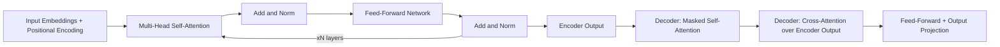

## Overview

This paper established the Transformer architecture: sequence modeling built entirely from self-attention, with no recurrence and no convolution. That single architectural choice is why large-scale LLM training is computationally practical today — recurrent models process a sequence one step at a time, while self-attention lets every position attend to every other position in parallel, so training throughput scales with available compute instead of sequence length. Every foundation model in this catalog (Llama, Qwen, Gemma, DeepSeek, and the rest) is a descendant of this architecture, with `result_status: foundational` here meaning "baseline that is still the reference point," not "superseded" — nothing in the catalog has replaced attention-based sequence modeling itself, though the specific 2017 encoder-decoder configuration described in the paper is not what current decoder-only LLMs use directly.

## Why it's in the Arsenal

- Every model-layer decision in this catalog — context window limits, positional encoding choices (RoPE, ALiBi, learned embeddings), attention-variant tradeoffs (grouped-query attention, sliding-window attention, linear attention) — is a variation on or optimization of the mechanism this paper introduced. You cannot reason about why a model handles long context poorly, or why quantizing attention weights differently from MLP weights matters, without this paper's vocabulary.
- `practical_applicability: theoretical` is not a demotion: almost no one implements attention from this paper directly anymore (every framework ships an optimized kernel), but debugging transformer behavior, choosing positional encoding schemes for a fine-tuning job, and understanding why certain inference optimizations (like KV caching or FlashAttention) work at all requires understanding the mechanism this paper defines.

## Core Contribution

The paper's core claim is architectural, not just empirical: replacing recurrence with scaled dot-product self-attention removes the sequential dependency that forces RNNs to process tokens one at a time. Concretely, it introduced three things that persist unchanged in essentially every LLM built since: (1) scaled dot-product attention, computing a weighted sum over all positions' value vectors using query-key similarity scores scaled by `1/sqrt(d_k)` to keep gradients well-behaved at larger dimensions; (2) multi-head attention, running several attention computations in parallel subspaces so the model can attend to different types of relationships (syntactic, positional, semantic) simultaneously; and (3) sinusoidal positional encodings, since attention itself has no inherent sense of token order. The practical consequence: because every position can be computed independently given the full sequence, training parallelizes across the entire sequence length rather than being serialized token-by-token, which is the specific property that made scaling training to today's model and dataset sizes computationally tractable.

## Key Results

- 28.4 BLEU on WMT 2014 English-to-German translation (2017) — at publication, more than 2 BLEU above the best previously reported result on that task, including ensemble models
- 41.8 BLEU on WMT 2014 English-to-French translation (2017), a new single-model state-of-the-art at the time
- Reported training cost of 3.5 days on 8 P100 GPUs for the large model — small by the standards of translation systems at the time, though trivial compared to the compute used for any current frontier LLM
- These BLEU numbers describe machine-translation quality on a benchmark that predates and is unrelated to how modern LLMs are evaluated; they should not be cited as evidence for anything about current model quality. The paper's lasting significance is architectural (see Core Contribution), not its leaderboard position, which was superseded within the same research cycle as later Transformer variants appeared.

## Methodology

The Transformer keeps the encoder-decoder shape used by prior sequence-to-sequence models but replaces every recurrent or convolutional sub-layer with self-attention plus a position-wise feed-forward network. Each encoder layer runs multi-head self-attention over the full input sequence followed by a feed-forward block, with residual connections and layer normalization around each; each decoder layer adds a second attention block that attends over the encoder's output, plus a causal mask that prevents each position from attending to future positions during generation. Multi-head attention itself is computed as `Attention(Q,K,V) = softmax(QK^T / sqrt(d_k))V`, run in parallel across `h` heads with separate learned projections, then concatenated and projected back down (paper Section 3.2). Positional information is injected once, at the input embedding stage, via fixed sinusoidal functions of position and dimension index (Section 3.5) — later architectures (RoPE, ALiBi) replace this specific choice while keeping everything else about the architecture intact, which is why "positional encoding scheme" is a solved-but-still-actively-varied design decision in every model card in this catalog.

## Practical Applicability

If you are debugging why a fine-tuned model degrades on long inputs, this paper is why: attention computes pairwise interactions across the whole sequence, so understanding attention patterns (and where they break down at context lengths outside training distribution) requires understanding this mechanism, not just the higher-level framework API you're using. If you are choosing a positional encoding scheme for a custom architecture or evaluating why one open-weight model handles long context better than another, this paper is the baseline every subsequent scheme (RoPE, ALiBi, YaRN) is explicitly a departure from — you need the original mechanism to understand what problem those later choices solve. If you are optimizing inference (FlashAttention-style kernels, KV cache management, grouped-query attention), all of those optimizations target specific computational properties of the mechanism defined here (the `O(n^2)` cost of computing pairwise attention scores), so understanding the baseline computation is a prerequisite to understanding why a specific optimization works and what tradeoff it makes.

## Limitations & Critiques

The original architecture has real, well-documented limitations that later work explicitly addresses. The attention mechanism's `O(n^2)` compute and memory cost in sequence length was known at publication and remains the primary reason long-context serving is expensive; entire research programs (linear attention, sliding-window attention, state-space models) exist specifically to work around this. The paper's absolute sinusoidal positional encoding does not extrapolate well beyond the trained context length — a limitation the field spent years addressing (relative position biases, RoPE, ALiBi, and explicit context-extension techniques), and no model in this catalog still uses the original scheme unmodified. The paper's own evaluation was limited to machine translation and English constituency parsing; it made no claim about — and could not have anticipated — the emergent in-context learning and instruction-following behavior that motivated nearly every use case in this catalog. No post-publication challenges to the architecture's core correctness have been identified as of `last_reviewed: 2026-07-01`; the debate in the field has been about efficiency and scaling, not about whether the mechanism works as described.

## Reproductions & Follow-up Work

The architecture has been independently reproduced so many times that "reproduction" in the traditional single-paper sense understates it: it is the substrate of the Hugging Face Transformers library, OpenAI's GPT series, Google's BERT and T5, and effectively every subsequent LLM, each of which is itself an independent re-implementation and validation of the core mechanism at increasing scale. The most direct lineage of follow-up work relevant to this catalog: BERT (Devlin et al., 2018, in this catalog) applied the encoder side to bidirectional pretraining; GPT-3 (Brown et al., 2020, in this catalog) validated the decoder-only variant at scale; RoPE, ALiBi, and FlashAttention (not yet separately cataloged) are the most cited direct successors addressing the positional-encoding and quadratic-cost limitations noted above.

## Relation to the Arsenal

This is the architectural foundation nearly every other entry in the Arsenal builds on, directly or indirectly. `bert` (foundational/) applies the encoder side of this architecture to bidirectional masked-language-model pretraining. `language-models-are-few-shot-learners` (foundational/) validates the decoder-only variant of this architecture at a scale that produces emergent few-shot behavior. Every foundation-model project entry in `content/projects/foundation-models/` (Llama, Qwen, Gemma, DeepSeek, Mistral, Phi) is a Transformer in this paper's lineage. Every inference-engine tool and project in this catalog (vLLM, SGLang, llama.cpp, TGI) exists specifically to serve this architecture efficiently, and the `speculative-decoding` and `gptq` research entries (inference-and-efficiency/) both describe optimizations that target the exact computational structure this paper defines.

## Resources

- [Paper (PDF)](https://arxiv.org/pdf/1706.03762)
- [arXiv](https://arxiv.org/abs/1706.03762)
- [Official Code](https://github.com/tensorflow/tensor2tensor)
- [Venue Proceedings](https://papers.nips.cc/paper/2017/hash/3f5ee243547dee91fbd053c1c4a845aa-Abstract.html)
- [Papers With Code](https://paperswithcode.com/paper/attention-is-all-you-need)
- [Key Reproduction / Analysis](https://en.wikipedia.org/wiki/Attention_Is_All_You_Need) — background on the paper's reception and citation trajectory (250,000+ citations as of 2026, among the top ten most-cited papers of the 21st century)
